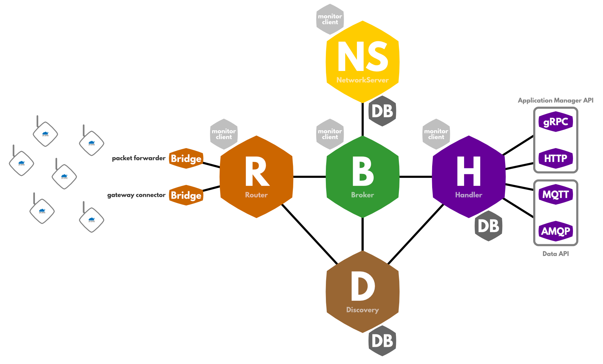

# Network

This section has general information on the architecture of The Things Network, managing it via the CLI and Console (closed source) as well as how to deploy some or all components on your own servers.

