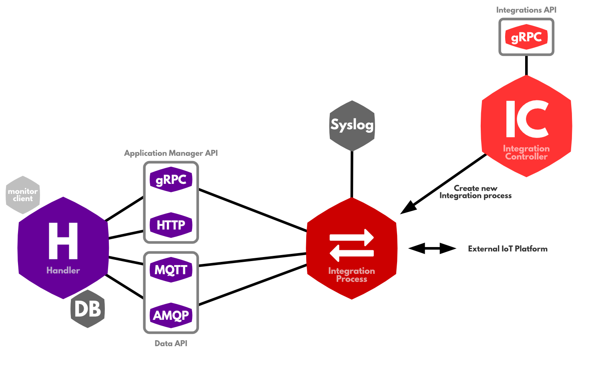

# Platform Integrations

> This guide deals with building integrations. To use integrations see [Applications](../applications).

An application can integrate The Things Network in different ways. This guide lays out the different [options](options.md) ranging from working directly with the APIs to working via a Platform Integration. It then continues to explain how to build an integration for your platform.

## Architecture
A platform integration uses the same APIs as [application](../applications/index.md), to integrate The Things Network with an application platform. This allows users to integrate  their applications on that platform in a few clicks.

> Contact [johan@thethingsnetwork.org](mailto:johan@thethingsnetwork.org) for more information.