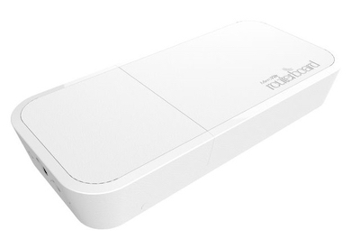
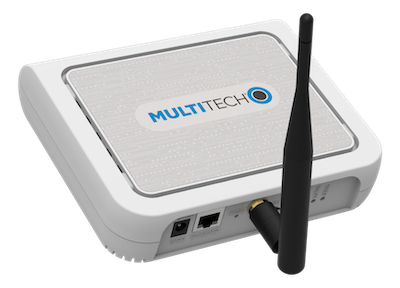

# Quick Start

The Things Network offers a free and developer-friendly way to get familiar with LoRaWAN technology. The Things Network provides a public community LoRaWAN network, initiated by [The Things Industries](https://thethingsindustries.com/), and supported by 100k+ community members from more than 100 countries around the world.

> Join The Things Network [Forum](https://www.thethingsnetwork.org/forum/) or [Slack](https://ttn.fyi/slack-invite) for community support.

> For commercial solutions, we recommend using an SLA-backed network provided by The Things Industries. Learn more about [The Things Industries](https://thethingsindustries.com/).

> The Things Network runs on open source code, actively maintained by The Things Industries. If you would like to explore or contribute, visit our [open source LoRaWAN stack repository](https://github.com/TheThingsNetwork/lorawan-stack).

#### Useful links:

- [The Things Network development environment](https://console.cloud.thethings.network/)
- [The Things Stack Introduction video](https://www.youtube.com/watch?v=rK8oJHZ9Q7U)
- [Visit the official The Things Stack documentation page.](https://www.thethingsindustries.com/docs)
- [What is The Things Industries, The Things Network and The Things Stack?](https://www.thethingsindustries.com/docs/getting-started/what-is-tts/)

> **Important note:** In 2021, The Things Network will be upgraded to use [**The Things Stack**](../the-things-stack), the third version of the LoRaWAN network stack. **The Things Network Stack** (version 2) will no longer be actively maintained. If you have been using The Things Network, you will need to learn how to [migrate your gateways and devices to The Things Stack](../the-things-stack/migrate-to-v3.md).

## Learn more about LoRaWAN

LoRaWAN is a radio frequency protocol that allows devices to connect to the Internet over a long range with incredibly low power consumption. Visit our documentation to [learn more about LoRaWAN](../lorawan).

Watch the video below on *Everything you need to know about LoRaWAN in 60 minutes* by Johan Stokking (tech lead of The Things Network):
<iframe width="560" height="315" src="https://www.youtube.com/embed/ZsVhYiX4_6o" frameborder="0" allow="accelerometer; autoplay; clipboard-write; encrypted-media; gyroscope; picture-in-picture" allowfullscreen></iframe>

Read along to learn how you can implement your end-to-end IoT prototype within a day.

## Set up your LoRaWAN network

The main building blocks of The Things Network are **gateways**. Thousands of gateways across the globe are already connected to The Things Network, making the community LoRaWAN network available for a free usage. 

> See the [global coverage map](https://www.thethingsnetwork.org/map)

Although you might already have a coverage in your area, we still recommend you to get your hands on a gateway to ensure reliable coverage. There are a lot of gateways with extensive features on the market, so make sure you choose the one that fits your needs best. For example, here is a short list of some popular indoor gateways:

|   |  Gateway | Link  |
| ------------- |:-------------:| -----:|
|  | **Mikrotik wAP LR8** | [More info](https://mikrotik.com/product/wap_lr8_kit) |
|  | **Laird Sentrius RG1xx** | [More info](https://www.lairdconnect.com/wireless-modules/lorawan-solutions/sentrius-rg1xx-lorawan-gateway-wi-fi-ethernet-optional-lte-us-only) |
|  | **Tektelic Kona Micro Lite** | [More info](https://tektelic.com/catalog/kona-micro-lite-lorawan-gateway) |
|  | **Multitech Conduit AP** | [More info](https://www.multitech.com/brands/multiconnect-conduit-ap) |

Once you have your hands on a gateway, [learn how to connect your gateway to The Things Stack](../devices-and-gateways/adding-gateways.md).

> **Important note:** Different world regions use different [frequency plans](https://www.thethingsindustries.com/docs/reference/frequency-plans/), e.g. 863-870 MHz for Europe, 902-928 MHz for North America, etc. Make sure you double check that the hardware aligns with your region’s radio frequency before purchasing!

To learn more about gateways, have a look at the review video by Ben Olayinka:
<iframe width="560" height="315" src="https://www.youtube.com/embed/h_6dIte_IxI" frameborder="0" allow="accelerometer; autoplay; clipboard-write; encrypted-media; gyroscope; picture-in-picture" allowfullscreen></iframe>

## Get your development board and activate it

To build a prototype of your end-to-end IoT solution, you will need a development board. Here is a short list of popular development boards that can help you build your IoT app in no-time:

| Image | Development board | Webshop  |
| ------------- |:-------------:| -----:|
|  | **The Things Uno** | [Buy](https://connectedthings.store/gb/lorawan-development/the-things-uno-development-board.html) |
|  | **Arduino MKR WAN 1300** | [Buy](https://store.arduino.cc/arduino-mkr-wan-1300-lora-connectivity-1414) |
|  | **Pycom LoPy4** | [Buy](https://pycom.io/product/lopy4/) |
|  | **STM32L0 Discovery Kit** | [Buy](https://www.st.com/en/evaluation-tools/b-l072z-lrwan1.html) |

Did you set up your gateway and created a free account on The Things Network? Great, now it is time to activate your development board! [Learn how to connect your device to The Things Stack](../devices-and-gateways/adding-devices.md).

To learn more about getting started with The Things Stack, have a look at the video by Bogdans Afonins:

<iframe width="560" height="315" src="https://www.youtube.com/embed/rK8oJHZ9Q7U" frameborder="0" allow="accelerometer; autoplay; clipboard-write; encrypted-media; gyroscope; picture-in-picture" allowfullscreen></iframe>

## Build your end-to-end application

Once you have your LoRaWAN network setup, you can use available integrations to build your end-to-end IoT solution. Integrations allow you to process data and act on it by triggering events. Visit our documentation to [find out more about integrations](https://www.thethingsindustries.com/docs/integrations/).

### Other useful links:

- [Official The Things Stack documentation page](https://www.thethingsindustries.com/docs)
- [What is The Things Industries, The Things Network and The Things Stack?](https://www.thethingsindustries.com/docs/getting-started/what-is-tts/)
- [The Things Stack Getting Started playlist](https://www.youtube.com/playlist?list=PLM8eOeiKY7JWTf-d4XmRuRjK1ZFaoinwM)
- [The Things Network Forum](https://www.thethingsnetwork.org/forum/)

