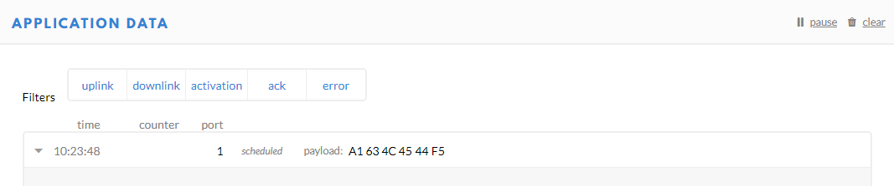

## AllThingsTalk Maker. Make IoT ideas happen.

[AllThingsTalk Maker](http://maker.allthingstalk.com/) is the developer platform by AllThingsTalk to rapidly connect your things and collect, visualize and use data in minutes. AllThingsTalk Maker supports your own custom binary data format which you can decode using the ABCL payload decoder. 
AllThingsTalk Maker is free for prototyping purposes.

## Set up the integration

Let’s say that you have a LoRaWAN device with temperature sensor and LED actuator and you want to connect it to Maker.

>Good example is our [LoRaWAN Rapid Development Kit](http://shop.allthingstalk.com/product/lora-rapid-development-kit/) with Grove sensors.

To enable your data to arrive in Maker, you’ll need to integrate TTN and Maker.

### Create an account on The Things Network

Go to [The Things Network console](https://console.thethingsnetwork.org/) and register an account.

### Add application
- Select *Applications*
- Click `+ add application`
- Choose **Application ID**, a unique identifier for your application
- Let the other fields stay on their defaults
- Click `Add application`

### Add AllThingsTalk integration

- Select the *Integrations* tab
- Click `+ add integration`
- Select the **AllThingsTalk Maker** tile

- Choose a **Process ID** for the integration, for example `talk-to-attalk`
- Select the default key as **Access Key**
- Click `Add integration`

### Create a LoRa Device
- Select *Devices* tab
- Click `+ register device`
- Choose a **Device ID**
- Enter the **Device EUI** of your device, or generate one
- Click `Register`

Now you have a Device registered under your Application.

### Connect the device to Maker

Go to [Maker](http://maker.allthingstalk.com) and connect your device:

- Go to **Devices**
- Choose `+ CONNECT A DEVICE`
- Under **LPWAN** devices, choose **Your own LoRa**
- Choose **The Things Network** tile
- Choose a **Device name**, for example *My RDK*
- Provide an **Application ID** and a **Device EUI** from your Device in TTN console, and click `Connect`

Now you’re set to send and receive LoRa data with Maker.

## Receive your sensor data

If your device reads temperature sensor’s value it can send it over TTN to your account in Maker.

### Create a sensor
- Choose `+ NEW ASSET`
- Create a **Sensor** with name `temperature` and profile type `number`

### Send data from TTN console and receive it in Maker

Before you start sending data from your device, you can test if your LoRa data arrives in Maker by sending it from TTN console.

You typically want to use a binary data format because of the limited payload size which are inherent to LPWAN networks such as LoRaWAN.

One of the payload formats Maker understands is [CBOR](http://cbor.io). The message format which AllThingsTalk uses for CBOR is
`{"<asset name>": <value>}`.

In RDK example, your temperature sensor reads 23 degrees Celsius, and you’d like to see that value in Maker. You can use [cbor.me](http://cbor.me) to convert the payload to CBOR, e.g,

`{"temperature": 23}` translates to `A1 6B 74 65 6D 70 65 72 61 74 75 72 65 17`

> Read more about [data formats](/developers/data-formats/).

Now you can send the payload from TTN console and verify that it arrives in Maker:

- In TTN console, go to *Device* tab
- Use **SIMULATE UPLINK** to send a payload:

- In Maker you will see `temperature` state updated to `23`

> ​​Important: LoRaWAN class ‘A’ devices can only receive payload data (downlink messages) as a response on an uplink message. The network uses the receiving slot of an uplink message to send data towards the device as typically the device will go to sleep mode to conserve energy.

## Actuate your device

Now that you’ve received your data in Maker, you can command your device from Maker, and turn on the LED. Before you do so, you can test by sending a command from Maker and receiving it in TTN console.

### Create an actuator asset

Create a `LED` asset which you’ll use to send a command.

- Choose `+ NEW ASSET`
- Create an **Actuator** with name `LED` and profile type `boolean`

### Actuate your device with CBOR

The easiest way to test the actuations is by using CBOR. The message format which AllThingsTalk uses for CBOR is
`{"<asset name>": <value>}`.

You can use [cbor.me](http://cbor.me) to convert your payload to CBOR, e.g,

- `{"LED": true}` translates to `A1 63 4C 45 44 F5`

In Maker, click on the asset `LED`, and from `Command` field send the command `true`:

Back in TTN console go to **Data** screen, and you’ll see the payload `A1 63 4C 45 44 F5` coming in:

>For your RDK device, you’d need to implement a logic which would turn on the LED when a value comes from Maker. For example, when value `true` comes from the asset `LED` your code will set LED state to `HIGH` and the LED on your device would light up.

### Actuate your device with ABCL

**ABCL** stands for [AllThingsTalk Binary Conversion Language](http://docs.allthingstalk.com/dl/AllThingsTalk_Binary_Conversion_Language_1_0_0.pdf) , and it’s a JSON-based, domain specific language, used for encoding and decoding of AllThingsTalk asset data to and from binary payloads. It gives you the freedom to specify your own decoding scheme on a per device level.

As opposed to CBOR, which sends  `A1 63 4C 45 44 F5` when you send `true` command from `LED` asset in Maker, with ABCL you can set a conversion which sends only `FF` for the same command. This results in much less data being used to achieve the same goal.

To set up a conversion in Maker, go to `SETTINGS > Payload formats` and check ☑️ **Use ABCL to convert custom binary data.**

Add a conversation which will translate the boolean state of `LED` actuator into the first byte of your binary payload:

    {"actuate": [{"asset": "mode", "field": {"byte": 0, "type": "boolean"}}]}

Click on the asset `LED`, and from `Command` field send the command `true`:

Back in TTN console go to **Data** screen, and you’ll see the payload `FF` coming in:

You can now use Maker to collect your temperature readings, and turn on the LED on your device.

Go ahead and make your idea happen using [AllThingsTalk LoRaWAN Rapid Development Kit](https://www1.allthingstalk.com/lorawan-rapid-development-kit).
