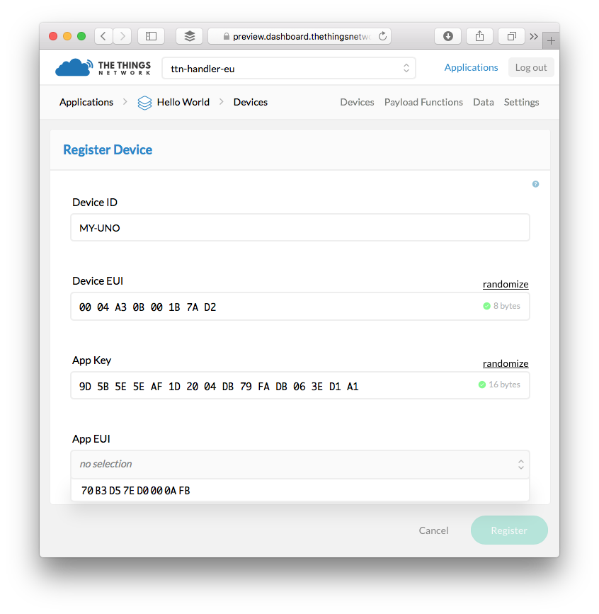

# Migrate Devices

For each device you'd like to migrate:

1.  On [staging](https://staging.thethingsnetwork.org/applications/), click the application you'd like to migrate devices from.
2.  In the **Devices** box click the **Dev EUI** of the device you'd like to migrate to see its **Device info** box.
3.  In [preview](https://preview.dashboard.thethingsnetwork.org/applications/), click the [migrated application](#migrate-applications) to go to its **Application Overview** page.
4.  Click **Devices** on the top right.
5.  Click **register device**.
    - For **Device ID**, use anything you like as long as it is unique and only uses alphanumeric charachters and nonconsecutive `-` and `_`.
    - For **Device EUI**, click **customize it** and copy-paste the **Dev EUI** from staging.
    - For **App Key**, click **customize it** and copy-paste the **App Key** from staging.
    - For **App EUI**, click to select the **App EUI** from staging which you added when you [migrated the application](#migrate-applications).

    

> Made a mistake? You can always come back to the devices and click **Settings** on the top right to change all of the above settings, except the **Device ID**.