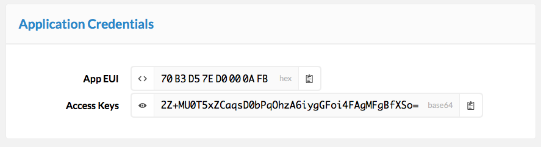

# Quick Start
This guide will walk you through setting up a Node.js project that listens to device activations and messages and responds to every 3rd message.

> In a hurry? Skip to [Connect](#connect) to get your application **App EUI** and **Access Keys** and then jump to the [Live Example](#live-example) to run the script we'll write here directly in your browser!

## Setup
Let's install Node.js, create a Node.js project and install the TTN Client.

1.  [Download](https://nodejs.org/en/download/) and install Node.js.
2.  Create a new Node.js project:

    ```bash
    cd $HOME
    mkdir app
    cd app
    npm init
    ```

    > Just press return to accept the default answer to any question asked.

3.  Install and save the [TTN Client](https://www.npmjs.com/package/ttn) as dependency:

    ```bash
    npm install --save ttn
    ```

## Connect
Next, we will write the script that requires the TTN Client module and uses it to connect.

1.  Create the main script and open it in your favorite editor:

    ```bash
    touch index.js
    open index.js
    ```

2.  Require the TTN Client module:

    ```js
    var ttn = require('ttn');
    ```

3.  In the [dashboard](https://staging.thethingsnetwork.org/applications), navigate to the application you'd like to use and follow the link *learn how to get data from this app* in the **Application Info** box.

    

4.  Copy the **App EUI** (hex) and **Access Keys** (base64)

    

5.  In the editor, create an instance of the client using the **App EUI** and **Access Keys** you copied:

    ```js 
    var appEUI = '70B3D57ED0000AFB';
    var accessKey = '2Z+MU0T5xZCaqsD0bPqOhzA6iygGFoi4FAgMFgBfXSo=';
    var client = new ttn.Client('staging.thethingsnetwork.org', appEUI, accessKey);
    ```

    > We expect the dashboard to be ready for production in September. Be aware that the URL will then change.

6.  Add a listener for the `connect` and `error` events to test the connection:

    ```js 
    client.on('connect', function() {
      console.log('[DEBUG]', 'Connected');
    });

    client.on('error', function (err) {
      console.error('[ERROR]', err.message);
    });
    ```
 
7.  Run the script to test the connection:

    ```bash
    node .
    ```

    You should see something like:

    ```bash
    $ node .
    [DEBUG] Connected
    ```

    Use `Ctrl C` to terminate the script.

    If you get an error it should say what is wrong:

    ```bash
    $ node .
    [ERROR] Connection refused: Not authorized
    ```

    Make sure you have copy-pasted the **App EUI** and **Access Keys** in the correct format.

## Receive Activations
Now that we are connected, let's listen for new device activations.

> Be aware that you will only receive `activation` events since the moment the script connects.

1.  Add a listener for the `activation` event:

    ```js
    client.on('activation', function (e) {
      console.log('[INFO] ', 'Activated: ', e.devEUI);
    });
    ```

2.  Run the script again:

    ```bash
    node .
    ```

3.  Power up, reset or upload a new sketch to a device to force it to activate and you should see something like:

    ```bash
    $ node .
    [DEBUG] Connected
    [INFO]  Activated:  0004A30B001B7AD2
    ```

    Use `Ctrl C` to terminate the script.    

## Receive Messages (uplink)
Now let's listen for actual messages coming in from devices.

I use the same script as [The Things Uno Quick Start](/uno/#quick-start), which both sends and receives messages.

1.  Add a listener for the `uplink` event:

    ```js
    client.on('uplink', function (msg) {
      console.info('[INFO] ', 'Uplink: ' + JSON.stringify(msg, null, 2));
    });
    ```

2.  Run the script again:

    ```bash
    node .
    ```

    If you uploaded the Quick Start sketch you should see something like:

    ```bash
    [DEBUG] Connected
    [INFO]  Uplink: {
      "devEUI": "0004A30B001B7AD2",
      "fields": {
        "message": "Hello"
      },
      "counter": 29,
      "port": 1,
      "metadata": {
        "frequency": 868.5,
        "datarate": "SF7BW125",
        "codingrate": "4/5",
        "gateway_timestamp": 326035051,
        "gateway_time": "2016-08-31T13:33:47.369434Z",
        "channel": 2,
        "server_time": "2016-08-31T13:33:47.384994459Z",
        "rssi": -71,
        "lsnr": 7.5,
        "rfchain": 1,
        "crc": 1,
        "modulation": "LORA",
        "gateway_eui": "B827EBFFFE87BD22",
        "altitude": 10,
        "longitude": 5.90418,
        "latitude": 52.95904
      }
    }
    ```

## Send Messages (downlink)
To send a message you will have to address a specific device by its **Dev EUI**. Devices will only receive the last (downlink) message send to them in response to the next (uplink) message they send themselves. So let's send a (downlink) message in response to each 3rd (uplink) message we receive from a device.

Again, I use the same script as [The Things Uno Quick Start](/uno/#quick-start) as it is set up to both send and receives messages.

1.  Follow the [The Things Uno Quick Start](/uno/#quick-start) or upload another sketch to your device which sends messages every few seconds and listens for a response it will then print to `Serial`.

2.  In the Arduino IDE, select **Tools > Serial Monitor** `Ctrl/⌘ Shift M` to open the Serial Monitor.

3.  In the editor for the script, add another listener for the `uplink` event that responds to every 3rd message:

    ```js
    client.on('uplink', function(msg) {

      if (msg.counter % 3 === 0) {
        console.log('[DEBUG]', 'Downlink');

        var payload = new Buffer('4869', 'hex');
        client.downlink(msg.devEUI, payload);
      }
    });
    ```

4.  Run the script again:

    ```bash
    node .
    ```

    After each 3rd message the script should output:

    ```
    [DEBUG] Downlink
    ```

    In the Serial Montor you should see something like this if you uploaded the Quick Start sketch:

    ```
    Sending: mac tx uncnf 1 with 5 bytes
    Successful transmission. Received 2 bytes
    Received Hi
    ```

Congratulations! Now you know how to send and receive messages from a Node.js script.