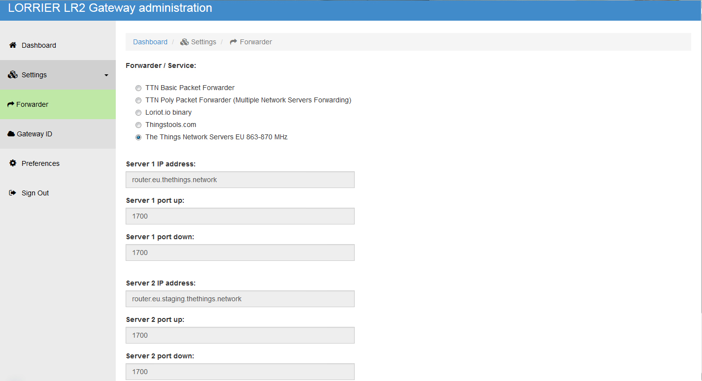
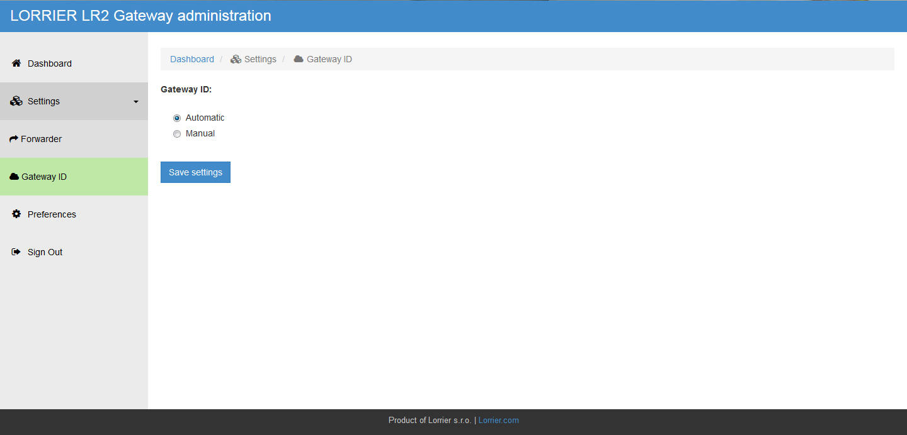

# Configure

Follow [LR2 Quick Settings](https://github.com/lorriercom/lorrier-lr2/blob/master/LR2_Quick_Settings.md)

1.  Connect the antenna to your LR2. Do not use this unit without antenna or
    appropriate attenuator connected.

2.  Connect your LR2 using enclosed POE adapter to your network. Default network
    setting is Static IP: 192.168.1.2. Booting of the LR2 takes about 60
    seconds.

3.  Set your Routerboard password. To change Routerboard password or to change
    network setting, follow the instructions in
    [/routeros/routerboard\_configuration.md](https://github.com/lorriercom/lorrier-lr2/blob/master/routeros/routerboard_configuration.md)
    file.

4.  Set your BBG password: Use SSH connection on port 2222 (default setting
    192.168.1.2:2222). Default login: username: *root* / password: *lorrier*. In
    the command line type *passwd root* and *passwd debian* to change your
    password.

5.  Type *192.168.1.2* (or your new IP setting) in your web browser and
    authorize the safety certificate to open web administration environment.

6.  Enter your login. The default login: username = *admin* / password =
    *lorrier*
    
    

7.  Choose your Packet Forwarder or network server service in the
    Settings-\>Forwarder window. The MAC address information (primarily for
    Loriot.io service) can be found in Dashboard-\>Device Info. After Packet
    Forwarder change, you may need to reboot your Gateway in Dashboard window.
    
    
    
    

8.  If needed, you can change your Gateway ID in the Settings/Gateway ID window.

    

9.  Set your web administration password in the Preferences window.
