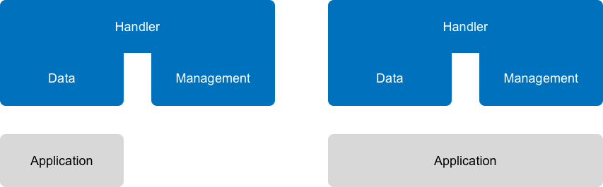
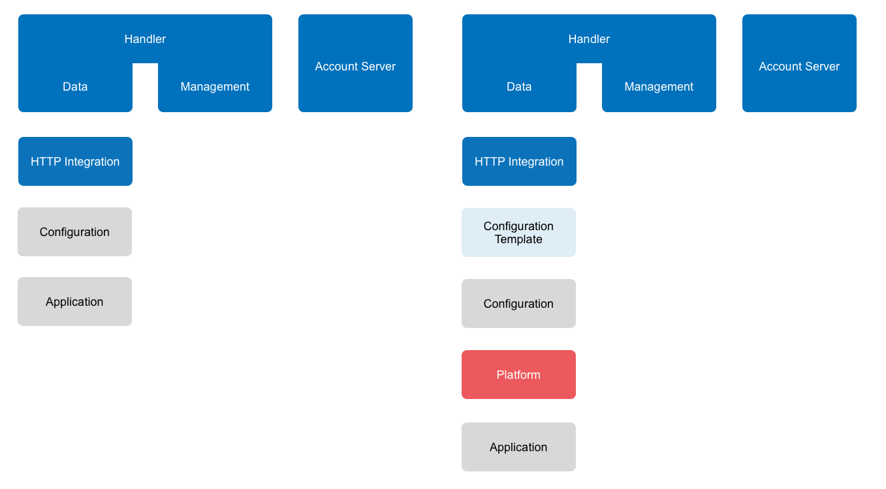
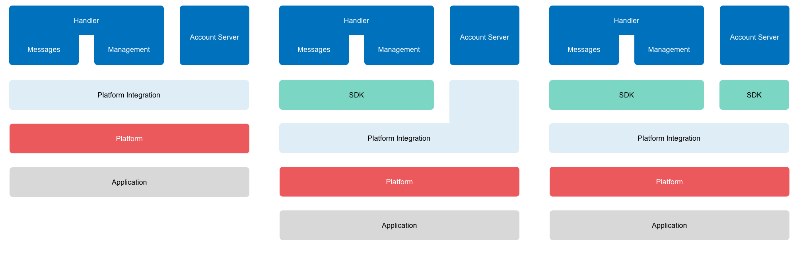

# Integration Options

An application can integrate The Things Network in different ways:

## 1. Handler Interfaces

In the most basic scenario, the application uses standard protocol libraries to connect to The Things Network's Handler interfaces such as the [MQTT broker](../../current/mqtt/) to communicate with devices and/or the [HTTP API](https://github.com/TheThingsNetwork/ttn/blob/v2-preview/api/handler/HTTP-API.md) to manage both applications and devices:

## 2. Platform SDK

We intend to provide a growing number of SDKs for popular platforms such as [Node.js](../../current/node-js) and [Java](../../v2-preview/java). These SDKs provide a layer of abstraction to make it easier to interact with the Handler:

> Some SDKs may only provide a wrapper for the MQTT interface. In that case, you will have to fall back to a standard HTTP library if you need to use the [HTTP API](https://github.com/TheThingsNetwork/ttn/blob/v2-preview/api/handler/HTTP-API.md).

If there is no SDK available for you language of choice and you'd like to help out, then jump to [Contribute SDKs](#platform-sdks)

## 3. HTTP Integration

Some platforms do not allow to execute code or communicate with the Handler's MQTT broker directly. Good examples are [IFTTT](https://ifttt.com/maker) and [Zapier](https://zapier.com/zapbook/webhook/). For these situations we provide an HTTP Integration which acts as a bridge to and from HTTP.

Simply configure it with URLs and The Things Network will forward device messages and events as HTTP requests. It also provides you with a unique HTTP endpoint to send messages to devices.

For some platforms we provide a configuration template. Instead of directly configuring the HTTP requests, we ask you only for variables like a platform key and generate the configuration for you.

## 4. Platform Integration

The most advanced way is a Platform Integration. For each integration the user adds, we spin up a container using a generic image for the selected platform. Configuration is passed to the container using environment variables.

The integration uses the the Handler Interfaces to communicate with devices and manage both applications and devices. On the other end it uses the platform APIs or SDK to integrate The Things Network and the user application running on the platform.
  

> If there's a SDK available for the platform the Integration is written in, of course you can use that SDK. We might even have an SDK for the Account Server, like we do in [Go](https://github.com/TheThingsNetwork/go-account-lib).

Platform Integrations can completely hide the user from any code and even The Things Network Console or CLI. A good example is an integration for Azure IoT Hub or Amazon IoT, where the user could manage his application and devices there, while the integration takes care of synchronizing with The Things Network.
