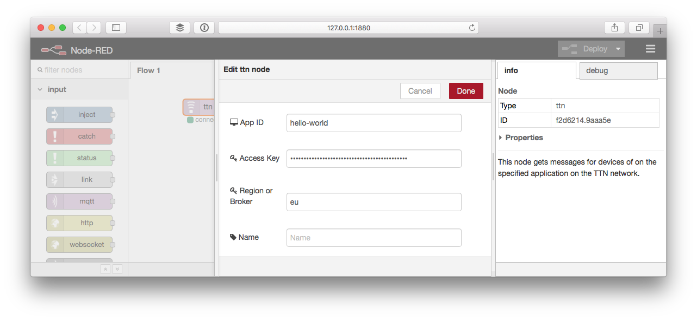
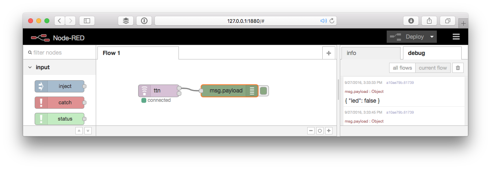
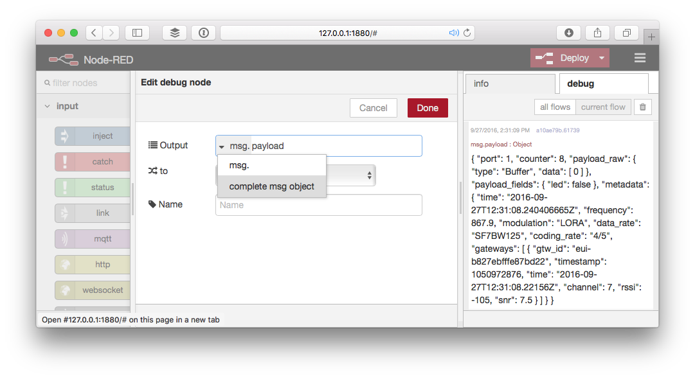

# Usage
Here's how you can use the TTN node to receive messages and activations.

## Configure
To use the TTN node you need to configure it for your The Things Network Application.

### Lookup your application info

1.  Open [The Things Network Dashboard](https://preview.dashboard.thethingsnetwork.org/) a new window.
2.  Select the application you'd like to connect to.

### Edit the TTN node

1.  In Node-RED, drag a **ttn** node from the input category in the toolbox on the left to your workflow.
2.  Double click the node to edit it.
3.  Click the `✏️` following *Add new ttn app...*.

    Copy-paste the following information from the dashboard:

    * For **App ID**, copy **Application ID** from the **Application Overview** box.
    * For **Access Key**, scroll down to the **Access Keys**. For the key you'd like to use, click `👁` to show the key and then `📋` to copy it.
    * For **Region or Broker**, scroll back again to use **Handler Status** from the **Application Overview** box. Only copy the last bit following `ttn-handler-`.

    

4.  Click **Deploy** on the top right. The node should say it's connected:

    

    In the terminal you should see something like:

        8 Sep 11:53:41 - [info] [ttn:f2d6214.9aaa5e] Connected to TTN application hello-world

## Receive Messages
Messages sent by devices on the application can be received via the upper output of the **ttn** node.

1.  Drag a **debug** node from the output category of the toolbox.
2.  Drag the upper output of the **ttn** node to the input of the **debug** node.

    

3.  Click **Deploy**.
4.  In the right sidebar select the **debug** tab.
5.  Soon after a device sends a message to your application you should see it come in like this:
    
    
    
    Nicely formatted, the debug output would look like:

    ```json
    {
    	"port": 1,
    	"counter": 8,
    	"payload_raw": {
    		"type": "Buffer",
    		"data": [0]
    	},
    	"payload_fields": {
    		"led": false
    	},
    	"metadata": {
    		"time": "2016-09-27T12:31:08.240406665Z",
    		"frequency": 867.9,
    		"modulation": "LORA",
    		"data_rate": "SF7BW125",
    		"coding_rate": "4/5",
    		"gateways": [{
    			"gtw_id": "eui-b827ebfffe87bd22",
    			"timestamp": 1050972876,
    			"time": "2016-09-27T12:31:08.22156Z",
    			"channel": 7,
    			"rssi": -105,
    			"snr": 7.5
    		}]
    	}
    }
    ```
    
    By default the debug node only shows `msg.payload`, which does not include the ID of the device that sent the message.
    
6.  Double click the **debug** node to edit it.
7.  Click the gray part of the **Output** value, select **complete msg object** and click **Done**:
    
    
    
8.  Click **Deploy** to see the next message in full, including the `devId`:

    ```json
    {
    	"devId": "my-uno",
    	"payload": {
    		"port": 1,
    		"counter": 31,
    		"payload_raw": {
    			"type": "Buffer",
    			"data": [0]
    		},
    		"payload_fields": {
    			"led": false
    		},
    		"metadata": {
    			"time": "2016-09-27T12:35:46.8640105Z",
    			"frequency": 867.1,
    			"modulation": "LORA",
    			"data_rate": "SF7BW125",
    			"coding_rate": "4/5",
    			"gateways": [{
    				"gtw_id": "eui-b827ebfffe87bd22",
    				"timestamp": 1329587859,
    				"time": "2016-09-27T12:35:46.842692Z",
    				"channel": 3,
    				"rssi": -111,
    				"snr": 6.2
    			}]
    		}
    	},
    	"_msgid": "426db946.bd9248"
    }
    ```

## Receive Activations
Device activations are sent from the lower node output.

1.  Drag the lower output to the input same **debug** node.
2.  Restart a device by briefly disconnecting power or upload a sketch.
3.  Soon, you should see the the activation message coming in like:

    ```json
    {
      "devId": "my-uno",
      "payload": {
        "app_eui": "70B3D57EF000001C",
        "dev_eui": "0004A30B001B7AD2",
        "dev_addr": "26012084",
        "metadata": {
          "time": "2016-09-08T14:04:52.755064047Z",
          "frequency": 868.5,
          "modulation": "LORA",
          "data_rate": "SF7BW125",
          "coding_rate": "4/5",
          "gateways": [{
            "eui": "B827EBFFFE87BD22",
            "timestamp": 1528942955,
            "time": "2016-09-08T14:04:52.716713Z",
            "channel": 2,
            "rssi": -57,
            "snr": 7.5,
            "rf_chain": 1
          }]
        }
      },
      "_msgid": "10d6a2ba.ef295d"
    }
    ```
