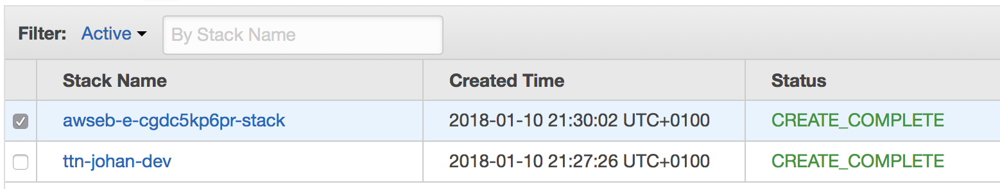

This guide will walk you through setting up the AWS IoT integration using CloudFormation: an easy process to configure one of the most advanced integrations for The Things Network.

1. Log in to the [AWS Management Console](http://console.aws.amazon.com)
2. Click on your region to create a new stack in that region: [🇺🇸 **us-west-2**](https://us-west-2.console.aws.amazon.com/cloudformation/home?region=us-west-2#/stacks/create/review?filter=active&templateURL=https%3A%2F%2Fs3.amazonaws.com%2Fthethingsnetwork%2Fbuilds%2Fintegration-aws%2Fdist%2Fcloudformation.template&stackName=ttn-integration&param_AccountServer=https:%2F%2Faccount.thethingsnetwork.org&param_DiscoveryServer=discovery.thethings.network:1900&param_InstanceType=t2.micro&param_ThingShadowDeltaFPort=1&param_ThingSyncEnabled=true&param_ThingSyncInterval=10m&param_ThingTypeName=lorawan), [🇪🇺 **eu-west-1**](https://eu-west-1.console.aws.amazon.com/cloudformation/home?region=eu-west-1#/stacks/create/review?filter=active&templateURL=https%3A%2F%2Fs3.amazonaws.com%2Fthethingsnetwork%2Fbuilds%2Fintegration-aws%2Fdist%2Fcloudformation.template&stackName=ttn-integration&param_AccountServer=https:%2F%2Faccount.thethingsnetwork.org&param_DiscoveryServer=discovery.thethings.network:1900&param_InstanceType=t2.micro&param_ThingShadowDeltaFPort=1&param_ThingSyncEnabled=true&param_ThingSyncInterval=10m&param_ThingTypeName=lorawan), [🇸🇬 **ap-southeast-1**](https://ap-southeast-1.console.aws.amazon.com/cloudformation/home?region=ap-southeast-1#/stacks/create/review?filter=active&templateURL=https%3A%2F%2Fs3.amazonaws.com%2Fthethingsnetwork%2Fbuilds%2Fintegration-aws%2Fdist%2Fcloudformation.template&stackName=ttn-integration&param_AccountServer=https:%2F%2Faccount.thethingsnetwork.org&param_DiscoveryServer=discovery.thethings.network:1900&param_InstanceType=t2.micro&param_ThingShadowDeltaFPort=1&param_ThingSyncEnabled=true&param_ThingSyncInterval=10m&param_ThingTypeName=lorawan)

   * Enter a **Stack name**, for example `ttn-app`
   * Enter the **App ID** and an **App Access Key** of your application in The Things Network
   * Enter an **Environment Name** for Elastic Beanstalk, for example `ttn-app`
   * If you are using a private network, change the **Account Server** and **Discovery Server** to the endpoints of your private network
   * Select an existing EC2 KeyPair in **SSH Key** to access the EC2 instance. [Read more](https://docs.aws.amazon.com/AWSEC2/latest/UserGuide/ec2-key-pairs.html)

   > The **App Access Key** that you enter should at least have the `messages` and `devices` rights.

   Example parameters:
   

3. Review your settings and check the **I acknowledge** box to acknowledge that resources for the integration may be created in your AWS account
4. Click **Create** to initiate the creation of the stack
5. After a coffee break of about six minutes, you will see two new stacks:

    

    > The `awseb-...` stack is an AWS Elastic Beanstalk stack that is created as part of the stack of the integration process.

🎉 You have now successfully configured the AWS IoT integration! See the guides on the left to learn working with the [thing registry](./thing-registry.md), [test messages](./test-messages.md), [thing shadows](./thing-shadows.md), [act on data](./act-on-data.md), [view metrics](./view-metrics.md) and [update](./update.md) the integration.
