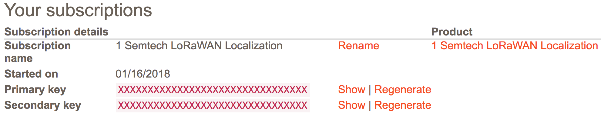
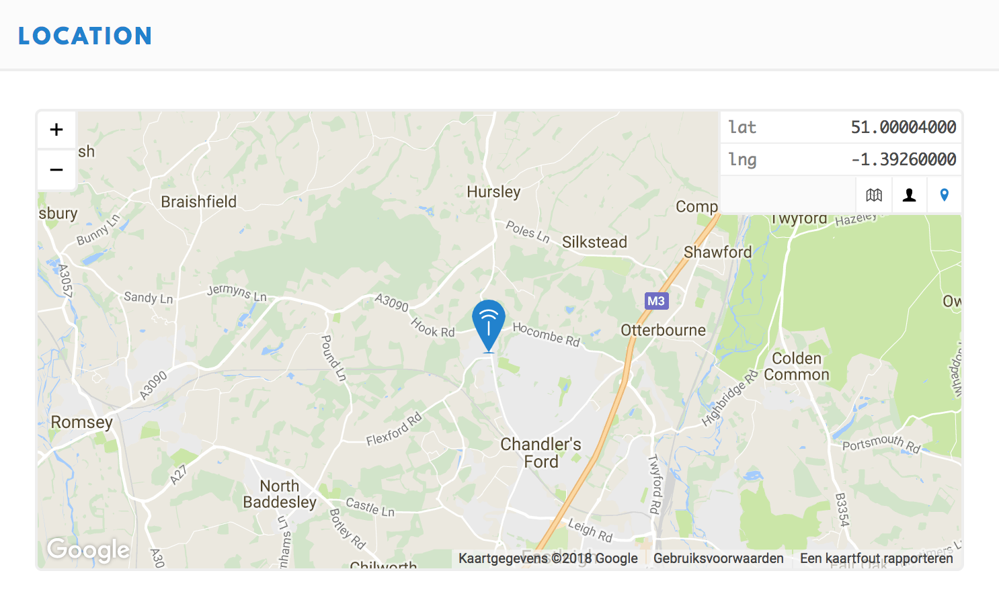

This guide walks you through applying for Collos membership, subscribing to the APIs and configuring the Collos integration in The Things Network Console.

## Subscribe to APIs

1. [Apply for a Collos membership](http://preview.collos.org/Home/Apply)
2. When your membership has been approved, sign in to the [Collos portal](https://apiportal.preview.collos.org/signin)
3. Go to **Products**
4. Click **Semtech LoRaWAN Localization**
5. Click **Subscribe** to subscribe to the APIs

## Getting your subscription key

Once your subscription has been approved, you can find your Collos subscription key.

1. Sign in to the [Collos portal](https://apiportal.preview.collos.org/signin)
2. Click on your name in the top right
3. Click **Profile**
4. Click **Show** to show your Collos subscription keys

   

   >You can use both **Primary key** and **Secondary key** for the Collos integration.

## Configuring the integration

1. Sign in to The Things Network Console
2. Under **Applications**, go to your application
3. Go to **Integrations**
4. Click **add integration**
5. Enter a **Process ID**, for example `rssi` or `tdoa`
6. Select an **Access Key**. This key should have at least the `devices` rights to update the location in the device registry
7. In **URL**, enter one of the Collos API endpoints:
   - LoRa TDOA + WiFi:
     ```
     https://api.preview.collos.org/localization-lora-recipes/v1/loraWifi
     ```
   - LoRa TDOA:
     ```
     https://api.preview.collos.org/semtech-localization-algorithms/v1/tdoa
     ```
   - LoRa RSSI:
     ```
     https://api.preview.collos.org/semtech-localization-algorithms/v1/rssi
     ```
8. Enter your **Collos subscription key**
9. Enter the **Cayenne channel**. If provided, the integration will send the location of your devices to [myDevices Cayenne](https://cayenne.mydevices.com) as GPS on the specified channel
10. Click **Add integration**

    

>To compare results from the different algorithms, you can add multiple integration processes for the three algorithms available and use different Cayenne channels.

🎉 You have now successfully configured the Collos integration. You will now see your device moving in The Things Network Console as well as in myDevices Cayenne.


