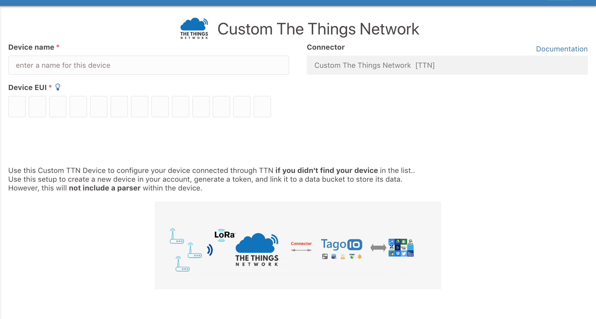
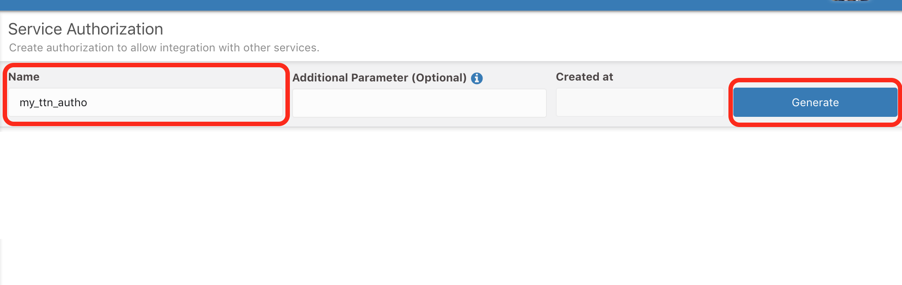

[TagoIO](https://tago.io/) allows you to quickly store, visualize, and act on sensor data.

Here you will learn how to integrate TTN LoRaWAN devices with [TagoIO](https://tago.io/). You will be able to send data from your devices (uplink) to TagoIO and back from TagoIO to the devices (downlink).

## 1. TagoIO Setup
After creating an account on [Tago.io](https://tago.io/), go to Devices, click on *Add Devices*, and filter by LoRaWAN TTN. Then, search for the device that you want to add. If you do not find it, select the type *Custom TTN Device*.

Just give a name for the device, type the device EUI, and click on the **Create Device** button. 

For example, if you selected the **Custom TTN** type, you will be presented with the following screen. 

After the device is created, a standard parser script is included in the **Payload Parser** tab based on the selected connector (unless you selected Custom TTN). Later, you can also add your own script to execute any calculation or to parse more data. 

Next you will need to create an Authorization for use in the TTN setup later. 

> This **Authorization** should be generated by TagoIO [here](https://admin.tago.io/devices/authorization); no Additional Parameters are needed

Copy this Authorization to use it in the next step.

## 2. TTN Setup

On [The Things Network Console](https://console.thethingsnetwork.org/) go to your already created Application, select the **Integrations** tab, and click **+add integration**.

Select **TagoIO** from the integration list.

You will be presented with a configuration screen to set the appropriate settings for the TagoIO integration.
* Process ID: This can be any lowercase alphanumeric name which should be unique for your application. Something like `send-data-to-tago` would be a good process ID.
* Access Key: Normally one would choose `default` from the list. If you want to limit the access that TagoIO has to your TTN application, you can create another access key with limited rights and choose that one here.
* Authorization: Paste the authorization key that you copied earlier from TagoIO into this field.

If you followed all the steps correctly, any data that is sent out by your device will be forwarded from TTN to your TagoIO account.

## Downlink

To send data back to your device, just go to your device at Tago and visit the tab **Configuration Parameters**.

Here you can add two parameters, for different data formats.

**downlink** 
Will send the raw payload to your device.

**payload_fields** 
The payload fields value needs to be a **valid JSON Object**, and Tago will send that object to your device.

You can choose between these two data formats, or you can send both.

When your data is sent to The Things Network and scheduled to send to your device, your parameter will be **marked as sent**, to **send it again**, mark the parameter as not sent.
