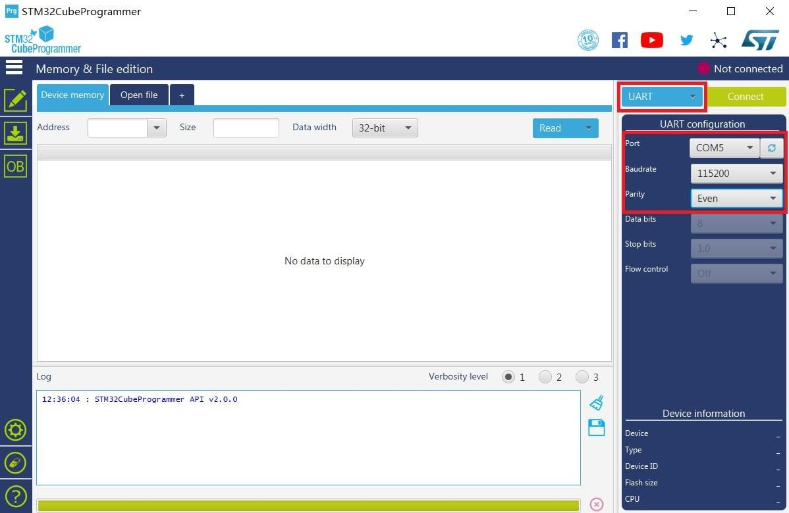

An easy and quick way to have a fully functional gateway is by using a Precompiled Firmware Image provided in this [**directory**](https://downloads.rakwireless.com/en/LoRa/WisNode/Firmware/). In this document are the step by step instructions of the bootloader’s burning process into the RAK811 WisNode.

1 . To start with, download and install the “STM32CubeProgrammer” tool in your PC through this [link](https://www.st.com/content/st_com/en/products/development-tools/software-development-tools/stm32-software-development-tools/stm32-programmers/stm32cubeprog.html#overview) or through this [RAK directory](https://downloads.rakwireless.com/en/LoRa/RAK811/Tools/SetupSTM32CubeProgrammer-2.1.0.rar).

2 . Consequently, download the bootloader archive [here](https://downloads.rakwireless.com/en/LoRa/WisNode/Firmware/RAK811_BOOT_V3.0.0.0.rar).

3 . Bridge the “BOOT” pin and “3V3” pin to set the board in boot mode as shown in the image below:

4 . Connect RAK811 WisNode LoRa Module with a computer or laptop through the USB interface.

5 . Press the "**RST**" button on the RAK811 WisNode LoRa Module.

6 . Open the “**STM32CubeProgrammer**” tool, and select **UART** type, then configure the **Port**, **Baudrate**, and **Parity** as the following picture shows:

>**Note**: Make sure to choose the correct port in the COM Port field. You can check this in the Device Manager for example in Windows.

7 . Then, press the “**Connect**” button at the top right corner.

>**Warning**: If there are some errors in the Log box or it can’t connect, please close the STM32CubeProgrammer and reset RAK811 WisNode LoRa Module, then open the STM32CubeProgrammer and connect again.

* The correct Log you should see is the information like the following picture shows:

Now, let’s start burning a bootloader into the RAK811 WisNode LoRa Module.

8 . First, erase all data on the RAK811 WisNode LoRa Module referred from the following picture below:

9 . Then, press “Open file” and select the unzipped bootloader bin file you downloaded in step 2:

10 . Click the “Download” button to start the burning process

11 . OK, you have successfully burned the firmware into RAK811 WisNode LoRa!

12 . "Disconnect” and close the “STM32CubeProgrammer” tool. Then, power down and remove the connection between BOOT pin and VCC pin to let RAK811 WisNode LoRa work in normal mode.

13 . Then, connect RAK811 WisNode LoRa with your PC’s USB interface again.

Alright! You can now start burning the firmware into RAK811 WisNode LoRa.
