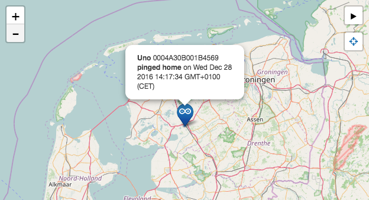

The Things Uno comes with a preinstalled Arduino Sketch that pings home on setup and every following minute.

> As soon as you upload your first sketch it will overwrite the preinstalled one!

Simply connect it to a power source via USB and you'll see it appear on the map at [ttn.fyi/activate](http://ttn.fyi/activate):



## Power your Device

While you keep an eye on the map at [ttn.fyi/activate](http://ttn.fyi/activate), use the bundled Micro-USB cable to connect the device to your computer or a power adapter.

Soon, you should see your device appear on the map.

### How do we get your location?

The Uno does not have a GPS sensor, but we do know the location of most gateways. Your device will appear in the center of all gateways that forwarded its message.

## Identify your Device

If you can't tell by the location, you will need your unique Device EUI. The preinstalled sketch prints this to USB port every time it sends data. You can read it using the Arduino IDE's Serial Monitor.

1.  Follow [Arduino / IDE Setup & Usage]() to setup the IDE.
2.  Make sure your device is connected to your computer with a Micro-USB cable.    

    > Make sure you use a cable that supports data, not just power. The one we ship with the Uno should work.

3.  In the Arduino IDE, select **Tools > Boards > Arduino Leonardo** - not *Uno*!
4.  Select the Node's Serial Port under **Tools > Port**.

    > If you don't see a port that identifies as **Arduino Leonardo** make sure The Things Uno's power LED is on and check the cable and USB port you have used. On Windows, you might need to [install drivers](https://www.arduino.cc/en/Guide/ArduinoLeonardoMicro#toc2). See [Arduino Troubleshooting](https://www.arduino.cc/en/Guide/Troubleshooting#toc16) for more suggestions.
    
5.  Select **Tools > Serial Monitor** `Ctrl/⌘ Shift M` to open the Serial Monitor.

    The next time it sends a message (every minute) it should print a list of information:

    ```
    EUI: 0004A30B001B7AD2
    Battery: 3223
    AppEUI: 70B3D57EF000001C
    DevEUI: 0004A30B001B7AD2
    Band: 868
    Data Rate: 5
    RX Delay 1: 1000
    RX Delay 2: 2000
    Total airtime: 0.00 s
    ```
    
    The first `EUI` value is what we're looking for.
    
8.  Switch back to [ttn.fyi/activate](http://ttn.fyi/activate) and scroll to the filter input.
9.  Enter the EUI and click **Filter**.

    The map will now show your device only:

    
    
🎉 Congrats! Continue to the [Quick Start]() to learn how to upload your own sketch.
