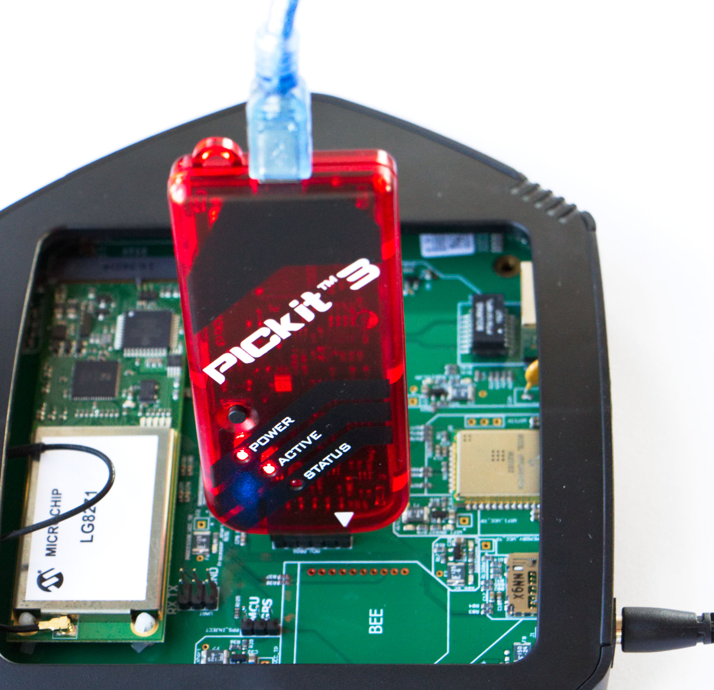
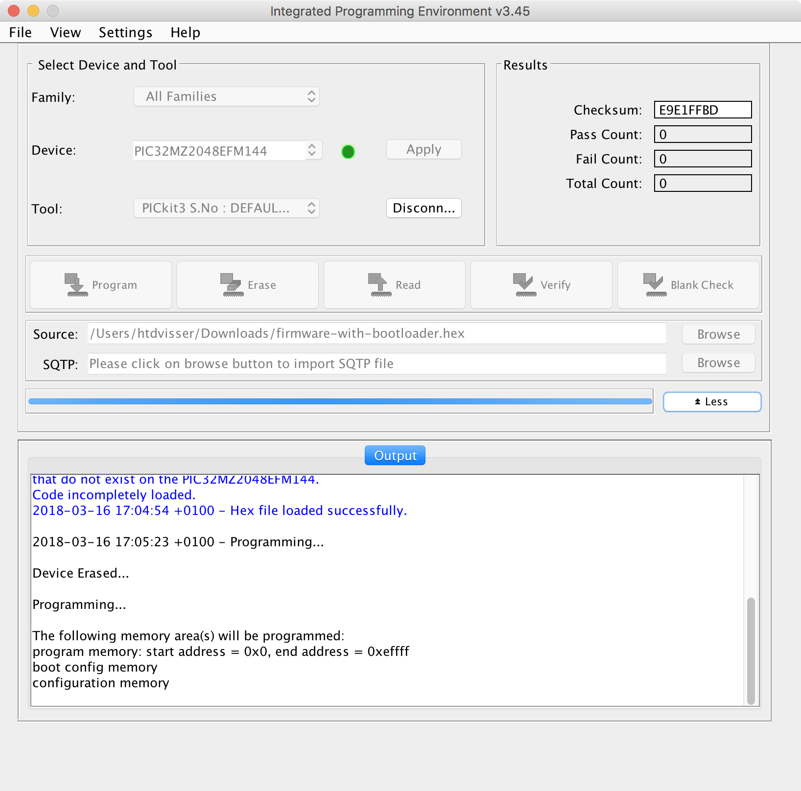

# Programming hex files using MPLABX IPE
In this section, we briefly walk through the process of Programming [The Things Gateway](../gateway/index.md) using the [MPLAB IPE](http://microchipdeveloper.com/ipe:start) integrated programming environment

#### 1. Connecting the Programmer
Connect the programmer to the `MCU_PROG` port of the gateway as shown below

   **Programmer<-->Gateway**
    

#### 2. Selection
Once connected, open the MPLAB IPE on your computer and select the device `PIC32MZ2048EFM144`.

   **Selection**
    

#### 3. Connection
Click the `connect` button next to the Tool to allow the IPE to connect to the Programmer. This allows the IPE to read existing firmware information.

   **Connection**
    

#### 4. Load Hex File
Now load the hex file from your PC. The IPE checks it for validity.

   **Load Hex File**
    

> In case you encounter a warning `hexfile contains code that is located at addresses that do not exist on the device`, you should still be able to continue with programming.

#### 5. Start Programming
Now click `Program` to start the reprogramming of the gateway.

   **Start Programming**
    

#### 6. Verification
Once the program is complete, the checksums are verified. 

   **Verification**
    

> Issues with the reprogramming? Please check [The Things Gateway FAQ](faq.md) or reach out to us via [The Things Network community forum](https://www.thethingsnetwork.org/forum) 
