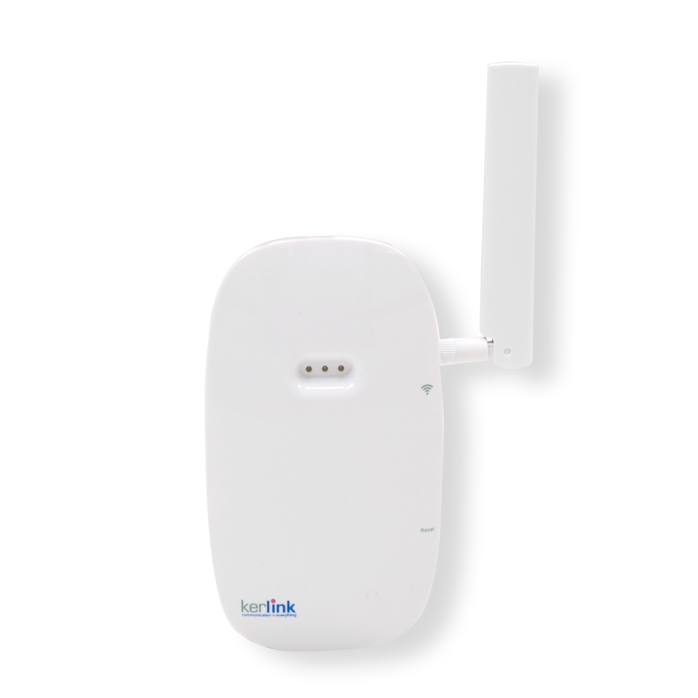

# Kerlink Wirnet iFemtoCell Evolution

The wirnet iFemtoCell Evolution is a low-cost, indoor LoRaWAN nano gateway that can be easily connected through GSM cellular or ethernet.



[Source & further info](https://wikikerlink.fr/wirnet-productline/doku.php?id=wiki:ifemtocell-e:hardware_arch_ifevo)
*You do need to request a login and password from Kerlink*


## Powering the iFemtoCell Evolution

Connect the 12V adapter.


## Connecting to the iFemtoCell Evolution

iFemtoCells are named after their serial number and are called `klk-fevo-XXXXXX`. You can replace the `XXXXXX` by the six hexadecimal digits from the serial number which are also the last six hexadecimal digits of the **Board ID** (printed on the bottom of the gateway).

> For example, if an iFemtoCell has `009CVc031234` as board ID, the host name will be: `klk-fevo-031234`

### Ethernet or cellular
 
Both ethernet and cellular can be used, though for setup Ethernet is preferred.

### iFemtoCell login/password

To prevent Web robots from attacking the gateway with standard login/password “root/root”, default password is built using the last 6 characters of the board ID: `pdmk-XXXXXX`. 

For example, if an iFemtoCell has `009CVc031234` as board ID, then the root password will be `pdmk-031234` (case sensitive).

```
klk-fevo-031234 login: root
Password: pdmk-031234
```

> For security reasons, it is highly recommended to change the password. You can do so with the command: `passwd`


### Install and configure the gateway

Follow the [unified generic KerOS guide](../keros) to install and configure your gateway.


