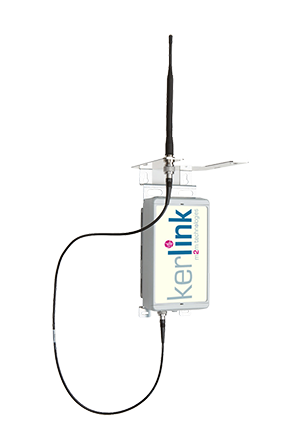

The [Kerlink Wirnet Station](http://www.kerlink.fr/en/products) is an industrial solution suitable for people who want to mount the gateway outside and who have sufficient technical skills to connect, mount and maintain the device themselves.

We have tested the device and although we have remarks about the somewhat older software that is being used, this device will do the job. A trained software engineer will be able to update the device using the software from The Things Network.

