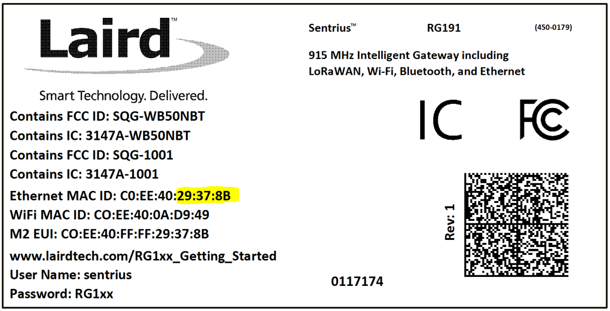
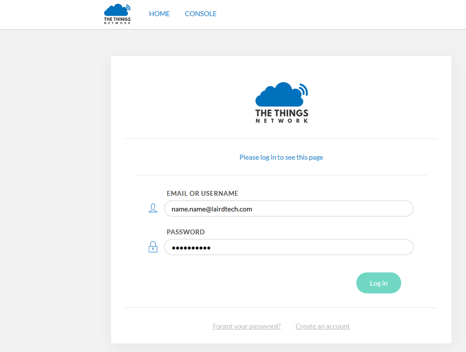

The Sentrius RG1xx LoRa-Enabled Gateway from Laird is the ultimate in secure, scalable, robust LoRa solutions for end-to-end control of your private LoRaWAN network. Leveraging Laird's field-proven and reliable 50 Series "Wireless Bridge" certified module, it also offers enterprise dual-band Wi-Fi, BT v4.0 (BLE and Classic) and wired Ethernet for complete design freedom. Based on the Semtech SX1301/SX1257 chipset designs, it offers a LoRa range up to 10 miles and pre-loaded LoRa Packet Forwarder software, perfect for highly scalable, flexible IoT networks. The Sentrius RG1xx Gateway works with Laird's Sentrius RM1xx Series LoRa+BLE certified modules for simple out-of-the-box integration and is compatible with 3rd party Cloud and LoRa partners, as well as any LoRaWAN certified client devices.

It is also available in an outdoor IP67 rated case

## Connecting the RG1xx

A 12v 2A power supply is included with the gateway and an ethernet cable. Attach the antennas to the unit, the LoRa antenna needs to be connected to the 868/915MHz port and the two Wi-Fi antennas need to be connected to the 2.4/5.5GHz ports.

Attach the ethernet cable between the gateway and network interface, then connect the power cable.

1. Determine the last three bytes of your gateway's Ethernet MAC address. This can be found on the label on the bottom of the gateway; the last three bytes are highlighted.

2. Enter the URL into the web browser to access the web interface. For example, for the gateway used in this guide, the URL is https://rg1xx29378B.local, where "29378B" are the last 6 digits of the Ethernet MAC address. Note that to do this requires an operating system which supports mDNS such as a Linux distribution with Avahi, Windows 10 or newer, or Mac.
3. Accept the self-signed security certificate in the browser.
4. Click Advanced.

5. Click Proceed.

6. Login to the gateway using the username `sentrius` and password `RG1xx`
> It is recommended that the default password is changed for security reasons. The password can be changed on the Wi-Fi -> Advanced web page.

Alternatively, a connection to the gateway can be made using Wi-Fi Quick Config, to do this:
1. Depress and hold the user button (see #2 below) for 7 seconds.

2. From a wirelessly enabled device perform a scan.
3. Connect to the access point rg1xx29378B, where "29378B" are the last 6 digits of the Ethernet MAC address found on the label on the bottom of the gateway. The network is secured with WPA2 with a password that is the same as the SSID.
4. Open a web browser to https://192.168.1.1
5. Login to the gateway using the username `sentrius` and password `RG1xx`
6. It is recommended that the default password is changed for security reasons. The password can be changed on the Wi-Fi -> Advanced web page.

## Connecting the Gateway to the Internet

### Setting Up Ethernet

By default, the Ethernet port is set up for DHCP addressing. Connect the Ethernet cable to a network with internet access. If more advanced Ethernet configuration is needed, please see the Sentrius RG1xx User Manual in the documentation tab of the RG1xx product page at lairdtech.com: http://www.lairdtech.com/products/rg1xx-lora-gateway

### Setting Up Wi-Fi

By default, the Wi-Fi in the gateway is not configured to connect to a Wi-Fi network. You must access the web interface on the gateway via the Ethernet interface to setup the Wi-Fi connection.

To set up the Wi-Fi, follow these steps:
1. Once logged into the web interface, navigate to the Wi-Fi page.

2. To connect to a Wi-Fi network, click Scan to scan for nearby Wi-Fi networks. Scanning continues until you click Stop or select one of the scan results in the list.

3. Click on the applicable scan result.
4. Enter the information for the Wi-Fi network.

## LoRa Packet Forwarding Setup

To set up LoRa packet forwarding on the gateway, follow these steps:

1. Click the LoRa tab in the main menu.

2. In the dropdown labeled Select Preset, select the preset for The Things Network Legacy (TTN).
3. Click Apply.

The network server must be compatible with the packet forwarder being used on the gateway. The packet forwarder can be custom configured on the forwarder, radios, and advanced pages.
If the LoRa network operated on a different channel plan it is also necessary to program this into the gateway on the radios page.

## Configuration with The Things Network

### Set up your account with The Things Network

To set up your account with The Things Network, follow these steps:
1. Go to https://www.thethingsnetwork.org/.
2. Create an account or log in to your existing account

3. Click Console.
4. Register your gateway:
    1. From the console screen, click Gateways.
    
    2. Click register gateway.
    
    3. Obtain the gateway ID from the Sentrius RG1xx web interface or from the bottom label on the Gateway.
     
    4. Fill in the information to register the gateway as shown below.
    > If the gateway is set to use "The Things Network Legacy" preset, be sure to check I'm using the legacy packet forwarder. Otherwise, the gateway can use the ìThe Things Networkî preset and the checkbox should be left unchecked
    
    
    5. Click Register Gateway.
    > If using an RG186 gateway, be sure to select an EU router.

    Once the gateway is registered, and if the gateway is communicating to The Things network, the status should display as connected.
    

### Create an Application with TTN

To create an application that can receive data from your LoRa-enabled gateway, complete the following steps:
1. At The Things Networkís website, click **Applications** in the top right of the menu.
2. Click **Add Application**
3. Complete the field as shown below. Note that application ID should be in lower case and used to uniquely identify your application on the network.

> Note: If using an RG186 gateway, be sure to select an EU Handler registration.

4. Once youíve created your application, click Add application to save it.

### Register your end-device with TTN

To register your end-device as the device that will send data to TTN, follow these steps:
1. From the applications screen, select the application that you added in the previous section.
2. Click register device.

3. Choose and enter a Device ID and an eight-byte Device EUI.

4. Click Register.
5. Make note of the Device EUI, Application EUI, and the App Key. These keys are needed later to set up the DVK-RM1xx.

