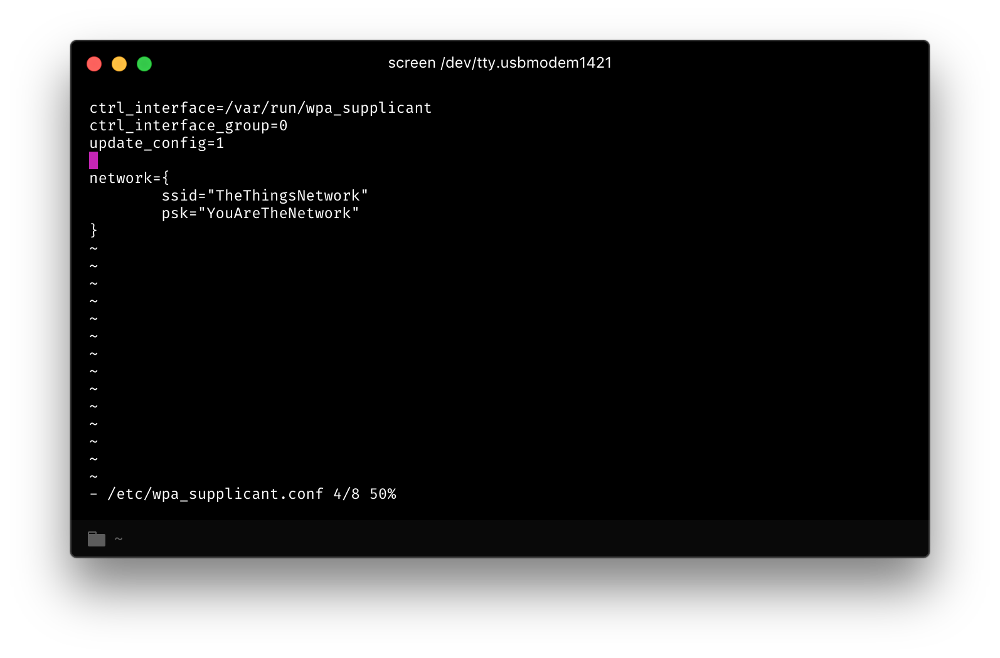

New models of Multitech Conduit now support Wi-Fi connectivity: ideal for environments where it is difficult to pass over an Ethernet cable.

## Connect to the Multitech Conduit
[Connect first](../mlinux.html#connect) to the Multitech Conduit - we'll need to execute some commands on the gateway.

## Configuring Wi-Fi connection
Once you're connected to the Conduit, let's configure it for your Wi-Fi network!

For this part, you'll need to be able to use a command-line text editor. If you've never used any, we recommend using [`nano`](https://www.nano-editor.org/dist/v2.1/nano.html) - an accessible, user-friendly text editor.

### Configuring the Wi-Fi network
Once connected to the gateway, open the `/etc/wpa_supplicant.conf` file:

```bash
$ nano /etc/wpa_supplicant.conf
```

We'll add extra lines at the end of this file, depending on the network you want to add.

+ If the network you want to add is not protected by a password, add those lines:

```
network={
        ssid="<ssid of the network>"
        key_mgmt=NONE
}
```

+ If the network is protected by a password, add those lines:

```
network={
        ssid="<ssid of the network>"
        psk="<password of the network>"
}
```

If there already is a `network={[...]}` configuration, delete it before adding your own network.



### Configuring the network interfaces
All you have to do left to enable Wi-Fi is to enable the Wi-Fi network interface. Open up the `/etc/network/interfaces` file, find the paragraph that begins with `auto wifi0`, and uncomment all the next lines.


### Reboot the gateway
Reboot your gateway, by typing this command: `shutdown -r now`.

When your gateway starts up, it should have connected to your Wi-Fi network! To verify this, execute the command `ifconfig` ; the system will show the available network interfaces. The `wifi0` should have appeared, with an associated IP for the gateway.
