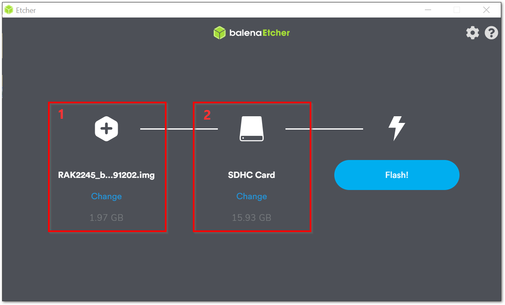

>**Note:** If you are planning to use the newly released Raspberry Pi 4 with the RAK2245, use the firmware which can be downloaded [here](https://downloads.rakwireless.com/LoRa/RAK2245-Pi-HAT/Firmware/)

An easy and quick way to have a fully functional gateway is by using a Precompiled Firmware Image provided. In this document, is the step by step instructions on how to install the Image into your SD Card used for the gateway.

## Burn the latest firmware
1. Download the latest firmware [here](https://downloads.rakwireless.com/en/LoRa/RAK2245-Pi-HAT/Firmware/), which is based on the Raspbian OS.
2. You need to use an image writing tool to install the firmware on the SD Card. For this, You will be using [Etcher](https://www.balena.io/etcher/), which is an open source utility used for burning image files.
3. Insert your SD Card into the SD Card reader and plug it into your Computer.
4. Open the Etcher Software, and select the downloaded image file thru the (**Label - 1**) button in the image below.

>Your SD Card should be automatically detected by the Etcher software in the Label-2 of the image below. If not, kindly ensure proper connection.

Click Flash and wait for a couple of minutes until it displays **"Flash Complete"**

