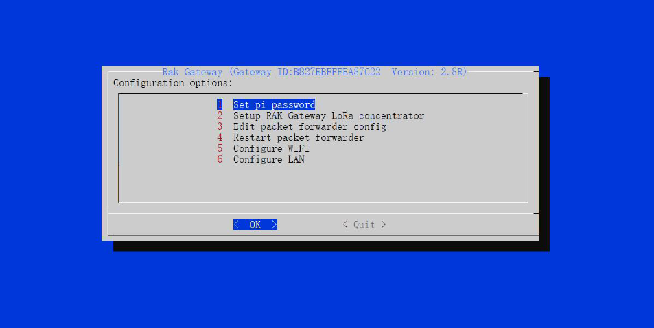
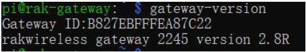
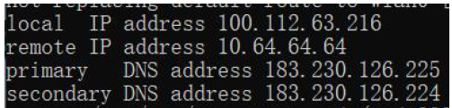

## Configuring the Gateway
Assuming you have successfully logged into your LoRa Gateway using SSH. Enter the following command in the command line:
```
sudo gateway-config
```

You will now then see a page like the following picture below



1. **Set pi password** - used to set/change the password of the LoRa Gateway.
2. **Set up RAK Gateway LoRa Concenterator** - used to configure the frequency, which the LoRa Gateway will operate on, and the LoRa Server which the LoRa Gateway will work with.
3. **Edit packet-forwarder config**- used to open the global_conf.json file, in order to edit LoRaWAN parameters manually.
4. **Restart packet -forwarder** - used to restart the LoRa packet forwarded process.
5. **Configure Wifi** - used to configure the Wi-Fi settings in order to connect to a network.
6. **Configure LAN** - used to configure the Ethernet adapter settings.

>**Gateway ID** A unique ID will be generated in for LoRa Gateway. This is also called Gateway EUI and is essential for registering the gateway with any LoRa Network Server (TTN, LoRaServer).


There is also another way to get your "Gateway ID", just enter the command below in the command line:

```
gateway-version
```



### Set a new password for the LoRa Gateway
It is a good security practice to change the default password **"raspberry"** which is the same on all Raspberry Pi devices.


You will be asked to enter your new password twice then press "Enter".

### Set up RAK Gateway LoRa concentrator
This menu allows you to select your LoRa frequency band and one of the two available Networks Server options:
* **TTN (The Things Network).** If you choose TTN as the LoRa Server, you will see the following page. Visit this [article](https://www.thethingsnetwork.org/docs/lorawan/frequencies-by-country.html) for more information on your local TTN frequency plan. This will allow you to choose the correct plan.


* **LoRaServer.** If you choose LoRaServer as your LoRa Server, you will see the following page:


Just like with TTN, choose the appropriate frequency for your country. Next, you need to set the IP Address of the LoRaServer, which you want your LoRa Gateway to work with.


The default IP Address is `127.0.0.1`. If you want to use an external LoRaServer, you need to set it to its IP Address.


## Connect the LoRa Gateway to a Router

If you want to use TTN or an independent LoRaServer which may be deployed in Local area network or Internet, you need to connect your LoRa Gateway to a router first.

### Connect through Wi-Fi
If you want to connect through Wi-Fi, it can easily be done with the Wireless capabilities of the Raspberry Pi.


There are 4 options to choose from in the Wi-Fi configuration menu:

1. **Enable AP Mode/Disable Client Mode** - the LoRa Gateway will work in Wi-Fi Access Point Mode after rebooting while the Wi-Fi Client Mode will be disabled (this is the default mode).
2. **Enable Client Mode/Disable AP Mode** - the LoRa Gateway will work in Wi-Fi Client mode after rebooting, while Wi-FI AP Mode will be disabled.
3. **Modify SSID and pwd for AP Mode** - used to modify the SSID and password of the Wi-Fi AP. Only works if the Wi-Fi AP Mode is enabled.
4. **Add New SSID for Client** - this is used if you want to connect to a new Wi-Fi Network. Only works in Wi-Fi Client mode.

### Connect through Ethernet
If you want to connect to router through Ethernet Cable, do the following steps:

* Just fill a static IP Address according to the IP address of the router you want to connect. Please note that the LoRa gateway and the router must be in the same network segment, otherwise the connection will fail.
* By default, the IP Address of the LoRa Gateway's Ethernet is `192.168.10.10`


* Then configure the IP address of the Router. This is the LAN Interface IP address of the router:


* Press OK then reboot the LoRa Gateway using the command `sudo reboot now` in the command line and it will connect to the router successfully through Ethernet.

## Connect the LTE (Only for the Cellular Version)

If you want to deploy your LoRa Gateway to a place where there is no option of connecting to the internet through Wi-Fi or Ethernet, you can still do this through LTE.

* First, make sure you have already inserted a suitable SIM Card into the RAK7243C Pilot Gateway. If not, turn off the gateway using the command `sudo shutdown now` and insert the card.

* Login to your gateway using SSH and enter the command `gateway-config` and choose Item 8. Configure LTE Module.


You will see 2 items:


There are 2 configuration Options for the LTE Module:

1. **Enable LTE Automatic Dial-up** - the LoRa Gateway will connect to LTE Automatically, when it boots.

2. **Disable LTE Automatic Dial-up** - the LoRa Gateway will not connect to LTE Automatically.

>**Note** By default, the LoRa Gateway will connect to LTE Automatically, when it boots. If you want to
disable it, choose "Disable LTE Automatic Dial-up"

* Now let's configure the LTE Network operator's information. You should make sure that the state of the LTE Connecting Automatically is disabled as of now!

* Open the built in serial port tool, by executing the following command:

```
sudo minicom -D /dev/ttyAMA0 -b 115200
```

Then you will be directed to minicom window:


* Try to enter the command `at` , if it returns **OK**, it means that you have opened the Serial Port Successfully!

>**Note** If you can't see "at" in the terminal, try to press "Ctrl + A" , then press "Z", then lastly press
"E".

* Now, execute the AT Command `at+cops=?` to query all LTE Networks around you. It may take several seconds. When it is done, you can see some information like this:


* The figure above is just a demo showing the different LTE Networks in China and may differ depending on your area. 

* Execute the AT Command `at+cops=1,0,XXX,YYY` to set the information of the LTE Network operator which you want to use. "XXX" is the operator identification name (ex: CHINA MOBILE, CHN-UNICOM, CHN-CT). "YYY" is the last number of the information for each operator - 0 for CHINA MOBILE.

* If it returns "**OK**" then you have set it successfully!

## Configure APN Name

Now, you should set the APN name for the pppd process too. Go back to configuration options and choose "**7 Configure APN name**":


The default APN Name is "HOLOGRAM". If you want to modify it, please note that the value must be a true and valid APN Name.Then, set the appropriate baud rate, its default value is 115200.


To test the LTE Function, execute the following command:

```
sudo pppd call gprs
```

A log will be displayed. At the end of it, you can see the local and remote IP address and the primary and secondary DNS:



* If you see valid addresses as in the image above, it means that the LoRa Gateway has connected to the LTE Network successfully!

* The last thing you should not forget to do, is to enable the LTE Connecting automatically when it starts.
