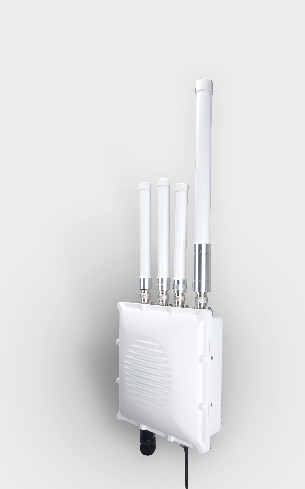

This document describes the details of the parts and functions of each of the components provided upon purchase of the RAK7249. Included also within the document are the necessary Gateway configuration steps to be followed. Take the warnings and notes into strict consideration to avoid damaging the device.

## First Time Power Up

### 1. Attach the antennas

First and foremost screw on the antennas. All 5 of them should be installed (WiFi, LoRa, LTE on the top, and GPS on the bottom). In case you do not desire to use one or more, make sure to terminate the port with a 50 Ohm load.

>**Note**: Do not power the device if any antenna port has been left open.

### 2. Power on the Gateway

It is recommended to use a CAT5 cable to provide power to the Gateway. Attach one end to the PoE injector and the other to the Ethernet port on the bottom of the casing.

### 3. Connecting to the Gateway

The connection can be done through Ethernet Port or WiFi. In both modes, the Management UI is accessible through a web browser directing to the IP address of the Gateway (check your router DHCP list).

* **WiFi AP Mode**

By default, the Gateway is configured to work in Access Point (AP) mode which has the following parameters:

SSID: **RAK7249_xxxx**, “xxxx” means the last 4 characters of MAC (no password is required to connect via WiFi).

Access Web UI: Connect via a browser to the default IP (**192.168.230.1**) of the gateway.

UI user: **root**

UI password: **root**

* **WAN port (DHCP IP) Mode**

Connect the Ethernet cable to the port marked “ETH” on POE injector and the other end to your Router. Find the IP address of your gateway on the DHCP list in your Router.

Access Web UI: Connect via a browser to the IP address of your gateway.

UI user: **root**

UI password: **root**

## Package Content

## Casing and Ports

