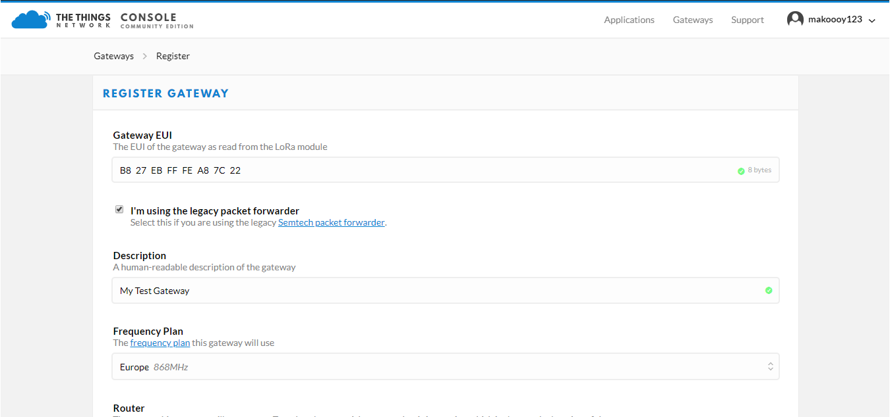

# Connecting the Gateway to The Things Network (TTN)

The Things Network is about enabling low power devices to use long range gateways to connect to an open-source, decentralized network to exchange data with Application. Learn more about the Things Network [here](https://www.thethingsnetwork.org/docs/).

* First, you should have connected your LoRa Gateway to the router in order to access the internet according to the method which has been introduced in the “Assembly Guide” in the previous section.

* Second, config your LoRa Gateway and choose TTN as the LoRa Server and choose a correct frequency according to the method which has been introduced in the Configuring the Gateway section.

* Now go to the [TTN Website](https://www.thethingsnetwork.org/) and Login. You will then see the following page:

* Choose Console then Click Gateway.

* All of your Registered Gateways will be displayed here in this page. Click "register gateway"

>**Note**: Make sure to select the “**I’m using the legacy packet forwarder**” option, before entering the Gateway EUI.

1. **Gateway** - The Gateway EUI can be found via the Overview page in the Web UI.
2. **Description** - A human readable description of your LoRa Gateway.
3. **Frequency Plan** - This is the frequency you want to use and it must be the same with LoRa Gateway and the LoRa Node. You may refer for your country's frequency plan through this [link](https://www.thethingsnetwork.org/docs/lorawan/frequency-plans.html).
4. **Router** - The router this gateway will connect to. To reduce latency, pick a router that is in a region which is close to the location of the gateway.
5. **Location** - Choose the location of the Gateway by entering its coordinates. This is reflected on the Gateway World Map!
6. **Antenna Placement** - Where is your antenna placed? Is it placed indoors or outdoors?

* Click Register Gateway and wait for a couple of minutes.

* Upon successful registration you should see the following screen:

Congratulations! Your LoRa Gateway has successfully connected to the The Things Network (TTN).