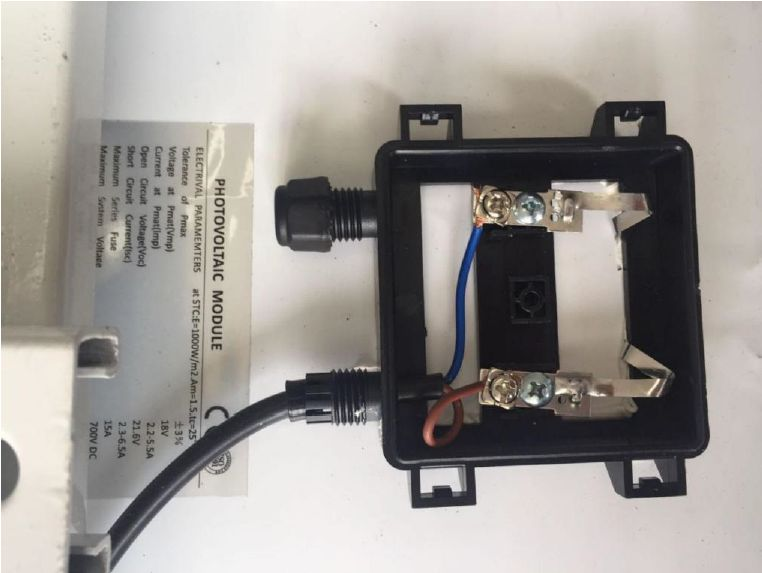

This document shows the step-by-step guide on how to set-up the Solar Panel and Battery Kit used for the RAK7249 - Macro Outdoor Gateway. Such steps must be thoroughly read and understood to avoid damaging the device.

## Package List

## Specifications

### Solar Panel

#### 1. Dimensions

The dimension of the Solar Panel included in the kit is **665 x 815 millimeter**. Provided in the image below is the detailed dimensions of the solar panel for extended functions.

#### 2. Electrical Characteristics

The table below is the electric characteristics of the Solar Panel included in the kit. It is best advised to have your electric parameters within the set values to maximize its functions and to avoid damage which could further affect your RAK7249 - Macro Outdoor Gateway' performance.

| Parameters                  | Value             |
|-----------------------------|-------------------|
| Maximum Power (Pmax)        | 80 Watts          |
| Voltage at Pmax (Vmp)       | 18 Volts          |
| Current at Pmax (Imp)       | 2.2 - 5.5 Amperes |
| Open Circuit Voltage (Voc)  | 21.6 Volts        |
| Short Circuit Current (Isc) | 2.3-6.5 Amperes   |

### Lithium Battery

#### 1. Electrical Characteristics

| Parameters             | Value               |
|------------------------|---------------------|
| Nominal Output Voltage | 12.6 Volts          |
| Nominal Output Current | 2 Amperes           |
| Capacity               | 50 Ah (Ampere-hour) |
| Charge Voltage         | 18 Volts            |

#### 2. Operational Temperature

The operational temperature of the Lithium Batter is **-20˚C ~ 60˚C**. It is advised to have your ambient temperature be within this temperature range to avoid failures or damage to the battery. 

#### 3. Dimensions

The dimension of the Lithium Battery included in the kit is **140 x 90 x 350 millimeter**.
## Installation Guide

1 . Install the bolts in the holes which are circled in red in the following image below. This will make an "**H-shaped**" base, for the Solar Panel to be mounted on top. The circular pipe in the middle of the shape is meant to fit over a circular shaped pole, so the whole construction sits on top with the panel facing upwards, on an angle.

>**Note**: Tighten the nuts and make sure that the rails that make up the base are holding tight against each other.

2 . Mount the battery on top of the two parallel rails in the middle. Make sure it is as close as possible to the middle of the construction. Fasten it to the rails with four bolts, each having a washer and a nut. Refer to the image below on how to insert the bolts into the railing that is part of the bottom of the battery casing.

>**Note**: Tighten the bolts as possible as the battery is quite heavy.

3 . Connect input port power cable of the Lithium Battery to the screw terminals on the back of the Solar Panel. The image below shows the connection on the back of the solar panel.

>**Note**: Make sure to follow the connection in the image below as interchanging the wires would reverse the polarity

* The following image then shows where the cable connection between the solar panel entering the input terminal on the battery performed in Step 3.

4 . Connect the Lithium Battery output terminal cable to the input power cable of the RAK7249 - Macro Outdoor Gateway as shown in the following figure.

5 . Mount the whole installation you have assembled on top of a circular pole. Put the panel facing up and insert the pole in the pipe opening on the bottom of the construction. Make sure the pole is of a sufficiently small diameter to fit with a recommended value of **65 millimeters**. Use **6 pieces of M8-bolts** to fix the bottom to the construction as shown in the image below.

## Important Things to Consider
* Reversing the polarity when connecting the battery is dangerous and may cause fire. Make sure you the power cord has been connected with the correct polarity.

* Your battery life will vary depending on local illumination intensity. For a 50Ah battery and an 80W solar panel, such as the ones used in the kit, the RAK7249 - Macro Outdoor Gateway should function for about 4 days. This is the worst case scenario where there is constant heavy rain and or constant presence of clouds.

* If you live in extreme condition environment that result in operational time significantly less than 4 days, reconsider into increasing the battery capacity and installing a solar panel with greater power output to compensate such issues.

## Optional Configurations
You can also try other configurations which is supported in RAK7249 Macro Outdoor Gateway. Click through the guides provided below to learn more. Enjoy!
* [Accessing the Gateway](https://doc.rakwireless.com/rak7249----macro-outdoor-gateway/accessing-the-gateway)
* [Amazon Web Services Platform](https://doc.rakwireless.com/rak7249----macro-outdoor-gateway/amazon-web-services-platform)
* [Web Management Platform](https://doc.rakwireless.com/rak7249----macro-outdoor-gateway/web-management-platform)
* [Lightning Protection - RAK7249](https://doc.rakwireless.com/rak7249----macro-outdoor-gateway/lightning-protection---rak7249)
* [Product Deployment Typical Application](https://doc.rakwireless.com/rak7249----macro-outdoor-gateway/product-deployment-typical-application)
* [LoRa Channel Customizing](https://doc.rakwireless.com/rak7249----macro-outdoor-gateway/lora-channel-customizing)
* [MQTT Bridge Configuration (TLS)](https://doc.rakwireless.com/rak7249----macro-outdoor-gateway/mqtt-bridge-configuration--tls-)
