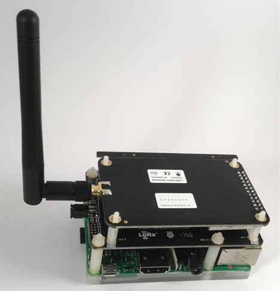
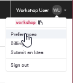
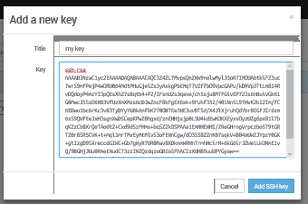
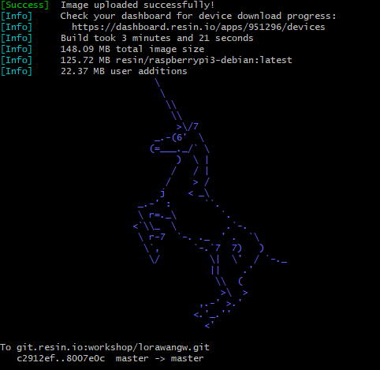
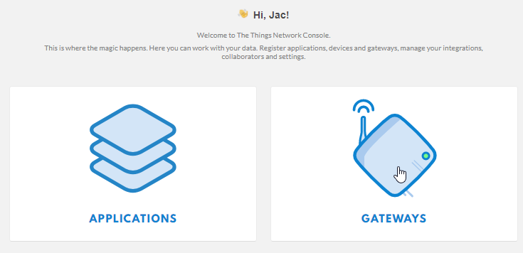

# Build your own RAK831 based gateway
This document is based on a workshop held during The Things Network Conference 2018.

[The slides used during that workshop.](TheThingsNetworkConference2018GatewayWorkshop.pdf)

In this workshop we will build a gateway based on the RAK831 and a Raspberry Pi model 3.


<span style="color:red">**NOTE:** Never power on the gateway without the antenna connected as shown in the picture</span>

## Preparations
The workshop requires some tools to be available on you system. Check the list below and
follow the link to the installation instructions if you do not have the tool installed.

* GIT commandline client. [windows](git-windows.md), [OSX](git-osx.md), for Linux use the tools from your distribution to install.
* For Windows and OSX: Etcher, SDcard writing software. [windows](etcher-windows.md), [OSX](etcher-osx.md)

You will also need a SSH public/private key pair, [generate a key pair](ssh.md) if you do not have it.

## Create resin.io account
If you do not have a resin.io account, now is the time to create it. Go to [signup](https://dashboard.resin.io/signup) to create it. (If you have an account skip to the next step)

On the first screen enter your e-mail address and a (secure) password.


Next you provide your first and last name, company if applicable and choose whether you will be using resin.io for a personal or professional project.


Now we need to add our public SSH key. Resin.io uses this key when we upload code to run on our devices.
In the upper right of the page click on the down arrow next to your name and select 'Preferences' from the menu.



Now select the tab "SSH keys" and click on "Enter SSH key manually"


In the next window you need to paste the **public** part of your SSH key. This is store in id_rsa.pub in the folder .ssh in your home folder (Windows: c:\users\<your username>\.ssh\id_rsa.pub, OSX /Users/<your username>.ssh/id_rsa.pub, Linux: /home<your username>/.ssh/id_rsa.pub)
Use your favorite editor to open the file and copy the contents to the form.



Save with "Add SSH key". Go back to the main page by clickin the resin.io logo in the top left of the page.

## Existing resin.io users
Go to http://resin.io and log in.

## Create a new application
On the resin.io main screen you are able to create a new application. The device type conveniantly defaults to Rapsberry Pi 3, which we will be using. Enter 'lorawangw' for the application name and proceed with 'CREATE NEW APPLICATION'


## Set Fleet configuration
The Raspberry Pi model 3 requires some settings to correct the timing and switch serial ports (not used in this setup, but would be required to access a GPS if it had been mounted)

1. In your browser go to 'FLEET'


2. Add:
<table>
<tr><th>Name</th><th>Value</th></tr>
<tr><td>RESIN_HOST_CONFIG_core_freq</td><td>250</td></tr>
<tr><td>RESIN_HOST_CONFIG_dtoverlay</td><td>pi3-miniuart-bt</td></tr>
</table>


## Add device
In the application select "Add device"


Leave all settings set to the default and click "Download resinOS".


Save the download to disk. (Remember where you save it!)

Once the download is finished, extract the contents of the zip file to disk (keep in mind the extracted file will be almost 2GB in size). In the next step we will write this file to SDcard.

## Write image to SDcard
Get the micro SDcard from the Raspberry Pi


Insert it into the SDcard writer (use a full size SDcard adapter if required).

Windows & OSX:
Open Etcher, click "Select image" and browse to the ISO file extracted in the previous step, verify the correct SDcard is choosen.


Once the right file and device have been click 'Flash!'. (On Windows this will show the UAC dialog, click 'Yes')

Proceed to the next step while Etcher is writing the image

Linux: 
Use dmesg to check which device is used for you SDcard. Check with mount if any partitions of it are mounted and unmount if this is the case.
Write the image to SDcard with dd.
```
sudo dd if=/tmp/resin-lorawangw-<revision>.img of=/dev/sdX bs=4M conv=sync
```
**NOTE:** Take care to select the right device, dd will quite hapily overwrite any disk, including your linux installation!

Proceed to the next step while dd is writing to the sdcard

## Add software to your application
Earlier we have created the resin.io application. Now we need to add the application code that should be run on the Raspberry Pi. For this we will use a prepared LoRaWAN gateway application available on github.

1. Open (OSX/Linux) Terminal or (Windows) Git Bash
2. Create a new directory to store the code on you local system go to it
```
mkdir lorawan-software
cd lorawan-software
```
3. Get the code from github

```
git clone https://github.com/jpmeijers/ttn-resin-gateway-rpi.git
```

The output should resemble:
```
Cloning into 'ttn-resin-gateway-rpi'...
remote: Counting objects: 27, done.
remote: Compressing objects: 100% (20/20), done.
remote: Total 27 (delta 4), reused 27 (delta 4), pack-reused 0
Unpacking objects: 100% (27/27), done.
```
4. Go to the newly created directory
```
cd ttn-resin-gateway-rpi
```
5. Now we need to couple this reposity to resin.io so we are able to send the code there. For this we need to execute the git command listed on our application page. (Top right)


6. Copy the text marked in the picture (for your application page) and paste it on the command line of your terminal/git bash.
```
git remote add resin <your resin.io account>@git.resin.io:<your resin.io account>/lorawangw.git
```
If the command runs successfully no output will be shown

7. Now we will push the code to resin.io, run
```
git push resin
```
The first time you run this command you will be see a message like
```
The authenticity of host 'git.resin.io (54.165.162.194)' can't be established.
ECDSA key fingerprint is SHA256:NfwmqnKId5cx1RWpebbEuuM87bCJbdyhzRnqFES9Nnw.
Are you sure you want to continue connecting (yes/no)?
```
Reply 'yes' to the question.

Next you will be prompted for the passphrase for your SSH key:
```
Enter passphrase for key '/c/Users/kersing/.ssh/id_rsa':
```
Enter the passphrase.

The upload starts and resin starts to build the image:
```
Counting objects: 27, done.
Delta compression using up to 4 threads.
Compressing objects: 100% (24/24), done.
Writing objects: 100% (27/27), 2.30 MiB | 3.71 MiB/s, done.
Total 27 (delta 4), reused 0 (delta 0)

[Info]     Starting build for workshop/lorawangw, user workshop
[Info]     Dashboard link: https://dashboard.resin.io/apps/951296/devices
[Info]     Building on arm02
[Info]     Fetching base images
[==================================================>] 100%
[Info]     Building Dockerfile.template project
```

This will take a few minutes. When the build is finished a unicorn will be shown.
Proceed with the next step while the build is running.



## Boot the gateway hardware
Eject the micro SDcard from your write and insert it into the Rapberry Pi SDcard slot. (Metal contacts at PCB side)

Make sure the antenna is connected to the RAK831 card (see pciture at the top), connect ethernet cable and power adaptor to the Raspberry Pi. Now plug the power adaptor into power socket.

The red LED on the Raspberry Pi should light and (after a few seconds) a green LED should start flashing.

Switch to your browser, select "DEVICES" on the left. After 1-2 minutes a device should appear in on the application page


If the build we started in the previous step is finished the node will start downloading, if not it will stay idle.

Click on the device name to open the device details


The top window on the right shows the output from the device. In this case it shows an error because the software attemped to start but is missing configuration parameters

## Add the gateway to the TTN console
To configure our gateway we need to add it in the TTN console.

1. Use your TTN credentials to log in to https://console.thethingsnetwork.org/
2. In the main screen click on gateways



3. Click on "register gateway" (or "Get started by registering one")


4. In the form enter the following values:

	* For 'Gateway ID', choose a unique name for the gateway, allowed A-Z, a-z, 0-9 and -
	* Do **not** check 'legacy packet forwarder'
	* For 'Description', enter a human read-able description
	* For 'Frequency Plan', choose the one appropriate for your location, for Amsterdam use Europe 868MHz
	* For 'Router', choose the one closest to you. Routers prefixed with 'ttn-' are public ones operated by The Things Network. 
	switch-router is based in Switzerland and meshed-router is Australian.
	* For 'Location', choose your location on the map
	* For 'Antenna Placement', choose Indoor/Outdoor as appropriate


Click "Register Gateway" to proceed.

The result should look like:


Keep this window open, you need it to copy-and-paste information

## Configure your device
Switch to your resin.io page. If you do not have the device summary page open, open it now.


Click on "ENVIRONMENT VARIABLES".

You need to add three variables:
1. Name the first one "GW_ID" (no quotes) and copy the value listed for the "Gateway ID" in the TTN console.
2. Name the second one "GW_KEY" (no quotes), on the TTN console click on the little eye icon to the right of "Gateway Key", this will display the value. Now use the icon at the end of the line to copy the value (and display "copied")


3. Paste this value and add.
4. Enter "GW_RESET_PIN" (no quotes) and value 11.


Once set (and the software download has finished) the software will start. If the software starts correctly you will see "concentrator started" in the output in the resin.io Logs.


In the TTN console the "Last seen" status should change to somthing between 0 and 60 seconds


In the TTN console switch to "Traffic". If there are any nodes nearby sending data (should be the case during the conference), packets will show


Congratulations, the gateway is now operational!
