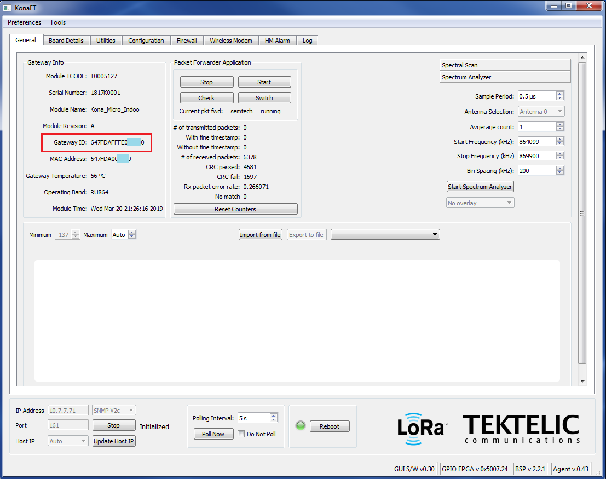
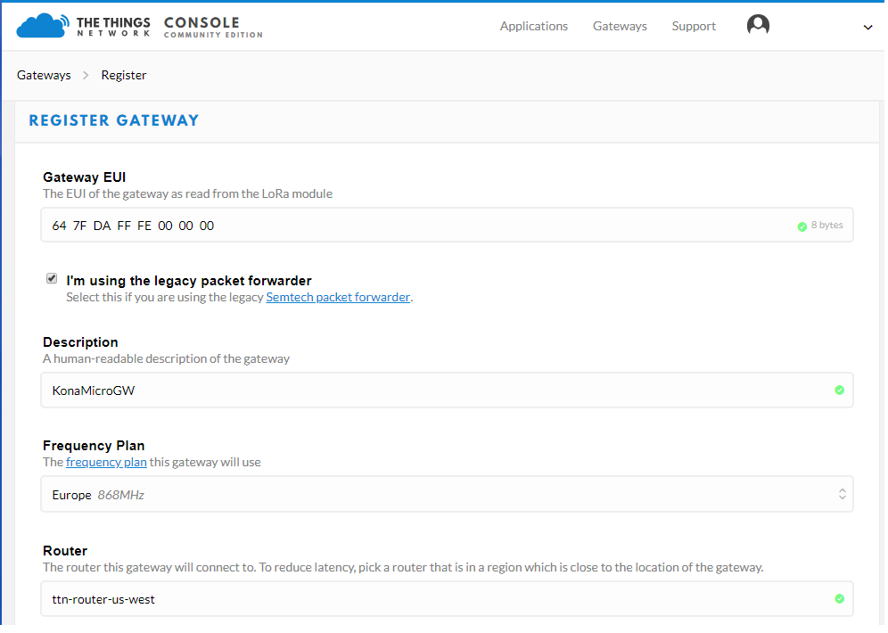

# KONA Micro IoT Gateway

The KONA Micro IoT Gateway is designed for enterprise and lightweight industrial applications that require &quot;Always On&quot; connectivity.  Configured with an internal 3G/4G modem and a built-in battery backup, the KONA Micro IoT gateway continues to operate and transmits sensor data to the network even when the main site has lost power.

Simple to configure and cost effective, it is an ideal hub for deployment of enterprise-level applications in areas where LoRaWAN coverage is not yet readily available or for private networks where the operator requires unfettered access to the gateways regardless of their deployment location.

## Key Features

- Time Division Duplex (TDD) 8 Rx / 1 Tx Channels
- Global Frequency Bands: NA915, EU868, AS923, JP920, CH779
- Extremely Compact, Simple, Reliable and Fully Integrated System
- Copper Ethernet & Global 3G/4G Backhaul Options
- Up to 27dBm Tx Power per Antenna
- Superior Receiver & Transmitter RF Performance
- Integrated 4 Hour Battery Back-up
- Enterprise Design IP-31 Enclosure, 0°C to +40°C
- Multiple Deployment & Mounting Options (Wall, Desk, Rack)
- Comprehensive KonaFT OA&M Tool
- Low Total Cost of Ownership Solution (Deployment and Maintenance)  

## Provisioning on TTN Network Server

This application note outlines the procedure to provision a Kona Gateway on The Things Network (TTN) Network Server.

### 1.1 Required Equipment

- Computer running Windows XP/7/10
- Kona Micro/Macro/Mega Gateway
- Power source
- KonaFT software self-extracting installer
- Cat 5/5e/6 Network cable

### 1.2 Gateway Setup

 1. Connect the Ethernet ports of the gateway and computer as illustrated below.
 2. Copy the KonaFT self-extracting installer software onto the computer then double-click on the installer icon to start the installation process.
 3. Apply power to the Kona Gateway (refer to product specific user&#39;s guide).  Boot up time of the Gateway is approximately 2 minutes. During boot up, the LED status is Flashing Green.
 4. The Kona Gateway supports DHCP on the Ethernet port. The Gateway MAC address is printed on the Gateway label. Using KonaFT and the MAC address determine the IP address of the Gateway.
 - In KonaFT select **Tools** , then select **Find My Gateway** , then press **Scan**. When scanning is complete click then entry that corresponds to the Gateway&#39;s MAC address and press **Select**.
 
 5. The Gateway&#39;s IP address should appear in the bottom left corner of the KonaFT GUI.  Ensure the port number is set to 161 (default), then select the Start button.
 6. Take note of the Gateway ID.  This information is required for registering the gateway on the Network Server.
 

### 1.3 Registering the Gateway on TTN

 1. Create a new TTN account or login to your previously created TTN account.
 2. Click the dropdown arrow next to the User, and select **CONSOLE**.
 3. Select **Gateways** , and then select **Register Gateway**.
 4. Under Gateway ID, check the Legacy Packet Forwarder checkbox.
 5. Under Gateway EUI, enter the 8 byte gateway ID recorded in one of the previous steps.
 6. Under Description add a human readable description of the gateway.
 7. Select a frequency plan from the dropdown box that corresponds to the frequency band supported by the Gateway.
 8. Select a router, picking the one that&#39;s closest to the physical location of the gateway to reduce latency.
 9. Add location and antenna placement if desired (optional).
 
 10. Click **Register Gateway**.

### 1.4 Configuring the Gateway to connect to TTN

 1. From KonaFT select the **Configuration** tab.
 2. Press the **Refresh files** button and then select **config.json** from the drop down menu.
 
 3. Press the **Read** button.
 
 4. Edit the config.json file to update the server\_address (router address) to point the gateway to the correct router.  Refer to [https://www.thethingsnetwork.org/docs/gateways/packet-forwarder/semtech-udp.html](https://www.thethingsnetwork.org/docs/gateways/packet-forwarder/semtech-udp.html).
 
 5. Add the Gateway ID (EUI).
 
 6. Press **Write** to save the changes to the config.json file.
 7. Reboot the Gateway.
 8. The Gateway should now connect to The Things Network.
