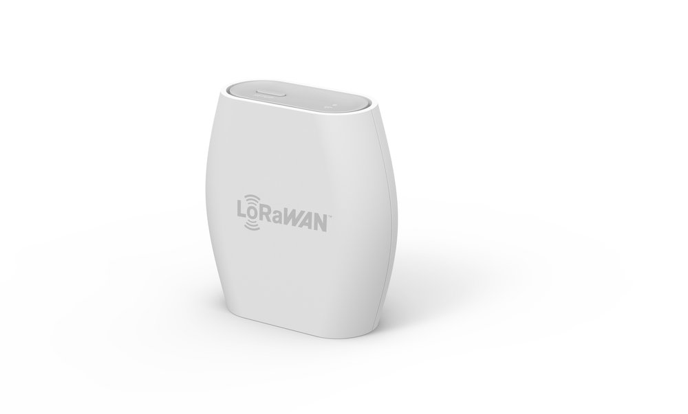


Instructions for connecting (claiming) The Things Indoor Gateway are available at [The Things Stack - The Things Indoor Gateway](https://www.thethingsindustries.com/docs/gateways/thethingsindoorgateway/).


The Things Indoor Gateway(TTIG) is designed to be a fully compliant, ultra low-cost LoRaWAN gateway, with WiFi as the backhaul. The gateway comes with a wall plug, and can be powered over USB-C on 900mA, making the gateway even suitable for applications that require dynamic coverage.

**Salient Features:**
* An ultra low cost 8 channel LoRaWAN indoor gateway for less than $100.
* One of the first gateways to support the state-of-the-art [BasicStation](https://doc.sm.tc/station/) Protocol.
* Supports LBT.
* Simple setup steps taking less than 5 mins.
* Can connect to any network backend of choice.
* Setup and Connectivity over WiFi.
* Can be powered up via a USB-C cable or via an elegant connector to the power outlet.
* Built-in omnidirectional antenna for indoor use.
* EU868, US915, AS923 and CN470 versions available.
* Security via a range of [modes](https://doc.sm.tc/station/authmodes.html).

## Buying The Things Indoor Gateway

**Links:**
* Amazon - US - [link](https://www.amazon.com/dp/B08L6BWNJR)
* Amazon - EU - [link](https://www.amazon.de/dp/B09HHGZGJP)
* RS Components - [link](https://uk.rs-online.com/web/p/radio-frequency-development-kits/1843981/)
* Connected Things - [link](https://connectedthings.store/gb/lorawan-gateways/the-things-indoor-gateway-868-mhz.html)
* IoT Shop - DE - [link](https://iot-shop.de/produkt/the-things-indoor-gateway)
* Allied Electronics - [link](https://www.alliedelec.com/product/rs-components-uk/ttig-915/71600476/)
* Antratek Electronics - EU - [link](https://www.antratek.com/the-things-indoor-gateway)
* Seeed - AU - [link](https://www.seeedstudio.com/The-Things-Indoor-Gateway-AU-p-4711.html)

Need help or more info? Drop us a [line](mailto:hardware@thethingsindustries.com).

## Activate your gateway in under 5 min

Please refer to the updated docs for connecting this gateway to The Things Stack - [link](https://www.thethingsindustries.com/docs/gateways/thethingsindoorgateway/)

## Resources

Find the datasheet in PDF [here](TTIG_datasheet.pdf)
