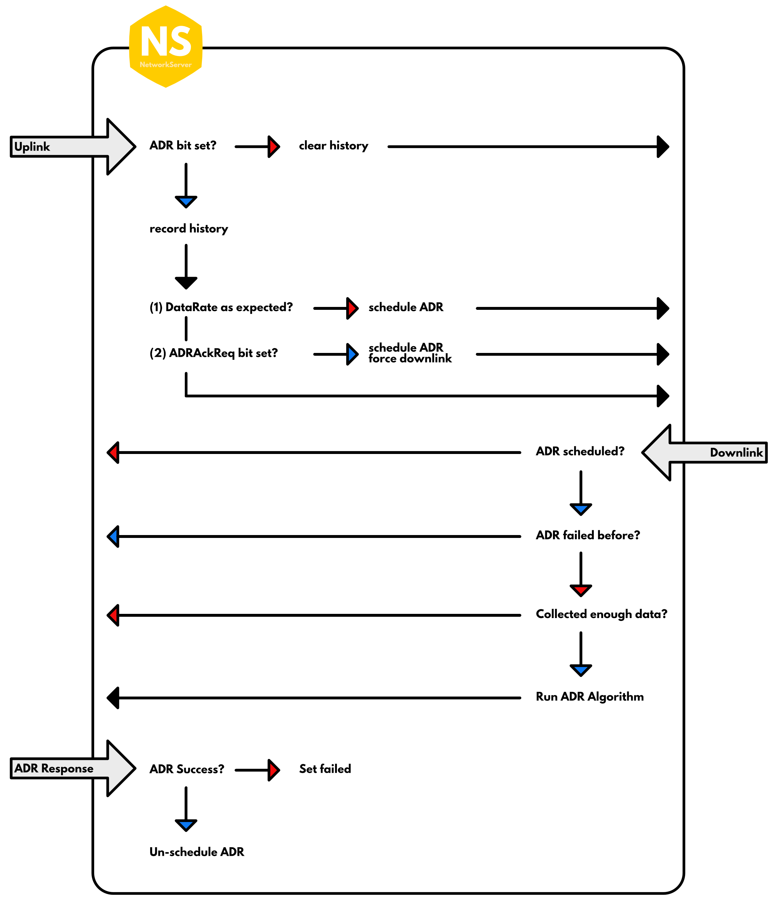
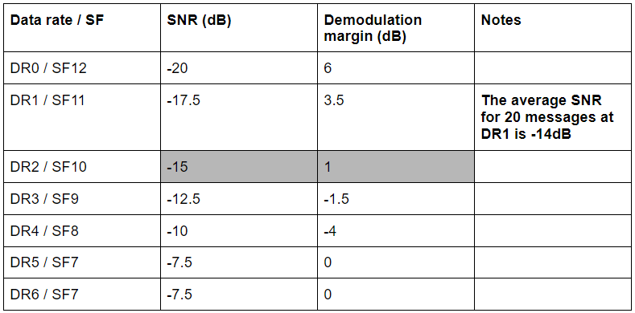
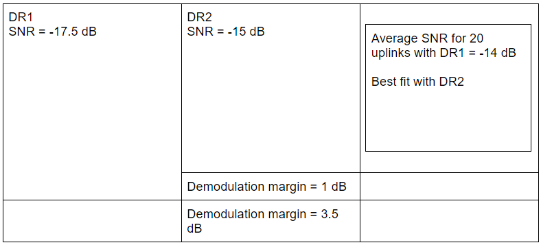

Adaptive Data Rate (ADR) is a mechanism for optimizing data rates, airtime and energy consumption in the network. ADR should be enabled whenever an end device has sufficiently stable RF conditions. This means that it can generally be enabled for static devices. If the static end device can determine that RF conditions are unstable (for example, when a car is parked on top of a parking sensor), ADR should (temporarily) be disabled. Mobile end devices should be able to detect when they are stationary for a longer times, and enable ADR during those times. End devices decide if ADR should be used or not, not the application or the network.

To determine the optimal data rate, the network needs some measurements (uplink messages). Currently TTN takes the 20 most recent uplinks, starting at the moment the ADR bit is set. These measurements contains the frame counter, signal-to-noise ratio (SNR) and number of gateways that received each uplink. When a device unsets the ADR bit (because it knows it is moving or it knows RF conditions are unstable), previous measurements are discarded. As soon as the ADR bit is set again, the network starts measuring again.

For each of these measurements, we take the SNR of the best gateway, and we calculate the so-called "margin", which is the measured SNR minus the required SNR to demodulate a message given the data rate. This margin is used to determine how much we can increase the data rate or lower the transmit power. For example, when the network receives a message with data rate `SF12BW125` and SNR `5.0`, that message has a margin of 25 dB. This is a waste of valuable airtime and energy. If we would increase the data rate to `SF7BW125` we would still have a margin of 12.5 dB, but that would be many times more airtime- and energy efficient. We could even lower the transmit power to save even more energy and cause less interference.

There are a several moments when an ADR request is scheduled or sent:

1. The initial ADR Request (for US915 and AU915). This is sent immediately after join and is mainly used to set the channel mask of the device. This one is a bit tricky, because we don't have enough measurements for setting an accurate data rate. To avoid silencing the device, we use an extra "buffer" of a few dB here. This request is only needed with pre-LoRaWAN 1.1 on our v2 stack. With LoRaWAN 1.1 devices on our v3 stack, we can set the channel mask in the JoinAccept message. ABP devices pre-LoRaWAN 1.1 will only get this message once, if they reset after that, they won't get the message again; this issue is also solved by LoRaWAN 1.1.
2. A regular ADR request is scheduled when we have enough measurements and the current data rate is not optimal. The request is only scheduled, and will be attached to an existing application downlink (such as an ACK or downlink payload).
3. An ADR request is sent when we have enough measurements and the device is using DR0 (SF12BW125 in most regions).
4. An ADR request is sent when the device sets the ADRAckReq bit. By default this happens after sending 64 uplinks without receiving a downlink, but as that depends on the device implementation we can't give you an exact number here.

ADR requests are no longer scheduled or sent if the device refused several ADR requests. This could either mean a bad implementation of the device, or a version mismatch between the device and the server.

The algorithm used in The Things Network is based on Semtech's recommended algorithm for rate adaptation. The following diagram outlines the ADR flow as implemented in The Things Network's NetworkServer:

## Adaptive Data Rate (ADR)

In this chapter, we will briefly look at the **Adaptive Data Rate (ADR)** mechanism used in LoRaWAN networks. Adaptive Data Rate allows for easy **scaling of** a LoRaWAN network, simply by adding **gateways** and **end nodes**.

The data rate impacts the device radio power consumption and Time-on-Air (TOA). LoRaWAN features a built-in mechanism for the adaptive management of the end device data rate. The Adaptive Data Rate (ADR) helps to minimize the Time-On-Air (TOA) and to reduce the transmission energy.

The ADR mechanism controls the following transmission parameters of an end device.

*   Spreading factor
*   Bandwidth
*   Transmission power

ADR can optimize the device’s power consumption while ensuring that it is still being received by the gateway. When ADR is in use, the network server will indicate to the end device that it should reduce its transmission power or increase its data rate. 

For example, ADR instructs end devices close to a gateway to use a low spreading factor (higher data rate), since they need very little link budget and shorter Time-On-Air to send uplink messages. ADR instructs end devices with low SNR to increase spreading factor (lower data rate) since they need a large link budget and longer Time-On-Air. The higher spreading factors also provide increased processing gain and higher reception sensitivity.

Adaptive Data Rate (ADR) is a simple mechanism that changes the end device’s data rate based on the following rules:

*   If the link budget is high, the data rate can be decreased by using a high spreading factor (SF11).
*   If the link budget is low, the data rate can be increased by using a low spreading factor (SF7)

Adaptive Data Rate is suitable for devices with particular RF conditions, for example, end devices that do not move. Adaptive Data Rate is not suitable for moving devices, such as animal trackers and vehicle trackers (or any mobile device). For these devices, the Non-Adaptive Data Rate mechanism can be implemented, which transmits messages using a few sets of data rates and uses a predefined pattern to select the next data rate. However, mobile end devices can also temporarily enable ADR if they will remain stationary for a long time.

An end device will decide when to use ADR (although the network server can also force the device's MAC layer to set or unset the ADR bit). The end device requests that the network server control its transmission parameters by setting the ADR flag in an uplink frame header. The network server collects the 20 most recent uplink transmissions for the device, averages the Signal-to-Noise Ratio (SNR) values, and then determines how much margin there is.

The following table presents SNR and demodulation margin for each data rate.

For example, the calculated average SNR for 20 uplink messages with DR1 is -14dB. This is the best fit for DR2 because the SNR of DR2 is -15dB and its demodulation margin is 1 dB. So we have enough margin for demodulating the signal with DR2.

The network server would then schedule a downlink with a MAC command for the end device to increase its data rate to DR2.

## Questions

1. The Adaptive Data Rate is suitable for
   - Static end devices
   - Mobile end devices
    
    
2. The end devices located close to a gateway should use a
   - Lower data rate
   - Higher data rate
   
   
3. The end devices located several kilometers from a gateway should use a
   - Lower data rate
   - Higher data rate
    
    
4. A higher data rate means,
   - A lower spreading factor
   - A higher spreading factor
   
   
5. Which of the following end devices should not implement ADR?
   - Environmental sensor
   - Water leakage detector
   - Pet tracker
   - Gas detector
