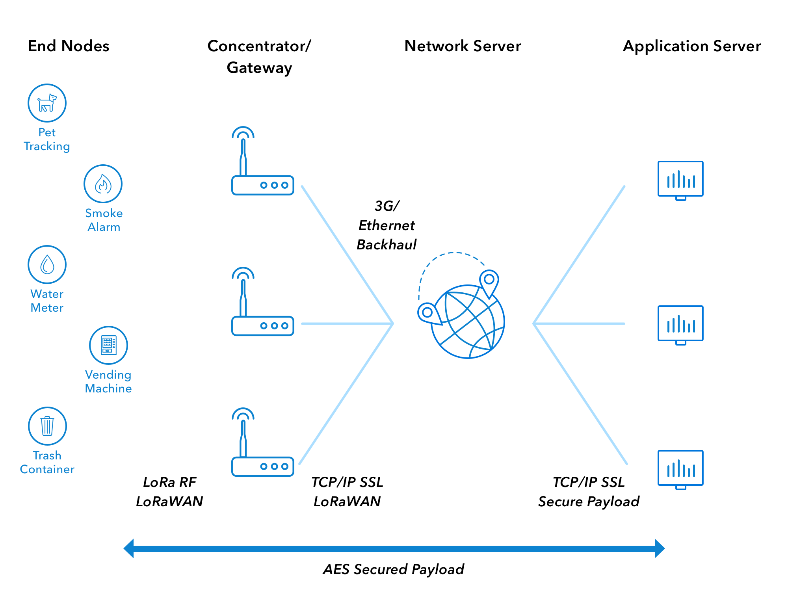

LoRaWAN is a media access control (MAC) protocol for wide area networks. It is designed to allow low-powered devices to communicate with Internet-connected applications over long range wireless connections. LoRaWAN can be mapped to the second and third layer of the OSI model. It is implemented on top of LoRa or FSK modulation in industrial, scientific and medical (ISM) radio bands. The LoRaWAN protocols are defined by the LoRa Alliance and formalized in the LoRaWAN Specification which can be downloaded on the LoRa Alliance website.

*Image: LoRaWAN Architecture*

* **[End Device, Node, Mote]()** - an object with an embedded low-power communication device.

* **[Gateway]()** - antennas that receive broadcasts from End Devices and send data back to End Devices.

* **[Network Server]()** - servers that route messages from End Devices to the right Application, and back.

* **[Application]()** - a piece of software, running on a server.

End devices communicate with nearby gateways and each gateway is connected to the network server. LoRaWAN networks use an ALOHA based protocol, so end devices don’t need to peer with specific gateways. Messages sent from end devices travel through all gateways within range. Message deduplication is handled by the network server.

Let’s examine each element of the LoRaWAN network in detail.

### End devices

A LoRaWAN end device can be a sensor, an actuator, or both. They are often battery operated. These end devices are wirelessly connected to the LoRaWAN network through gateways using LoRa RF modulation. The following figure shows an example LoRaWAN end device - a water meter.

### Gateways

Each gateway is registered to a LoRaWAN network. A gateway receives LoRa messages from end devices and simply forwards them to the LoRaWAN network server. Gateways are connected to the internet through an IP backbone. IP traffic from gateway to the network server can be **backhauled** through Cellular (3G/4G/5G), WiFi, Ethernet, Fiber-optic or 2.4 GHz radio links. 

#### Types of LoRaWAN Gateways

LoRaWAN gateways can be categorized into indoor (picocell) and outdoor (macrocell) gateways. Indoor gateways provide coverage in difficult-to-reach indoor locations and are therefore suitable for use in homes, businesses and buildings. 

_Figure: The Things Indoor gateway_

Outdoor gateways are suitable for providing coverage in rural, urban, and dense urban areas. This type of gateway is intended for deployment places like cellular towers, the rooftops of very tall buildings, metal pipes (masts) etc. The following figure shows a LoRaWAN gateway attached to a tall metal pipe (mast).

_Figure: A Kerlink outdoor gateway is installed at the port of Amsterdam._

Usually, the receiver sensitivity of an outdoor gateway is higher than the receiver sensitivity of an indoor gateway.

### Network Server

The network server manages the entire LoRaWAN network. It receives IP traffic from gateways. The Network Server is responsible for network management functions like:

*   **Over-The-Air-Activation** - see chapter [End Device Activation](../end-device-activation)
*   **Message deduplication** - eliminating duplicate messages received by multiple gateways
*   **Message routing** - forwarding uplink application payloads to the appropriate application server, forwarding downlink messages coming from any application server to the end device, forwarding Join-request and Join-accept messages between the devices and the join server (in v1.1 and 1.0.4).
*   **Adaptive data rate control** - see chapter [Adaptive Data Rate](../adaptive-data-rate)
*   **Acknowledgement of messages** - providing acknowledgement of confirmed data messages and some MAC commands.

### Application Server

The application server processes application-specific data messages received from end devices. It also generates all the application-layer downlink payloads and sends them to the connected end devices through the network server. A LoRaWAN network can have more than one application server. The collected data can be interpreted by applying techniques like machine learning and artificial intelligence to solve business problems.

### Join Server

The Join Server processes join-request messages sent by end devices. It stores root keys, generates session keys, and transfers those session keys to the network server and the application server. The Join Server is introduced in LoRaWAN 1.1 and 1.0.4. You will learn how the Join Server processes the join-request message in the chapter [End Device Activation](../end-device-activation).

## Questions 

1. Who initiates uplink messages?
   - Network server
   - End devices
   - Application server
   - Join server
   
   
2. What is not a role of the Network Server?
   - Data deduplication
   - Initiate uplink messages
   - Adaptive data rate control
   - Message routing
   
   
3. Which is not a backhaul for gateways?
   - Cellular
   - WiFi
   - Ethernet
   - Grounding wire with a lightning arrestor
   
   
4. The Application server processes:
   - MAC commands
   - Application-specific data messages
   - Join-request messages
   
   
5. The Join Server processes:
    - Join-request messages
    - MAC commands
    - Application-specific data messages
