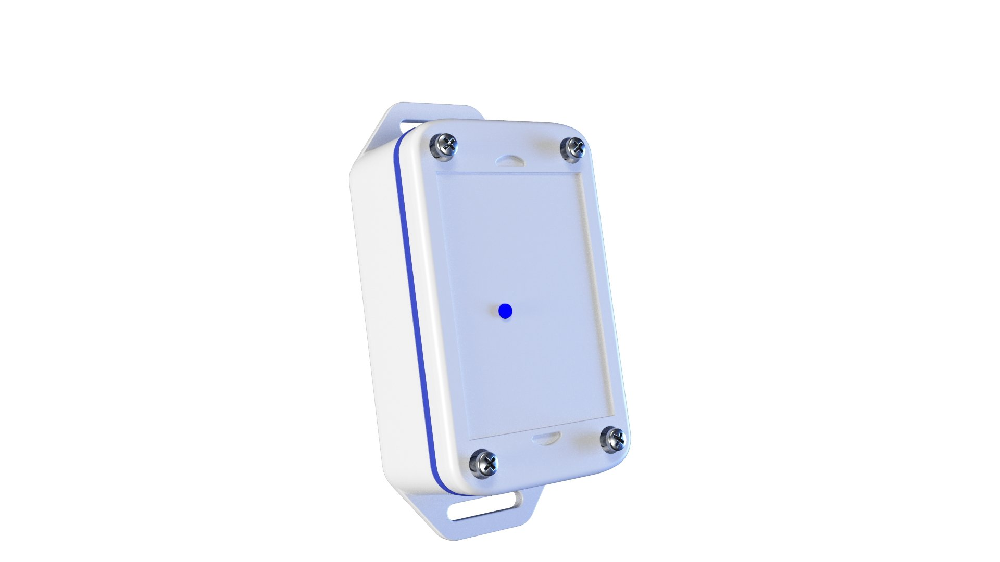
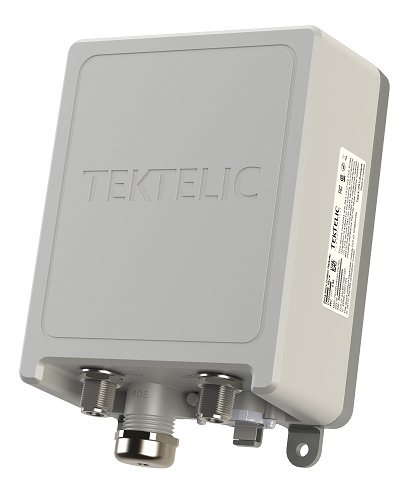

LoRaWAN networks are deployed in a **star-of-stars** topology. 

A typical LoRaWAN network consists of the following elements.

*Figure: A typical LoRaWAN network architecture*

* **End Devices** - sensors or actuators send LoRa modulated wireless messages to the gateways or receive messages wirelessly back from the gateways.
.

* **Gateways** - receive messages from end devices and forward them to the Network Server.

* **Network Server** - a piece of software running on a server that manages the entire network.

* **Application servers** - a piece of software running on a server that is responsible for securely processing application data.

* **Join Server** - a piece of software running on a server that processes join-request messages sent by end devices (The Join Server is not shown in the above figure).

End devices communicate with nearby gateways and each gateway is connected to the network server. LoRaWAN networks use an ALOHA based protocol, so end devices don’t need to peer with specific gateways. Messages sent from end devices travel through all gateways within range. These messages are received by the Network Server. If the Network Server has received multiple copies of the same message, it keeps a single copy of the message and discards others. This is known as message deduplication.

Let’s examine each element of the LoRaWAN network in detail.

### End devices

A LoRaWAN end device can be a sensor, an actuator, or both. They are often battery operated. These end devices are wirelessly connected to the LoRaWAN network through gateways using LoRa RF modulation. The following figure shows an end device that consists of sensors like temperature, humidity, and fall detection.

*Figure: LoRaWAN end device - The Things Industries Generic Node Sensor Edition*

### Gateways

Each gateway is registered (using configuration settings) to a LoRaWAN network server. A gateway receives LoRa messages from end devices and simply forwards them to the LoRaWAN network server. Gateways are connected to the Network Server using a **backhaul** like Cellular (3G/4G/5G), WiFi, Ethernet, fiber-optic or 2.4 GHz radio links.

#### Types of LoRaWAN Gateways

LoRaWAN gateways can be categorized into indoor (picocell) and outdoor (macrocell) gateways. 
Indoor gateways are cost-effective and suitable for providing coverage in places like deep-indoor locations (spaces covered by multiple walls), basements, and multi-floor buildings. These gateways have internal antennas or external ‘pigtail’ antennas. However depending on the indoor physical environment some indoor gateways can receive messages from sensors located several kilometers away.
 
The following figure shows The Things Indoor gateway designed to be directly plugged into an AC power outlet.

*Figure: The Things Indoor gateway*

Outdoor gateways provide a larger coverage than the indoor gateways. They are suitable for providing coverage in both rural and urban areas. . These gateways can be mounted on cellular towers, the rooftops of very tall buildings, metal pipes (masts) etc. Usually an outdoor gateway has an external antenna (i.e. Fiberglass antenna) connected using a coaxial cable.
If you are good at hacking electronic products, you can convert some indoor gateways to outdoor gateways using water/dust proof enclosures and adding external antennas.
 
The following figure shows a LoRaWAN outdoor gateway. It has connectors for connecting external LoRaWAN, 3G/4G, and GPS antennas. Can you figure them out?

*Figure: Tektelic Enterprise Outdoor Gateway*

Usually, the receiver sensitivity of an outdoor gateway is higher than the receiver sensitivity of an indoor gateway.

### Network Server

The Network Server manages gateways, end-devices, applications, and users in the entire LoRaWAN network.

A typical LoRaWAN Network Server has the following features. 

* Establishing secure 128-bit AES connections for the transport of messages between end-devices and the Application Server (end-to-end security).
* Validating the authenticity of end devices and integrity of messages.
* Deduplicating uplink messages.
* Selecting the best gateway for routing downlink messages.
* Sending ADR commands to optimize the data rate of devices.
* Device address checking.
* Providing acknowledgements of confirmed uplink data messages.
* Forwarding uplink application payloads to the appropriate application servers
* Routing uplink application payloads to the appropriate Application Server.
* Forwarding Join-request and Join-accept messages between the devices and the join server
* Responding to all MAC layer commands.

### Application Server

The Application Server processes application-specific data messages received from end devices. It also generates all the application-layer downlink payloads and sends them to the connected end devices through the Network Server. A LoRaWAN network can have more than one Application Server. The collected data can be interpreted by applying techniques like machine learning and artificial intelligence to solve business problems.

### Join Server

The Join Server assists in secure device activation, root key storage, and session key generation. The join procedure is initiated by the end device by sending the Join-request message to the Join Server through the Network Server. The Join-server processes the Join-request message, generates session keys, and transfers NwkSKey and AppSKey to the Network server and the Application server respectively.
The Join Server was first introduced with LoRaWAN v1.1. It is also availabe in LoRaWAN v1.0.4.  

## Questions 

1. Who initiates uplink messages?
   - Network server
   - End devices
   - Application server
   - Join server
   
   
2. What is not a role of the Network Server?
   - Data deduplication
   - Initiate uplink messages
   - Adaptive data rate control
   - Message routing
   
   
3. Which is not a backhaul for gateways?
   - Cellular
   - WiFi
   - Ethernet
   - Grounding wire with a lightning arrestor
   
   
4. The Application server processes:
   - MAC commands
   - Application-specific data messages
   - Join-request messages
   
   
5. The Join Server processes:
    - Join-request messages
    - MAC commands
    - Application-specific data messages
