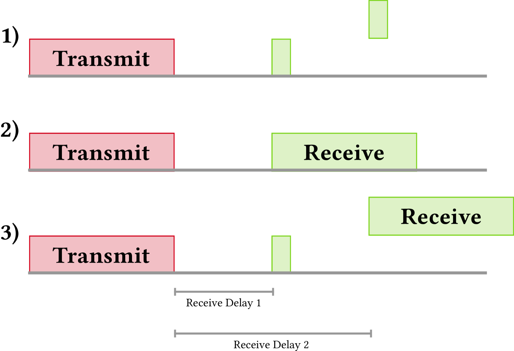

# Classes

The LoRaWAN specification defines three device types. All LoRaWAN devices must implement Class A, whereas Class B and Class C are extensions to the specification of Class A devices.

## Class A

**Class A** devices support bi-directional communication between a device and a gateway. Uplink messages (from the device to the server) can be sent at any time (randomly). The device then opens two receive windows at specified times (1s and 2s) after an uplink transmission. If the server does not respond in either of these receive windows (situation 1 in the figure), the next opportunity will be after the next uplink transmission from the device. The server can respond either in the first receive window, or in the second receive window, but should not use both windows.

## Class B

**Class B** devices extend Class A by adding scheduled receive windows for downlink messages from the server. Using time-synchronized beacons transmitted by the gateway, the devices periodically open receive windows.

## Class C

**Class C** devices extend Class A by keeping the receive windows open unless they are transmitting, as shown in the figure below. This allows for low-latency communication but is many times more energy consuming than Class A devices.

