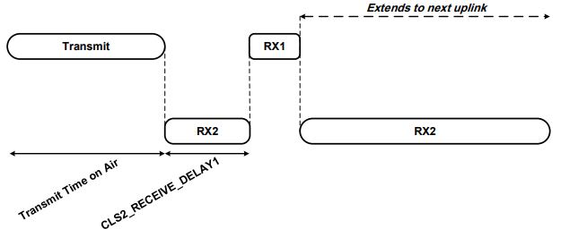

The LoRaWAN specification defines three device types. All LoRaWAN devices must implement Class A, whereas Class B and Class C are extensions to the specification of Class A devices.

## Class A

**Class A** devices support bi-directional communication between a device and a gateway. Uplink messages (from the device to the server) can be sent at any time (randomly). The device then opens two receive windows at specified times (1s and 2s) after an uplink transmission. If the server does not respond in either of these receive windows (situation 1 in the figure), the next opportunity will be after the next uplink transmission from the device. The server can respond either in the first receive window, or in the second receive window, but should not use both windows.

## Class B

**Class B** devices extend Class A by adding scheduled receive windows for downlink messages from the server. Using time-synchronized beacons transmitted by the gateway, the devices periodically open receive windows.

## Class C

**Class C** devices extend Class A by keeping the receive windows open unless they are transmitting, as shown in the figure below. This allows for low-latency communication but is many times more energy consuming than Class A devices.

## Device Classes

LoRaWAN end devices are categorized into three different classes based on the **mode of operation**. They are,

*   Class A (all end devices)
*   Class B (beacon)
*   Class C (continuous)

## Class A - All end devices

All LoRaWAN end devices **must** support **Class A** operation. The Class A communication is always **initiated** by the **end device** and is **fully asynchronous**. A **Class A** end-device can send an **uplink** message at any time and is followed by two short receive windows (also called receive slots) named RX1 and RX2. The following diagram illustrates Class A operation.

Figure: Class A receive windows

*   **RX1** – first short receive window
*   **RX2** – second short receive window
*   **RECEIVE_DELAY1** – the duration between the end of the **uplink transmission** and the start of the **first receive window (RX1)**. During this time, the end device goes into sleep mode. The **default** value for **RECEIVE_DELAY1** is **1 second** for all regions and is configurable.
*   **RECEIVE_DELAY2** – the duration between the end of the **uplink transmission** and the start of the **second receive window (RX2)**. During this time, the end device goes into sleep mode. The **default** value for **RECEIVE_DELAY2** is **2 seconds** for all regions.

As the **RECEIVE_DELAY**1 is configurable, for example, if the **RECEIVE_DELAY1** is **1 second**, the **RECEIVE_DELAY2** is calculated as, **RECEIVE_DELAY1 + 1 second = 2 seconds**. 

For both **receive delays**, the accuracy of the time varies **+/- 20 microseconds**.

The end device opens the two **receive windows** as follows.

*   If the **end device** receives a **downlink** message in the **first receive window (RX1)**, it does not open the **second receive window (RX2)**. 
*   If the **end device** doesn’t receive a **downlink** message in the **first receive window (RX1)**, it opens the **second receive window (RX2)**. 
*   Sometimes, the **end device** may not receive a **downlink** message in **either receive window (RX1 and RX2)**. 

At the end of the **first (RX1)** or **second (RX2) receive window** based on the above situations, the device goes into sleep mode and remains there until it must send an uplink message. This makes Class A the lowest power operating mode and it provides the **longest battery life**.

The following lists **features** of **Class A** end devices:

*   Often battery-powered
*   Lowest energy consumption
*   Spends most of the time in sleep mode
*   Bi-directional communication (uplink followed by downlink)
*   Usually keeps long intervals between uplinks
*   Unicast messages (sent to a single end device)
*   High downlink latency (to receive a downlink, the end device must send an uplink)

The following lists some common **Class A** end-device **applications**, but there are many more.

*   Environmental monitoring
*   Animal tracking
*   Fire detection
*   Water leakage detection
*   Earthquake early detection
*   Location tracking

## Class B - Beacon

In addition to the **Class A** two short receive windows (RX1 and RX2), Class B devices use extra downlink **ping slots** at **scheduled** times. In order to start its **downlink ping slots** at the **scheduled** time, the device receives **time-synchronized beacons** from the **gateway**. This allows the server to know when the end device is listening for downlink messages. The duration between the start of the two **beacons** is known as the **beacon period** and the duration between the two **ping slots** is known as the **ping period**. The **Class B** end devices have **lower latency** than the **Class A** end devices, because they are reachable at preconfigured times and do not need to send an uplink to receive a downlink. The battery life is **shorter** in Class B than Class A. The following diagram illustrates Class B operation.

Figure: Class B receive windows, beacons, and ping slots (BC - beacon, PN- ping slots).

The following lists **features **of the **Class B** end devices:

*   Often battery powered
*   Lower downlink latency than Class A
*   Bi-directional with scheduled downlink slots
*   Supports unicast and multicast messages
*   Receives periodic beacons from gateways
*   Usually keeps long intervals between uplinks but short intervals between downlinks (ping slots)
*   Energy consumption is higher than Class A but lower than Class C
*   Time in sleep mode is low compared to Class A but high compared to Class C.

The following lists some common **Class B** end device **applications**, but there are more.

*   Smart metering
*   Temperature reporting

## Class C - Continuous

Class C devices continuously open the **RX2** receive window until the next uplink transmission. The network server can send a downlink message at any time to a Class C end device, except during an uplink. Class C end devices consume more power than Class A and B. These devices typically need a continuous power source, for example, mains power with a backup battery. However, for battery powered devices, temporary mode switching between classes A & C is a possibility. Class C mode is useful for intermittent tasks such as firmware over-the-air updates. 

The following diagram illustrates Class C operation.

Figure: Class C receive windows.

The following are features of **Class C** end devices:

*   Often mains powered
*   No downlink latency - continuous receive window
*   Supports unicast and multicast messages
*   The network server can initiate downlink at any time

The following are some common **Class C** end device **applications**, but there are more.

*   Utility meters
*   Streetlights

##  Questions

1. Which end device class consumes the lowest power?
   - Class A
   - Class B
   - Class C
   
   
2. Which end device class consumes the highest power?
   - Class A
   - Class B
   - Class C
   
   
3. Which end device class is suitable to operate with the mains power?
   - Class A
   - Class B
   - Class C
   
   
4. What do you mean by RECEIVE_DELAY1 in Class A mode of operation?
   - The delay between the end of the uplink transmission and the start of the RX1 receive window.
   - The delay between the end of the uplink transmission and the start of the RX2 receive window.
   - The delay between the end of the RX1 and the end of the RX2 receive windows.
   - The delay between the start of the RX1 and the start of the RX2 receive windows.
   
   
5. Which device class has the lowest downlink latency?
   - Class A
   - Class B
   - Class C
   
   
6. Which device class has the highest downlink latency?
   - Class A
   - Class B
   - Class C
   
   
7. Which device class is synchronized to the network using periodic beacons?
   - Class A
   - Class B
   - Class C
   
   
8. Which device class only can receive a downlink message after sending an uplink message?
   - Class A
   - Class B
   - Class C
   
   
9. The recommended value for RECEIVE_DELAY1 for all regions is
   - 1 second
   - 2 seconds
   - 3 seconds
   - 4 seconds
   
   
10. The recommended value for RECEIVE_DELAY2 for all regions is
    - 1 second
    - 2 seconds
    - 3 seconds
    - 4 seconds
