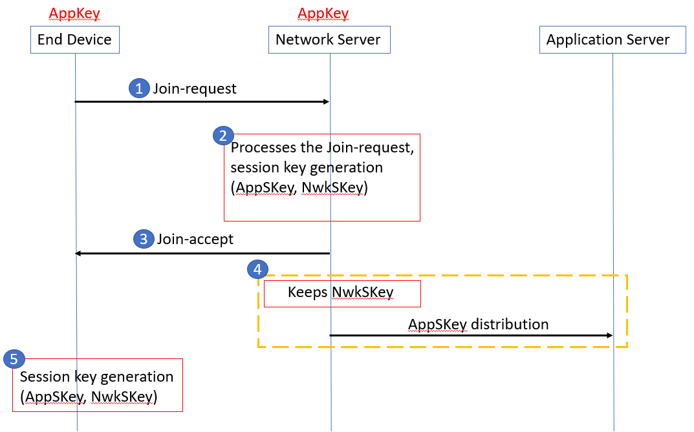
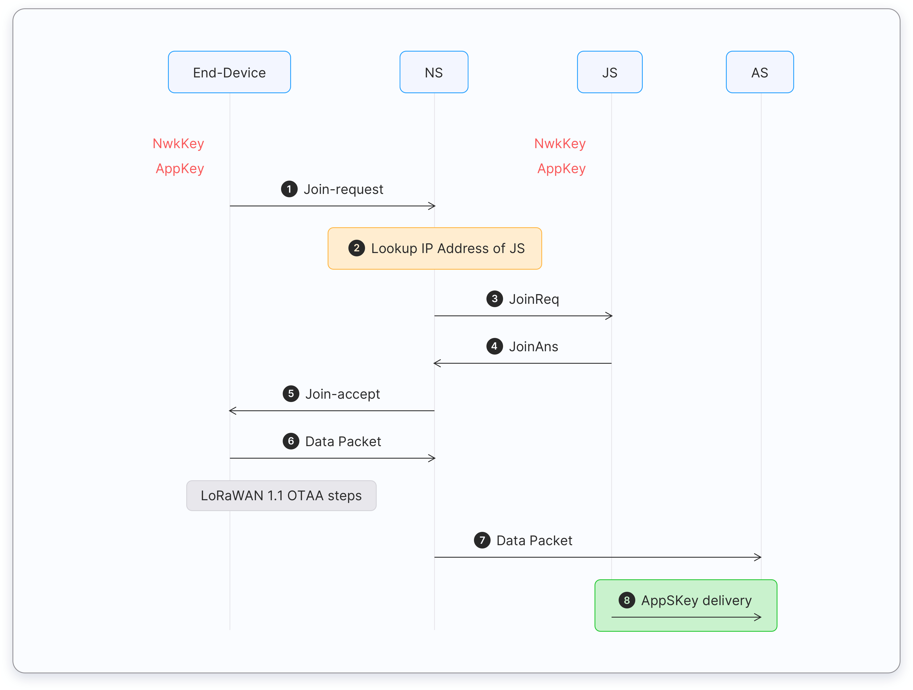

Every end device must be registered with a network before sending and receiving messages. This procedure is known as **activation**. There are two activation methods available:

* **Over-The-Air-Activation (OTAA)** - the most secure and recommended activation method for end devices. Devices perform a join procedure with the network, during which a dynamic device address is assigned and security keys are negotiated with the device.
* **Activation By Personalization (ABP)** - requires hardcoding the device address as well as the security keys in the device. ABP is **less secure** than OTAA and also has the downside that devices can not switch network providers without manually changing keys in the device. 

The join procedure for LoRaWAN 1.0.x and 1.1 is slightly different. The following two sections describe the join procedure for LoRaWAN 1.0.x and 1.1 separately.

## Over The Air Activation in LoRaWAN 1.0.x

In LoRaWAN 1.0.x, the join procedure requires two MAC messages to be exchanged between the end device and the Network Server:

*   Join-request - from end device to the Network Server
*   Join-accept - from Network Server to the end device

Before activation, the **AppEUI**, **DevEUI**, and **AppKey** should be stored in the end device. The **AppKey** is an AES-128 bit secret key known as the **root key**. The same **AppKey** should be provisioned onto the network where the end device is going to register. The **AppEUI** and **DevEUI** are not secret and are visible to everyone.



The **AppKey** is **never sent** over the network.



The following steps describe the Over-The-Air-Activation (OTAA) procedure.

_Figure: OTAA message flow in LoRaWAN 1.0_

##### Step 1

The join procedure is always initiated by the end device. The end device sends the **Join-request** message to the network that is going to be joined. The **Join-request** message consists of the following fields.

<table>
  <tr>
   <td><strong>8 bytes</strong>
   </td>
   <td><strong>8 bytes</strong>
   </td>
   <td><strong>2 bytes</strong>
   </td>
  </tr>
  <tr>
   <td>AppEUI
   </td>
   <td>DevEUI
   </td>
   <td>DevNonce
  </tr>
</table>

* **AppEUI** – a 64-bit globally unique application identifier in IEEE EUI64 address space that uniquely identifies the entity able to process the Join-req frame.
* **DevEUI** – a 64-bit globally unique device identifier in IEEE EUI64 address space that uniquely identifies the end-device.
* **DevNonce** – a unique, random, 2-byte value generated by the end device. The Network Server uses the DevNonce of each end-device to keep track of their join requests. If an end device sends a Join-request with a previously used DevNonce (this situation is known as a replay attack), the Network Server **rejects** the Join-request and does not allow that end device to register with the network.

The **Message Integrity Code (MIC)** is calculated over all the fields in the Join-request message using the **AppKey**. The calculated MIC is then added to the Join-request message.



* The **AppKey** is not sent with the **Join-request** message.
* The **Join-request** message is **not encrypted**.



The **Join-request** message can be transmitted using any data rate and using one of the region-specific join channels. For example, in Europe an end device can transmit the Join-request message by randomly choosing among 868.10 MHz, 868.30 MHz, or 868.50 MHz. The Join-request message travels through one or more gateways to the Network Server.

##### Step 2

The Network Server processes the Join-request message. The Network Server will generate two **session keys** (NwkSKey and AppSKey) and the **Join-accept** message if the end-device is permitted to join a network.

The **Join-accept** message consists of the following fields.

<table>
  <tr>
   <td><strong>3 bytes</strong>
   </td>
   <td><strong>3 bytes</strong>
   </td>
   <td><strong>4 bytes</strong>
   </td>
   <td><strong>1 bytes</strong>
   </td>
   <td><strong>1 bytes</strong>
   </td>
   <td><strong>16 bytes (optional)</strong>
  </tr>
  <tr>
   <td>AppNonce
   </td>
   <td>NetID
   </td>
   <td>DevAddr
   </td>
   <td>DLSettings
   </td>
   <td>RXDelay
   </td>
   <td>CFList
   </td>
  </tr>
</table>

* **AppNonce** – a random value or unique ID provided by the Network Server. The AppNonce is used by the end device to derive the two session keys, **AppSKey** and **NwkSKey**.
* **NetID** – consists of the network identifier (NwkID), the most significant 7 bits.
* **DevAddr** – a 32-bit device address assigned by the Network Server to identify the end device within the current network.
* **DLSettings** – a 1-byte field consisting of downlink settings which the end device should use.
* **RxDelay** – contains the delay between TX and RX.
* **CFList** – an optional list of channel frequencies for the network the end-device is joining. These frequencies are region-specific.

The **Message Integrity Code (MIC)** is calculated over all the fields in the Join-accept message using the **AppKey**. The calculated MIC is then added to the Join-accept message.

The **Join-accept** message itself is then encrypted with the **AppKey**. The Network Server uses an AES decrypt operation in ECB mode to encrypt the Join-accept message.

##### Step 3

The Network Server sends the encrypted **Join-accept** message back to the end device as a normal downlink.

 No response is given to the end-device if the Join-request message is not accepted by the Network Server.

##### Step 4
The Network Server keeps the **NwkSKey** and distributes the **AppSKey** to the Application Server.

##### Step 5

The end device decrypts the Join-accept message using AES encrypt operation. The end device uses the **AppKey** and  **AppNonce** to derive the two session keys, the **Network Session Key (NwkSKey)** and the **Application Session Key (AppSKey)**.

The end device is now activated on the Network.

After activation, the following additional information is stored in the end device.

* **DevAddr** - a 32-bit device address assigned by the Network Server to identify the end device within the current network. 
* **NwkSKey** - the network session key is used by the end device and Network Server to calculate and verify the Message Integrity Code (MIC) of all data messages for ensuring message integrity. The NwkSKey is also used to encrypt and decrypt payloads with MAC commands.
* **AppSKey** - the application session key is used to encrypt and decrypt application payloads in data messages for ensuring message confidentiality.

## Over-The-Air-Activation in LoRaWAN 1.1

In LoRaWAN 1.0.x, the join procedure requires two MAC messages to be exchanged between the end device and the Join Server:

* Join-request - from end device to the Join Server
* Join-accept - from Join Server to the end device

Before activation, the **JoinEUI**, **DevEUI**, **AppKey**, and **NwkKey** should be stored in the end device. The **AppKey** and **NwkKey** are AES-128 bit secret keys known as **root keys**. The matching **AppKey**, **NwkKey**, and **DevEUI** should be provisioned onto the Join Server that will assist in the processing of the join procedure and session key derivation. The **JoinEUI** and **DevEUI** are **not secret** and visible to everyone.



The **AppKey** and **NwkKey** are never sent over the network.



The following steps describe the Over-The-Air-Activation (OTAA) procedure.

_Figure: OTAA message flow in LoRaWAN 1.1_

##### Step 1

The join procedure is always initiated by the end device. The end device sends the **Join-request** message to the network that is going to be joined. The **Join-request** message consists of the following fields.

<table>
  <tr>
   <td><strong>8 bytes</strong>
   </td>
   <td><strong>8 bytes</strong>
   </td>
   <td><strong>2 bytes</strong>
   </td>
  </tr>
  <tr>
   <td>JoinEUI
   </td>
   <td>DevEUI
   </td>
   <td>DevNonce
   </td>
  </tr>
</table>

*   **JoinEUI** – a 64-bit global application identifier in IEEE EUI64 address space that uniquely identifies the **Join Server** that can assist in the processing of the Join-request and derivation of the session keys.
*   **DevEUI** – a 64-bit global device identifier in IEEE EUI64 address space that uniquely identifies the end-device.
*   **DevNonce** – a 2-byte counter, starting at 0 when the device is initially powered up and incremented with every **Join-request**. The DevNonce value is used to prevent **replay attacks**.



* In LoRaWAN 1.1 **AppEUI** is replaced with the **JoinEUI**.



The MIC is calculated over all the fields in the Join-request message using the **NwkKey**. The calculated MIC is then added to the **Join-request** message.



* The **NwkKey** is not sent with the **Join-request** message.
* The **Join-request** message is not encrypted and sent as plain text.



The Join-request message can be transmitted using any data rate and using one of the region-specific join channels. For example, in Europe an end device can transmit the Join-request message by randomly choosing among 868.10 MHz, 868.30 MHz, or 868.50 MHz. The **Join-request** message travels through one or more gateways to the Network Server.



No response is given to the end-device if the Join-request is not accepted.



##### Step 2

The Network Server forwards the Join-request message to the corresponding Join Server. 

##### Step 3
The Join Server processes the Join-request message. The Join Server will generate all the session keys (AppSKey, FNwkSIntKey, SNwkSIntKey, and NwkSEncKey) if the end-device is permitted to join the network.

##### Step 4

If the above step gets success, the Network Server generates the **Join-accept** message. The Join-accept message consists of the following fields.

<table>
  <tr>
   <td><strong>1 byte</strong>
   </td>
   <td><strong>3 bytes</strong>
   </td>
   <td><strong>4 bytes</strong>
   </td>
   <td><strong>1 bytes</strong>
   </td>
   <td><strong>1 bytes</strong>
   </td>
   <td><strong>16 bytes</strong>
   </td>
  </tr>
  <tr>
   <td>JoinNonce
   </td>
   <td>NetID
   </td>
   <td>DevAddr
   </td>
   <td>DLSettings
   </td>
   <td>RXDelay
   </td>
   <td>CFList
   </td>
  </tr>
</table>

* **JoinNonce** – a device specific counter value provided by the Join Server and used by the end device to derive the session keys, **FNwkSIntKey**, **SNwkSIntKey**, **NwkSEncKey**, and **AppSKey**.
* **NetID** – a 24-bit unique network identifier.
* **DevAddr** – a 32-bit device address assigned by the Network Server to identify the end device within the current network.
* **DLSettings** – a 1-byte field consisting of downlink settings which the end device should use.
* **RxDelay** – contains delay between TX and RX
* **CFList** – an optional list of channel frequencies for the network the end-device is joining. These frequencies are region-specific.

The Message Integrity Code (MIC) is calculated over all the fields in the Join-accept message using NwkKey (for LoRaWAN 1.0 devices) or JSIntKey (for LoRaWAN 1.1 devices) . The calculated MIC is then added to the Join-accept message.

The Join-accept message itself is then encrypted with the NwkKey. The Network Server uses an AES decrypt operation in ECB mode to encrypt the join-accept message.

The **Join-accept** message is encrypted with the **NwkKey** (if triggered by Join-request) or **JSEncKey** (if triggered by Rejoin-request).

Then the Network Server sends the encrypted Join-accept message back to the end device as a normal downlink.

No response is given to the end-device if the Join-request message is not accepted by the Network Server.

##### Step 5
The Join Server sends the AppSKey to the Application Server and the three network session keys (FNwkSIntKey, SNwkSIntKey, and NwkSEncKey) to the Network Server.

##### Step 6
The end-device decrypts the Join-accept message using AES encrypt operation. The end device uses AppKey, NwkKey, and JoinNonce to generate session keys.

For LoRaWAN 1.0.x devices, 
* AppSKey is derived from the NwkKey.
* FNwkSIntKey, SNwkSIntKey, and NwkSEncKey are derived from the NwkKey.

For  LoRaWAN 1.1 devices,
* AppSKey is derived from AppKey.
* FNwkSIntKey, SNwkSIntKey, and NwkSEncKey are derived from the NwkKey.
 
The end device is now activated on the Network.

After activation, the following additional information is stored in the end device.

* **DevAddr** - a 32-bit device address assigned by the Network Server to identify the end device within the current network. 
* **FNwkSIntKey** - a network session key that is used by the end device to calculate the MIC (partially) of all uplink data messages for ensuring message integrity.
* **SNwkSIntKey** - a network session key that is used by the end device to calculate the MIC (partially) of all uplink data messagse and calculate the MIC of all downlink data messages for ensuring message integrity.
* **NwkSEncKey** - a network session key that is used to encrypt and decrypt the payloads with MAC commands of the uplink and downlink data messages for ensuring message confidentiality.
* **AppSKey** - a session key used by both the Application Server and the end device to encrypt and decrypt the application data in the data messages for ensuring message confidentiality.

## Activation By Personalization

Activation By Personalization (ABP) directly ties an end-device to a pre-selected network, bypassing the over-the-air-activation procedure. Activation by Personalization is the less secure activation method, and also has the downside that devices can not switch network providers without manually changing keys in the device. A Join Server is not involved in the ABP process.

An end device activated using the ABP method can only work with a single network and keeps the same security session for its entire lifetime.

### Activation By Personalisation in LoRaWAN 1.0.x

The **DevAddr** and the two session keys **NwkSKey** and **AppSKey** are directly stored into the end-device instead of the DevEUI, AppEUI, and the AppKey. Each end device should have a unique set of NwkSKey and AppSkey. The same **DevAddr** and **NwkSKey** should be stored in the Network Server and the **AppSKey** should be stored in the Application Server 

_Figure: Pre-sharing DevAddr and session keys for ABP in LoRaWAN 1.0_

### Activation By Personalisation in LoRaWAN 1.1

The **DevAddr** and the four-session keys **FNwkSIntKey**, **SNwkSIntKey**, **NwkSEncKey**, and **AppSKey** are directly stored into the end device instead of the DevEUI, JoinEUI, AppKey, and NwkKey. The same **DevAddr**,  **FNwkSIntKey**, **SNwkSIntKey**, and **NwkSEncKey** should be stored in the Network Server and the and **AppSKey** should be stored in the Application Server. 

_Figure: Pre-sharing DevAddr and session keys for ABP in LoRaWAN 1.1_

## Questions

1. What is not a secure activation method?
    - Over The Air Activation (OTAA)
    - Activation By Personalization (ABP)
    
2. What is the most secure activation method?
    - Over The Air Activation (OTAA)
    - Activation By Personalization (ABP)
    
3. What security keys should be stored in an end-device for ABP in LoRaWAN 1.1?
    - FNwkSIntKey, SNwkSIntKey, NwkSEncKey, AppSKey
    - NwkSKey, AppSKey
    - JSIntKey, JSEncKey
    
4. What security keys should be stored in an end-device for ABP in LoRaWAN 1.0.x?
    - FNwkSIntKey, SNwkSIntKey, NwkSEncKey, AppSKey
    - NwkSKey, AppSKey
    - JSIntKey, JSEncKey
