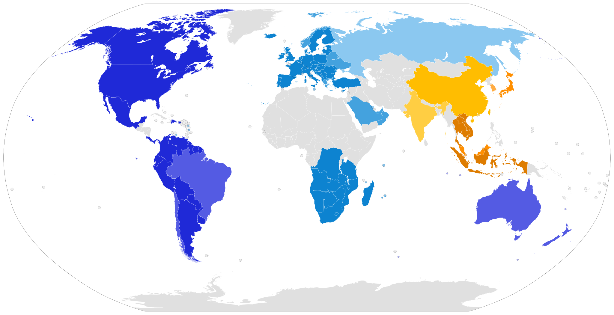

This document is only a summary of radio regulations, and the appropriate frequency plans that should be used for The Things Network in the respective countries. **This is in no way an official document; gateway owners are still obliged to find, study and adhere to their own country's regulations.** Some countries also expect you to register your gateway, or obtain a license. In that case you are using a "free band", not a "license free band". In some countries it is also necessary that the gateway is certified (CE, FCC, ...) if you allow other people to also communicate via it.

For discussions about the frequency plans in different countries, see the posts on the forum tagged with [Country/Frequency-Plan](https://www.thethingsnetwork.org/forum/c/country/frequency-plan).

### A

| Country | Frequency Plan | Regulatory document |
| --- | --- | --- |
| Afghanistan | | |
| Albania | EU863-870 EU433 | CEPT Rec. 70-03 |
| Algeria | | [CONDITIONS D’UTILISATION DES EQUIPEMENTS D’IDENTIFICATION PAR RADIOFREQUENCES - RFID](http://www.anf.dz/pdf/caf/RFID.pdf) |
| Andorra | EU863-870 EU433 | CEPT Rec. 70-03 |
| Angola | EU863-870 EU433 | CRASA follows CEPT Rec. 70-03 |
| Antigua and Barbuda | | |
| Argentina | AU915-928 | [RESOL-2018-581-APN-MM](https://www.enacom.gob.ar/multimedia/normativas/2018/res581MM.pdf) |
| Armenia | | EN 302 208  |
| Australia | AU915-928 | |
| Austria | EU863-870 EU433 | CEPT Rec. 70-03 |
| Azerbaijan | unknown, no CEPT | EN 302 208, CEPT Rec. 70-03 |

### B

| Country | Frequency Plan | Regulatory document |
| --- | --- | --- |
| Bahamas
| Bahrain | EU863-870 EU433 | [Kingdom Of Bahrain National Frequency Plan](http://www.tra.org.bh/media/document/The%202009%20National%20Frequency%20Plan.pdf) |
| Bangladesh
| Barbados
| Belarus | unknown, limited CEPT | CEPT Rec. 70-03 |
| Belgium | EU863-870 EU433 | CEPT Rec. 70-03 |
| Belize
| Benin
| Bhutan
| Bolivia | US902-928 | |
| Bosnia and Herzegovina | EU863-870 EU433 | CEPT Rec. 70-03 |
| Botswana | EU863-870 EU433 | CRASA follows CEPT Rec. 70-03 |
| Brazil | AU915-928 | [National Telecommunications Agency (ANATEL) Resolution No. 680, from June 27, 2017 - Portuguese only](http://www.anatel.gov.br/legislacao/resolucoes/2017/936-resolucao-680),  Article 10   [National Telecommunications Agency (ANATEL) Act No. 14448, from December 4, 2017 - Portuguese only](http://www.anatel.gov.br/legislacao/atos-de-requisitos-tecnicos-de-certificacao/2017/1139-ato-14448) Section 10.3 |
| Brunei | AS923-925 ("AS2") | |
| Bulgaria | EU863-870 EU433 | CEPT Rec. 70-03 |
| Burkina Faso
| Burundi

### C

| Country | Frequency Plan | Regulatory document |
| --- | --- | --- |
| Cabo Verde
| Cambodia | AS923-925 ("AS2") | |
| Cameroon
| Canada | US902-928 | |
| Central African Republic (CAR)
| Chad
| Chile | AU915-928 | [FIJA NORMA TECNICA DE EQUIPOS DE ALCANCE REDUCIDO](https://www.leychile.cl/Consulta/m/norma_plana?org=&idNorma=240404) |
| China | CN470-510 CN779-787 | |
| Colombia | US902-928 | |
| Comoros
| Democratic Republic of the Congo | EU863-870 EU433 | CRASA follows CEPT Rec. 70-03 |
| Republic of the Congo
| Costa Rica | US902-928 | |
| Cote d'Ivoire
| Croatia | EU863-870 EU433 | CEPT Rec. 70-03 |
| Cuba
| Curaçao |  | [Ministeriële regeling vrijstelling telecommunicatiemachtiging 2015](http://btnp.org/images/stories/pdf/telecom/PB_20153.pdf)
| Cyprus | EU863-870 EU433 | CEPT Rec. 70-03 |
| Czech Republic | EU863-870 EU433 | CEPT Rec. 70-03 |

### D

| Country | Frequency Plan | Regulatory document |
| --- | --- | --- |
| Denmark | EU863-870 EU433 | CEPT Rec. 70-03 |
| Djibouti
| Dominica
| Dominican Republic | US902-928 | |

### E

| Country | Frequency Plan | Regulatory document |
| --- | --- | --- |
| Ecuador | US902-928 | |
| Egypt
| El Salvador
| Equatorial Guinea
| Eritrea
| Estonia | EU863-870 EU433 | CEPT Rec. 70-03 |
| Eswatini (formerly Swaziland) | EU863-870 EU433 | CRASA follows CEPT Rec. 70-03 |
| Ethiopia

### F

| Country | Frequency Plan | Regulatory document |
| --- | --- | --- |
| Fiji
| Finland | EU863-870 EU433 | CEPT Rec. 70-03 |
| France | EU863-870 EU433 | CEPT Rec. 70-03 |

### G

| Country | Frequency Plan | Regulatory document |
| --- | --- | --- |
| Gabon
| Gambia
| Georgia | unknown, limited CEPT | CEPT Rec. 70-03 |
| Germany | EU863-870 EU433 | [Non-specific Short Range Devices (SRD) regulations](http://www.bnetza.de/SharedDocs/Downloads/DE/Sachgebiete/Telekommunikation/Unternehmen_Institutionen/Frequenzen/Allgemeinzuteilungen/2018_05_SRD_pdf.html), CEPT Rec. 70-03 |
| Ghana
| Greece | EU863-870 EU433 | [Radio frequency regulations](http://www.eett.gr/opencms/export/sites/default/admin/downloads/Announcments/AP399_034.pdf), [433MHz SRD regulations](http://www.eett.gr/opencms/export/sites/default/EETT/Electronic_Communications/Radio_Communications/TelecommunicationsEquipment/104v2.pdf), [868MHz SRD regulations](http://www.eett.gr/opencms/export/sites/default/EETT/Electronic_Communications/Radio_Communications/TelecommunicationsEquipment/105v2.pdf), CEPT Rec. 70-03 |
| Grenada
| Guatemala
| Guinea
| Guinea-Bissau
| Guyana | US902-928 | |

### H

| Country | Frequency Plan | Regulatory document |
| --- | --- | --- |
| Haiti
| Honduras
| Hong Kong (different than China) | AS923-925 ("AS2") | |
| Hungary | EU863-870 EU433 | CEPT Rec. 70-03 |

### I

| Country | Frequency Plan | Regulatory document |
| --- | --- | --- |
| Iceland | EU863-870 EU433 | CEPT Rec. 70-03 |
| India | IN865-867 | [Use of low power wireless equipments in the frequency band 865-867MHz for RFID](http://www.wpc.gov.in/WriteReadData/userfiles/file/RFID%20Delicensing.doc)
| Indonesia | AS923-925 ("AS2") | |
| Iran | | EN 302 208 |
| Iraq
| Ireland | EU863-870 EU433 | CEPT Rec. 70-03 |
| Israel | | EN 302 208 |
| Italy | EU863-870 EU433 | CEPT Rec. 70-03 |

### J

| Country | Frequency Plan | Regulatory document |
| --- | --- | --- |
| Jamaica
| Japan | AS920-923 ("AS1") | [ARIB STD-T108](https://www.arib.or.jp/english/html/overview/doc/5-STD-T108v1_0-E1.pdf) |
| Jordan

### K

| Country | Frequency Plan | Regulatory document |
| --- | --- | --- |
| Kazakhstan
| Kenya
| Kiribati
| Kosovo
| Kuwait
| Kyrgyzstan

### L

| Country | Frequency Plan | Regulatory document |
| --- | --- | --- |
| Laos | AS923-925 ("AS2") | |
| Latvia | EU863-870 EU433 | CEPT Rec. 70-03 |
| Lebanon 
| Lesotho | EU863-870 EU433 | CRASA follows CEPT Rec. 70-03, [Radio Spectrum Management Guidelines and Procedures 2014](http://www.lca.org.ls/images/documents/Radio%20Spectrum%20Management%20Guidelines%20and%20Procedures_2014.pdf)
| Liberia
| Libya
| Liechtenstein | EU863-870 EU433 | CEPT Rec. 70-03 |
| Lithuania | EU863-870 EU433 | CEPT Rec. 70-03 |
| Luxembourg | EU863-870 EU433 | CEPT Rec. 70-03 |

### M

| Country | Frequency Plan | Regulatory document |
| --- | --- | --- |
| Madagascar | EU863-870 EU433 | CRASA follows CEPT Rec. 70-03 |
| Malawi | EU863-870 EU433 | CRASA follows CEPT Rec. 70-03 |
| Malaysia | AS920-923 ("AS1") | |
| Maldives
| Mali
| Malta | EU863-870 EU433 | CEPT Rec. 70-03 |
| Marshall Islands
| Mauritania
| Mauritius | EU863-870 EU433 | CRASA follows CEPT Rec. 70-03 |
| Mexico | US902-928 | |
| Micronesia
| Moldova | EU863-870 EU433 | CEPT Rec. 70-03 |
| Monaco
| Mongolia
| Montenegro | EU863-870 EU433 | CEPT Rec. 70-03 |
| Morocco |  | [Decision ANRT/DG/Nº08/13 - 20th June 2013](https://www.anrt.ma/sites/default/files/2013-08-13-condit-tech-install-radioelect-app-faible-puissance-fr.pdf) |
| Mozambique | EU863-870 EU433 | CRASA follows CEPT Rec. 70-03 |
| Myanmar (Burma)

### N

| Country | Frequency Plan | Regulatory document |
| --- | --- | --- |
| Namibia | EU863-870 EU433 | CRASA follows CEPT Rec. 70-03 |
| Nauru
| Nepal
| Netherlands | EU863-870 EU433 | [Regeling gebruik van frequentieruimte zonder vergunning en zonder meldingsplicht 2015](http://wetten.overheid.nl/BWBR0036378/2016-12-28), CEPT Rec. 70-03 |
| New Zealand | AU915-928 | [Radio Spectrum Management](https://www.rsm.govt.nz/about-rsm/spectrum-policy/gazette/gurl/short-range-devices) |
| Nicaragua
| Niger
| Nigeria
| North Macedonia | EU863-870 EU433 | CEPT Rec. 70-03 |
| North Korea
| Norway | unknown, limited CEPT | CEPT Rec. 70-03 |

### O

| Country | Frequency Plan | Regulatory document |
| --- | --- | --- |
| Oman | | EN 302 208 |

### P

| Country | Frequency Plan | Regulatory document |
| --- | --- | --- |
| Pakistan
| Palau
| Palestine
| Panama | US902-928 | |
| Papua New Guinea
| Paraguay | US902-928 | |
| Peru | US902-928 | |
| Philippines | EU863-870 EU433 | **NOTE:** This is not a license free band. If you connect to a commercial telecoms operator you are however allowed to use thier frequencies. Please check the rules and obtain a license before running a gateway. |
| Poland | EU863-870 EU433 | CEPT Rec. 70-03 |
| Portugal | EU863-870 EU433 | CEPT Rec. 70-03 |
| Puerto Rico | US902-928 | |

### Q

| Country | Frequency Plan | Regulatory document |
| --- | --- | --- |
| Qatar

### R

| Country | Frequency Plan | Regulatory document |
| --- | --- | --- |
| Romania | EU863-870 EU433 | CEPT Rec. 70-03 |
| Russia | EU863-870 EU433 | CEPT Rec. 70-03, [Decision ГКРЧ 07-20-03-001](http://minsvyaz.ru/ru/documents/4039/), Appendix 10 |
| Rwanda

### S

| Country | Frequency Plan | Regulatory document |
| --- | --- | --- |
| Saint Kitts and Nevis
| Saint Lucia
| Saint Vincent and the Grenadines
| Samoa
| San Marino
| Sao Tome and Principe
| Saudi Arabia | EU863-870 EU433 | [National frequency plan in the kingdom of Saudi Arabia](http://www.citc.gov.sa/en/RulesandSystems/RegulatoryDocuments/FrequencySpectrum/Documents/SM%20002%20E-NFP.pdf) |
| Senegal
| Serbia | EU863-870 EU433 | CEPT Rec. 70-03 |
| Seychelles | EU863-870 EU433 | CRASA follows CEPT Rec. 70-03 |
| Sierra Leone
| Singapore | AS920-923 ("AS1") | |
| Slovakia | EU863-870 EU433 | CEPT Rec. 70-03 |
| Slovenia | EU863-870 EU433 | CEPT Rec. 70-03 |
| Solomon Islands
| Somalia
| South Africa | EU863-870 EU433 | CRASA follows CEPT Rec. 70-03, [The Radio Frequency Spectrum Regulations 2015](http://www.amateurradio.org.za/Government%20Gazzette%2038641_30-3_IcasaCV01%20-%20Radio%20Frequency%20Spectrum%20Regulations%202015%20(2).pdf) | 
| South Korea | KR920-923 | |
| South Sudan
| Spain | EU863-870 EU433 | CEPT Rec. 70-03 |
| Sri Lanka
| Sudan
| Suriname | US902-928 | |
| Sweden | EU863-870 EU433 | [Svenska frekvensplanen](https://etjanster.pts.se/radio/frekvensplanen), CEPT Rec. 70-03 |
| Switzerland | EU863-870 EU433 | CEPT Rec. 70-03 |
| Syria

### T

| Country | Frequency Plan | Regulatory document |
| --- | --- | --- |
| Taiwan | AS923-925 ("AS2") | [LP0002 2016](http://www.rootlaw.com.tw/Attach/L-Doc/A040110071000200-1050823-1000-001.pdf) or [LP0002 2011](http://www.ncc.gov.tw/chinese/law_detail.aspx?site_content_sn=3441&is_history=0&sn_f=1807), section 4, "Radio Frequency Identification, RFID" |
| Tajikistan
| Tanzania | EU863-870 EU433 | CRASA follows CEPT Rec. 70-03 |
| Thailand | AS923-925 ("AS2") | |
| Timor-Leste
| Togo
| Tonga
| Trinidad and Tobago
| Tunisia | | EN 302 208 |
| Turkey | EU863-870 EU433 | CEPT Rec. 70-03 |
| Turkmenistan
| Tuvalu

### U

| Country | Frequency Plan | Regulatory document |
| --- | --- | --- |
| Uganda
| Ukraine | unknown, limited CEPT | CEPT Rec. 70-03 |
| United Arab Emirates (UAE) | EU863-870 EU433 | EN 302 208, [TRA Regulations](https://www.tra.gov.ae/assets/YXsb1a9i.pdf.aspx) |
| United Kingdom (UK) | EU863-870 EU433 | [Forum thread about requirements](https://www.thethingsnetwork.org/forum/t/uk-legal-requirements-for-equipment/6239), CEPT Rec. 70-03 |
| United States of America (USA) | US902-928 | |
| Uruguay | US902-928 | |
| Uzbekistan

### V

| Country | Frequency Plan | Regulatory document |
| --- | --- | --- |
| Vanuatu
| Vatican City (Holy See) | EU863-870 EU433 | |
| Venezuela | US902-928 | |
| Vietnam | AS923-925 ("AS2") | |

### Y

| Country | Frequency Plan | Regulatory document |
| --- | --- | --- |
| Yemen | | |

### Z

| Country | Frequency Plan | Regulatory document |
| --- | --- | --- |
| Zambia | EU863-870 EU433 | CRASA follows CEPT Rec. 70-03 |
| Zimbabwe | EU863-870 EU433 | CRASA follows CEPT Rec. 70-03 |

_[Country list source](https://www.countries-ofthe-world.com/all-countries.html)_

### Regulatory Documents

**[CEPT/ERC Recommendation 70-03 relating to the use of short range devices (SRD)](http://www.erodocdb.dk/docs/doc98/official/pdf/rec7003e.pdf)**

Already implemented in: Albania, Andorra, Austria, Belgium, Bosnia & Herzegovina, Bulgaria, Cyprus, Czech Republic, Germany, Denmark, Spain, Estonia, France, Finland, United Kingdom, Hungary, Netherlands, Croatia, Italy, Ireland, Iceland, Liechtenstein, Lithuania, Luxembourg, Latvia, Moldova, Former Yugoslav Republic of Macedonia, Malta, Montenegro, Poland, Portugal, Romania, Sweden, Serbia, Switzerland, Slovak Republic, Slovenia, Turkey

Limited implementation: Belarus, Georgia(433), Greece, Norway, Russian Federation, Ukrain

Not implemented in: Azerbaijan, Georgia(868)

---

**[Communications Regulators' Association of Southern Africa (CRASA) Harmonised Frequency Bands For SRD Applications](http://www.crasa.org/common_up/crasa-setup/06-07-2015_FRAME%20WORK%20FOR%20HARMONISATION%20FREQUENICES%20FOR%20SHORT%20RANGE%20DEVICES%20%20OF%20%20SHORT%20RANGE%20DEVICES%20%20(SRDs)%20-%20ANNEXURE%20A.pdf)**

Angola, Botswana, Democratic Republic of Congo, Lesotho, Malawi, Mauritius, Mozambique, South Africa, Namibia, Swaziland, Tanzania, Zambia, Zimbabwe.

Even though there is an overlap between the Southern African Development Community (SADC) and CRASA, the Seychelles and Madagascar are not members of CRASA. They are however included in the SADC Frequency allocation plan: [SADC Frequency Allocation Plan](http://www.crasa.org/common_up/crasa-setup/12-03-2015_SADC%20FREQUENCY%20BAND%20%202013.pdf)
