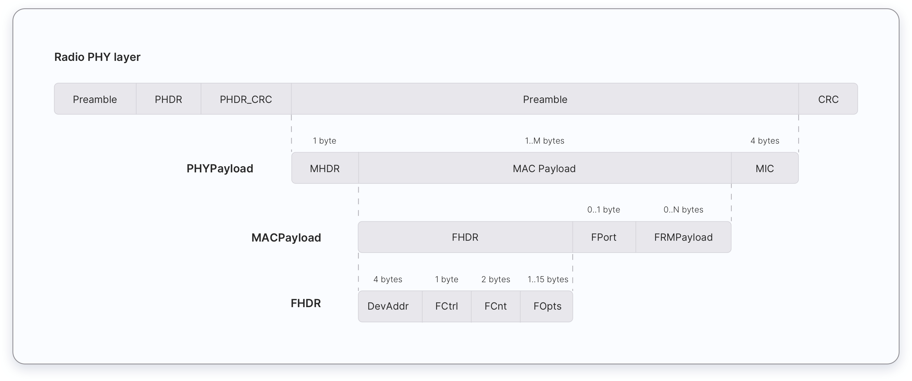

In this chapter, you will learn about different message types used in LoRaWAN 1.0.x and 1.1. These message types are used to transport MAC commands and application data. The Things Fundamentals Certification exam expects you should have basic knowledge on the following topics with regards to the message types:

*   Uplink and downlink messages.
*   MAC Message types and their uses.
*   Sending MAC commands in the FOpts field.
*   Sending MAC commands and application data in the FRMPayload field.
*   Keys used to encrypt each field that carries MAC Commands and application data.
*   Keys used to calculate the Message Integrity Code (MIC) of each message.

## Uplink and Downlink Messages
LoRa messages can be divided into uplink and downlink messages based on the direction they travel.

**Uplink messages** - Uplink messages are sent by end devices to the Network Server relayed by one or many gateways. If the uplink message belongs to the Application Server or the Join Server, the Network server forwards it to the correct receiver.

**Downlink messages** - Each downlink message is sent by the Network Server to only one end device and is relayed by a single gateway. This includes some messages initiated by the Application Server and the Join Server too.

## MAC Message Types

LoRaWAN defines several MAC message types.

The following table presents MAC message types that can be found in LoRaWAN 1.0.x and 1.1. 

<table>
  <tr>
   <td><strong>LoRaWAN 1.0.x</strong>
   </td>
   <td><strong>LoRaWAN 1.1</strong>
   </td>
   <td><strong>Description</strong>
   </td>
  </tr>
  <tr>
   <td>Join-request
   </td>
   <td>Join-request
   </td>
   <td>An uplink message, used by the over-the-air activation (OTAA) procedure
   </td>
  </tr>
  <tr>
   <td>Join-accept
   </td>
   <td>Join-accept
   </td>
   <td>A downlink message, used by the over-the-air activation (OTAA) procedure
   </td>
  </tr>
  <tr>
   <td>Unconfirmed Data Up
   </td>
   <td>Unconfirmed Data Up
   </td>
   <td>An uplink data frame, confirmation is not required
   </td>
  </tr>
  <tr>
   <td>Unconfirmed Data Down
   </td>
   <td>Unconfirmed Data Down
   </td>
   <td>A downlink data frame, confirmation is not required
   </td>
  </tr>
  <tr>
   <td>Confirmed Data Up
   </td>
   <td>Confirmed Data Up
   </td>
   <td>An uplink data frame, confirmation is requested
   </td>
  </tr>
  <tr>
   <td>Confirmed Data Down
   </td>
   <td>Confirmed Data Down
   </td>
   <td>A downlink data frame, confirmation is requested
   </td>
  </tr>
  <tr>
   <td>RFU
   </td>
   <td>Rejoin-request
   </td>
   <td>1.0.x - Reserved for Future Usage

1.1 - Uplink over-the-air activation (OTAA) Rejoin-request
   </td>
  </tr>
  <tr>
   <td>Proprietary
   </td>
   <td>Proprietary
   </td>
   <td>Used to implement non-standard message formats
   </td>
  </tr>
</table>

### Join-request, Rejoin-request, and Join-accept messages

In LoRaWAN 1.0.x, **two** MAC message types are used by the Over-The-Air-Activation (OTAA) procedure:

*   Join-request
*   Join-accept

In LoRaWAN 1.1, **three** MAC message types are used by the Over-The-Air-Activation (OTAA) procedure and for roaming purposes:

*   Join-request
*   Join-accept
*   Rejoin-request

#### Join-request

The Join-request message is always initiated by an end device and sent to the Network Server. In LoRaWAN versions **earlier** than 1.0.4 the Join-request message is forwarded by the Network Server to the Application Server. In LoRaWAN 1.1 and 1.0.4+,  the Network Server forwards the Join-request message to the device’s Join Server. The Join-request message is not encrypted.

#### Join-accept

In LoRaWAN versions **earlier** than 1.0.4 the Join-accept message is generated by the Application Server. In LoRaWAN 1.1 and 1.0.4+ the Join-accept message is generated by the Join Server. In both cases the message passes through the Network Server. Then the Network Server routes the Join-accept message to the correct end-device. The Join-accept message is encrypted as follows.

*   In LoRaWAN 1.0, the Join-accept message is encrypted with the AppKey.
*   In LoRaWAN 1.1, the Join-accept message is encrypted with different keys as shown in the table below.

<table>
  <tr>
   <td>
<strong>If triggered by</strong>
   </td>
   <td><strong>Encryption Key</strong>
   </td>
  </tr>
  <tr>
   <td>Join-request
   </td>
   <td>NwkKey
   </td>
  </tr>
  <tr>
   <td>Rejoin-request type 0, 1, and 2
   </td>
   <td>JSEncKey
   </td>
  </tr>
</table>

#### Rejoin-request

The Rejoin-request message is always initiated by an end device and sent to the Network Server. There are three types of Rejoin-request messages: Type 0, 1, and 2. These message types are used to initialize the new session context for the end device. For the Rejoin-request message, the network replies with a Join-accept message.

### Data Messages

There are 4 data message types used in both LoRaWAN 1.0.x and 1.1. These data message types are used to transport both MAC commands and application data which can be combined together in a single message. Data messages can be confirmed or unconfirmed: confirmed data messages must be acknowledged by the receiver whereas unconfirmed data messages do not need to be acknowledged by the receiver.

A data message is constructed as shown below:

MAC payload of the data messages consists of a frame header (FHDR) followed by an optional port field (FPort) and an optional frame payload (FRMPayload).

<table>
  <tr>
   <td>
7 to 22 bytes
   </td>
   <td>0 to 1 byte
   </td>
   <td>0 to N bytes
   </td>
  </tr>
  <tr>
   <td>FHDR
   </td>
   <td>FPort
   </td>
   <td>FRMPayload
   </td>
  </tr>
</table>

The frame header (FHDR) of the MAC payload consists of the following fields.

<table>
  <tr>
   <td>
4 bytes
   </td>
   <td>1 byte
   </td>
   <td>2 bytes
   </td>
   <td>0 to 15 bytes
   </td>
  </tr>
  <tr>
   <td>DevAddr
   </td>
   <td>FCtrl
   </td>
   <td>FCnt
   </td>
   <td>FOpts
   </td>
  </tr>
</table>

The maximum length of the MAC Payload field is region and data rate-specific and can be found in the [Regional Parameters chapter](). 

## Sending MAC Commands and Application-Specific Data

A data message can contain any sequence of MAC commands. A data message can carry both MAC commands and application data simultaneously in separate fields.

MAC commands can be sent either in the frame options field (FOpts) field or frame payload field (FRMPayload) field of a data message, but not both simultaneously.

Application data can be sent in the frame payload (FRMPayload) field of a data message. The FRMPayload field CAN NOT contain MAC commands and application data simultaneously.

### Sending MAC Commands in FOpts Field

MAC commands can be piggybacked in the FOpts field of a data message for sending. The total length of the MAC commands MUST NOT exceed 15 bytes.

* In LoRaWAN 1.0.x, these piggybacked MAC commands are always sent unencrypted. 
* In LoRaWAN 1.1, these piggybacked MAC commands are always sent encrypted using the NwkSEncKey.

### Sending MAC Commands and Application-specific data in the FRMPayload field

The FRMPayload field can contain MAC Commands or application data. If the FRMPayload field is not empty, the FPort field must be present. If the FPort field is present, 

* FPort value `0` indicates that the FRMPayload field contains only MAC commands. The total length of the MAC commands MUST NOT exceed the maximum FRMPayload length (region-specific).
* FPort value `1-223` indicates that the FRMPayload field contains application data. 

The following table shows the possible values for the FPort field depending on what it carries.

<table>
  <tr>
   <td><strong>FPort Value</strong>
   </td>
   <td><strong>Description</strong>
   </td>
  </tr>
  <tr>
   <td>0
   </td>
   <td>MAC commands only
   </td>
  </tr>
  <tr>
   <td>1 to 223
   </td>
   <td>Application-specific data
   </td>
  </tr>
  <tr>
   <td>224
   </td>
   <td>LoRaWAN MAC layer test protocol
   </td>
  </tr>
  <tr>
   <td>255
   </td>
   <td>Reserved for Future Use (RFU)
   </td>
  </tr>
</table>

If the FRMPaylod field contains MAC commands or application data, the FRMPayload field must be encrypted before the Message Integrity Code (MIC) is calculated. This ensures message confidentiality. The following table shows which key is used to encrypt the FRMPayload field in different LoRaWAN versions. 

<table>
  <tr>
   <td><strong>FRMPayload</strong>
   </td>
   <td><strong>Direction</strong>
   </td>
   <td><strong>FPort</strong>
   </td>
   <td><strong>1.0.x</strong>
   </td>
   <td><strong>1.1</strong>
   </td>
  </tr>
  <tr>
   <td>MAC Commands
   </td>
   <td>Uplink/Downlink
   </td>
   <td>0
   </td>
   <td>NwkSKey
   </td>
   <td>NwkSEncKey
   </td>
  </tr>
  <tr>
   <td>Application-specific data
   </td>
   <td>Uplink/Downlink
   </td>
   <td>1 to 223
   </td>
   <td>AppSKey
   </td>
   <td>AppSKey
   </td>
  </tr>
</table>

## Calculating the Message Integrity Code (MIC)

The Message Integrity Code (MIC) ensures the integrity and authenticity of a message. The message integrity code is calculated over all the fields in the message and then added to the message itself. The following list shows what fields are used to calculate the MIC for each message type in LoRaWAN 1.0.x and 1.1.

<table>
  <tr>
   <td><strong>LoRaWAN version</strong>
   </td>
   <td><strong>Message Type</strong>
   </td>
   <td><strong>Fields</strong>
   </td>
  </tr>
  <tr>
   <td>1.0.x
   </td>
   <td>Join-request
   </td>
   <td>MHDR | AppEUI | DevEUI | DevNonce
   </td>
  </tr>
  <tr>
   <td>1.0.x
   </td>
   <td>Join-accept
   </td>
   <td>MHDR | AppNonce | NetID | DevAddr | DLSettings | RxDelay | CFList
   </td>
  </tr>
  <tr>
   <td>1.0.x
   </td>
   <td>Data messages (up and down)
   </td>
   <td>MHDR | FHDR | FPort | FRMPayload
   </td>
  </tr>
  <tr>
   <td>1.1
   </td>
   <td>Join-request
   </td>
   <td>MHDR | JoinEUI | DevEUI | DevNonce
   </td>
  </tr>
  <tr>
   <td>1.1
   </td>
   <td>Join-accept
   </td>
   <td>MHDR | JoinNonce | NetID | DevAddr | DLSettings | RxDelay | CFList
   </td>
  </tr>
  <tr>
   <td>1.1
   </td>
   <td>Rejoin-request Type 0 and 2
   </td>
   <td>MHDR | Rejoin Type | NetID | DevEUI | RJcount0
   </td>
  </tr>
  <tr>
   <td>1.1
   </td>
   <td>Rejoin-request Type 1
   </td>
   <td>MHDR | Rejoin Type | JoinEUI | DevEUI | RJcount1
   </td>
  </tr>
  <tr>
   <td>1.1
   </td>
   <td>Data messages (up and down)
   </td>
   <td>MHDR | FHDR | FPort | FRMPayload
   </td>
  </tr>
</table>

The following table presents which key is used to calculate the MIC of each message type in LoRaWAN 1.0.x and 1.1.

<table>
  <tr>
   <td><strong>LoRaWAN version</strong>
   </td>
   <td><strong>Message Type</strong>
   </td>
   <td><strong>Key</strong>
   </td>
  </tr>
  <tr>
   <td>1.0.x
   </td>
   <td>Join-request
   </td>
   <td>AppKey
   </td>
  </tr>
  <tr>
   <td>1.0.x
   </td>
   <td>Join-accept
   </td>
   <td>AppKey
   </td>
  </tr>
  <tr>
   <td>1.0.x
   </td>
   <td>Uplink data message
   </td>
   <td>NwkSKey
   </td>
  </tr>
  <tr>
   <td>1.0.x
   </td>
   <td>Downlink data messages
   </td>
   <td>NwkSKey
   </td>
  </tr>
  <tr>
   <td>1.1
   </td>
   <td>Join-request
   </td>
   <td>NwkKey
   </td>
  </tr>
  <tr>
   <td>1.1
   </td>
   <td>Join-accept
   </td>
   <td>JSIntKey
   </td>
  </tr>
  <tr>
   <td>1.1
   </td>
   <td>Rejoin-request Type 0 and 2
   </td>
   <td>SNwkSIntKey
   </td>
  </tr>
  <tr>
   <td>1.1
   </td>
   <td>Rejoin-request Type 1
   </td>
   <td>JSIntKey
   </td>
  </tr>
  <tr>
   <td>1.1
   </td>
   <td>Uplink data messages
   </td>
   <td>FNwkSIntKey and SNwkSIntKey
   </td>
  </tr>
  <tr>
   <td>1.1
   </td>
   <td>Downlink data message
   </td>
   <td>SNwkSIntKey
   </td>
  </tr>
</table>

When a LoRaWAN 1.1 device is provisioned with a LoRaWAN 1.0.x Network Server, the MIC of each message is calculated as shown in the following table.

<table>
  <tr>
   <td><strong>Message Type</strong>
   </td>
   <td><strong>Key</strong>
   </td>
  </tr>
  <tr>
   <td>Join-request
   </td>
   <td>NwkKey
   </td>
  </tr>
   <tr>
   <td>Join-accept
   </td>
   <td>NwkKey
   </td>
  </tr>
  <tr>
   <td>Uplink data messages
   </td>
   <td>FNwkSIntKey
   </td>
  </tr>
  <tr>
   <td>Downlink data messages
   </td>
   <td>FNwkSIntKey
   </td>
  </tr>
</table>

## Practice Questions

1. MAC commands can be transported in:
    - FOpts
    - FCtrl
    - FCnt
    - FPort

2. Application data can be transported in:
    - FRMPayload
    - FOpts
    - FPort
    - FCtrl
    
3. Which field can transport application payload or MAC commands?
    - FRMPayload
    - FOpts
    - FPort
    - FCtrl
    
4. If the FRMPayload field transports MAC commands in LoRaWAN 1.0.x, it must be encrypted using the:
    - NwkSKey
    - AppSKey
    - NwkSEncKey
    
5. If the FRMPayload field transports application data in LoRaWAN 1.0.x, it must be encrypted using the:
    - NwkSKey
    - AppSKey
    - NwkSEncKey
    
6. If the FRMPayload field transports MAC commands in LoRaWAN 1.1, it must be encrypted using the:
    - NwkSKey
    - AppSKey
    - NwkSEncKey
    
7. If the FRMPayload field transports application-specific data in LoRaWAN 1.1, it must be encrypted using the:
    - NwkSKey
    - AppSKey
    - NwkSEncKey
    
8. Which message initiates the over-the-air-activation (OTAA) procedure?
    - Join-request message
    - Join-accept message
    - Uplink data message
    - Downlink data message
