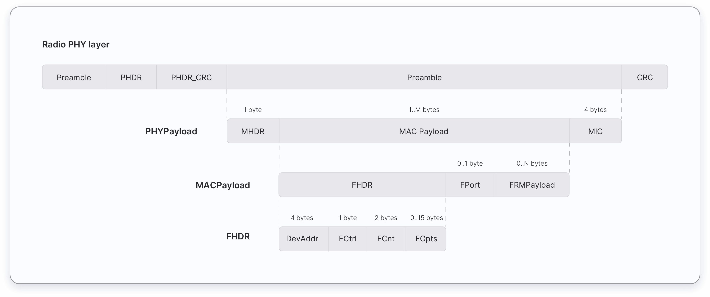

In this chapter, you will learn about different message types used in LoRaWAN. These message types are used to transport application-specific data and MAC commands. The Things Fundamentals Certification Exam expects you should have basic knowledge on the following topics with regards to the message types:

*   MAC Message types and their uses.
*   Transporting MAC commands in the FOpts field.
*   Transporting MAC commands and application payloads in FRMPayload the field.
*   Keys used to encrypt each message field that carries MAC Commands and application payloads.
*   Keys used to calculate the MIC of each message.

## MAC Message Types

LoRaWAN defines several MAC message types. 

*   LoRaWAN 1.0.x uses 7 MAC message types.
*   LoRaWAN 1.1 uses 8 MAC message types. 

The following table presents MAC message types that can be found in LoRaWAN 1.0.x and 1.1. 

Table: MAC message types in LoRaWAN 1.0.x and 1.1

<table>
  <tr>
   <td><strong>LoRaWAN 1.0.x</strong>
   </td>
   <td><strong>LoRaWAN 1.1</strong>
   </td>
   <td><strong>Description</strong>
   </td>
  </tr>
  <tr>
   <td>Join-request
   </td>
   <td>Join-request
   </td>
   <td>Uplink OTAA join-request
   </td>
  </tr>
  <tr>
   <td>Join-accept
   </td>
   <td>Join-accept
   </td>
   <td>Downlink OTAA join-accept
   </td>
  </tr>
  <tr>
   <td>Unconfirmed Data Up
   </td>
   <td>Unconfirmed Data Up
   </td>
   <td>Uplink data frame, confirmation not required
   </td>
  </tr>
  <tr>
   <td>Unconfirmed Data Down
   </td>
   <td>Unconfirmed Data Down
   </td>
   <td>Downlink data frame, confirmation not required
   </td>
  </tr>
  <tr>
   <td>Confirmed Data Up
   </td>
   <td>Confirmed Data Up
   </td>
   <td>Uplink data frame, confirmation requested
   </td>
  </tr>
  <tr>
   <td>Confirmed Data Down
   </td>
   <td>Confirmed Data Down
   </td>
   <td>Downlink data frame, confirmation requested
   </td>
  </tr>
  <tr>
   <td>RFU
   </td>
   <td>Rejoin-request
   </td>
   <td>1.0.x - Reserved for Future usage

1.1 - Uplink OTAA rejoin request
   </td>
  </tr>
  <tr>
   <td>Proprietary
   </td>
   <td>Proprietary
   </td>
   <td>Used to implement non-standard message formats
   </td>
  </tr>
</table>

### Join-request, Rejoin-request, and Join-accept messages

In LoRaWAN 1.0.x, **two** MAC message types are used by the Over-The-Air-Activation (OTAA) procedure:

*   Join-request
*   Join-accept

In LoRaWAN 1.1, **three** MAC message types are used by the Over-The-Air-Activation (OTAA) procedure and for roaming purposes:

*   Join-request
*   Join-accept
*   Rejoin-request

#### Join-request

The Join-request message is always initiated by an end device and sent to the network server. In LoRaWAN versions **earlier** than 1.0.4 the Join-request message is forwarded by the Network Server to the Application Server. In LoRaWAN 1.1 and 1.0.4+,  the network server forwards the Join-request message to the device’s Join Server. The Join-request message is not encrypted.

#### Join-accept

In LoRaWAN versions **earlier** than 1.0.4 the Join-accept message is generated by the application server. In LoRaWAN 1.1 and 1.0.4+ the Join-accept message is generated by the Join Server. In both cases the message passes through the Network Server. Then the Network Server routes the Join-accept message to the correct end-device. The Join-accept message is encrypted as follows.

*   In LoRaWAN 1.0, the Join-accept message is encrypted with the AppKey.
*   In LoRaWAN 1.1, the Join-accept message is encrypted depending on the Join-request or Rejoin-request as shown in the table below.

<table>
  <tr>
   <td>
<strong>Triggered by</strong>
   </td>
   <td><strong>Join-accept message is encrypted by</strong>
   </td>
  </tr>
  <tr>
   <td>Join-request
   </td>
   <td>NwkKey
   </td>
  </tr>
  <tr>
   <td>Rejoin-request (for all types)
   </td>
   <td>JSEncKey
   </td>
  </tr>
</table>

#### Rejoin-request

The Rejoin-request message is always initiated by an end device and sent to the network server. There are three types of Rejoin-request messages: Type 0, 1, and 2. These message types are used to initialize the new session context for the end device. For the Rejoin-request message, the network replies with a Join-accept message.

### Data Messages

There are 4 data message types used in both LoRaWAN 1.0.x and 1.1. These data message types are used to transport both MAC commands and application data which can be combined together in a single message. Data messages can be confirmed or unconfirmed: confirmed data messages must be acknowledged by the receiver whereas unconfirmed data messages do not need to be acknowledged by the receiver.

A data message is constructed as shown below:

The MAC payload of the data messages consists of a Frame Header (FHDR) followed by an optional Port Field (FPort) and an optional Frame Payload (FRMPayload).

<table>
  <tr>
   <td>
7 to 22 bytes
   </td>
   <td>0 to 1 byte
   </td>
   <td>0 to N bytes
   </td>
  </tr>
  <tr>
   <td>FHDR
   </td>
   <td>FPort
   </td>
   <td>FRMPayload
   </td>
  </tr>
</table>

The frame header (FHDR) of the MAC payload consists of the following fields.

<table>
  <tr>
   <td>
4 bytes
   </td>
   <td>1 byte
   </td>
   <td>2 bytes
   </td>
   <td>0 to 15 bytes
   </td>
  </tr>
  <tr>
   <td>DevAddr
   </td>
   <td>FCtrl
   </td>
   <td>FCnt
   </td>
   <td>FOpts
   </td>
  </tr>
</table>

The maximum length of the MAC Payload field is region and data rate specific and can be found in the [Regional Parameters chapter](). 

## Sending MAC Commands and Application-Specific Data

The MAC commands can be sent either in the FOpts field or FRMPayload field of a data message, but not both simultaneously.

### Transporting MAC Commands in FOpts Field

The FOpts field can be used to transport MAC commands that are piggybacked onto the data frame. 

* In LoRaWAN 1.0.x, these piggybacked MAC commands are always sent unencrypted. 
* In LoRaWAN 1.1, these piggybacked MAC commands are always sent encrypted with the FOpts field using the NwkSEncKey.

### Transporting MAC Commands and Application-specific data in FRMPayload field

The FRMPayload field can contain Application payload or MAC Commands. If the FRMPayload field is not empty, the FPort must be present. If the FPort is present, FPort value `0` indicates that the FRMPayload contains MAC commands only and FPort value `1` indicates that the FRMPayload field contains an Application payload. 

The following are the possible values for the FPort field:

<table>
  <tr>
   <td><strong>FPort Value</strong>
   </td>
   <td><strong>Description</strong>
   </td>
  </tr>
  <tr>
   <td>0
   </td>
   <td>MAC commands only
   </td>
  </tr>
  <tr>
   <td>1 to 223
   </td>
   <td>Application-specific message
   </td>
  </tr>
  <tr>
   <td>224
   </td>
   <td>LoRaWAN MAC layer test protocol
   </td>
  </tr>
  <tr>
   <td>255
   </td>
   <td>Reserved for future use
   </td>
  </tr>
</table>

If the FRMPaylod field contains MAC commands or application data, the FRMPayload must be encrypted before the Message Integrity Code (MIC) is calculated. The following table shows which key is used to encrypt the FRMPayload field in different LoRaWAN versions. This ensures message confidentiality.

FRMPayload encryption keys:

<table>
  <tr>
   <td><strong>FRMPayload</strong>
   </td>
   <td><strong>FPort</strong>
   </td>
   <td><strong>1.0.x</strong>
   </td>
   <td><strong>1.1</strong>
   </td>
  </tr>
  <tr>
   <td>MAC Commands
   </td>
   <td>0
   </td>
   <td>NwkSKey
   </td>
   <td>NwkSEncKey
   </td>
  </tr>
  <tr>
   <td>Application-specific data
   </td>
   <td>1 to 223
   </td>
   <td>AppSKey
   </td>
   <td>AppSKey
   </td>
  </tr>
</table>

## Calculating the Message Integrity Code

The Message Integrity Code (MIC) ensures the integrity and authenticity of a message. The message integrity code is calculated over all the fields in the message and then added to the message. The following list shows what fields are used to calculate the MIC for each message type.

* Data messages: MHDR | FHDR | FPort | FRMPayload
* Join-request messages: MHDR | JoinEUI | DevEUI | DevNonce
* Join-accept messages: MHDR | JoinNonce | NetID | DevAddr | DLSettings | RxDelay | CFList
* Rejoin-request Type 0 and 2 messages: MHDR | Rejoin Type | NetID | DevEUI | RJcount0
* Rejoin-request Type 1 messages:  MHDR | Rejoin Type | JoinEUI | DevEUI | RJcount1

The following table presents which key is used to calculate the MIC of each data message type.

<table>
  <tr>
   <td><strong>LoRaWAN version</strong>
   </td>
   <td><strong>Message Type</strong>
   </td>
   <td><strong>MIC is calculated using</strong>
   </td>
  </tr>
  <tr>
   <td>1.0.x
   </td>
   <td>Join request
   </td>
   <td>AppKey
   </td>
  </tr>
  <tr>
   <td>1.0.x
   </td>
   <td>Join accept
   </td>
   <td>AppKey
   </td>
  </tr>
  <tr>
   <td>1.0.x
   </td>
   <td>Uplink data message
   </td>
   <td>NwkSKey
   </td>
  </tr>
  <tr>
   <td>1.0.x
   </td>
   <td>Downlink data messages
   </td>
   <td>NwkSKey
   </td>
  </tr>
  <tr>
   <td>1.1
   </td>
   <td>Join accept
   </td>
   <td>If triggered by join request -> NwkKey

If triggered by rejoin request -> JSIntKey
   </td>
  </tr>
  <tr>
   <td>1.1
   </td>
   <td>Uplink data messages
   </td>
   <td>If the end device is connected to a LoRaWAN 1.0 network server then, FNwkSIntKey

If the end device is connected to a LoRaWAN 1.1 network server then, SNwkSIntKey
   </td>
  </tr>
  <tr>
   <td>1.1
   </td>
   <td>Downlink data message
   </td>
   <td>SNwkSIntKey
   </td>
  </tr>
</table>

## Questions

1. The MAC commands can be transported in:
    - FOpts
    - FCtrl
    - FCnt
    - FPort

2. The application payload can be transported in:
    - FRMPayload
    - FOpts
    - FPort
    - FCtrl
    
3. Which field can transport application payload or MAC commands?
    - FRMPayload
    - FOpts
    - FPort
    - FCtrl
    
4. If the FRMPayload transports MAC commands in LoRaWAN 1.0.x, it must be encrypted using the:
    - NwkSKey
    - AppSKey
    - NwkSEncKey
    
5. If the FRMPayload transports application data in LoRaWAN 1.0.x, it must be encrypted using the:
    - NwkSKey
    - AppSKey
    - NwkSEncKey
    
6. If the FRMPayload transports MAC commands in LoRaWAN 1.1, it must be encrypted using the:
    - NwkSKey
    - AppSKey
    - NwkSEncKey
    
7. If the FRMPayload transports application-specific data in LoRaWAN 1.1, it must be encrypted using the:
    - NwkSKey
    - AppSKey
    - NwkSEncKey
    
8. Which message initiates the OTAA procedure?
    - Join-request message
    - Join-accept message
    - Rejoin-request message
    - Uplink data message
