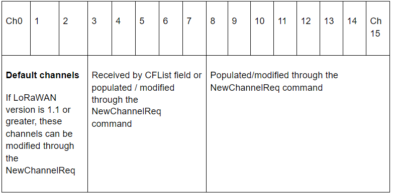
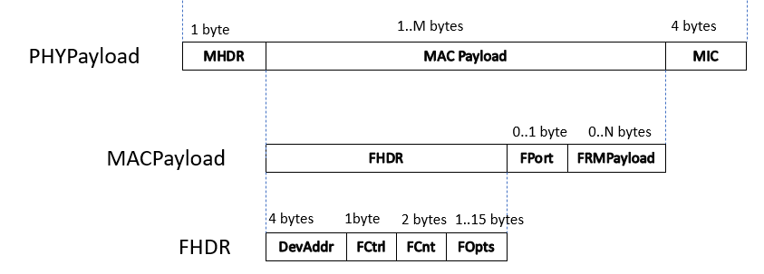

LoRaWAN operates in unlicensed radio spectrum. This means that anyone can use the radio frequencies without having to pay million dollar fees for transmission rights. It is similar to WiFi, which uses the 2.4GHz and 5GHz ISM bands worldwide. Anyone is allowed to set up WiFi routers and transmit WiFi signals without the need for a license or permit.

LoRaWAN uses lower radio frequencies with a longer range. The fact that frequencies have a longer range also comes with more restrictions that are often country-specific. This poses a challenge for LoRaWAN, that tries to be as uniform as possible in all different regions of the world. As a result, LoRaWAN is specified for a number of bands for these regions. These bands are similar enough to support a region-agnostic protocol, but have a number of consequences for the implementation of the backend systems.

+ LoRaWAN has official regional specifications, called **Regional Parameters**, that you can download from the [LoRa Alliance website](https://lora-alliance.org/lorawan-for-developers).

+ These LoRaWAN regional specifications do not specify everything either. They only cover a region by specifying the common denominator. For example, the LoRaWAN regional parameters for Asia only specify a common subset of channels - but there are variations between regulations in Asian countries. Furthermore, each network server operator is free to select additional parameters, such as additional emission channels. We call these parameters **Other**. For The Things Network, they are defined in [this GitHub repository](https://github.com/TheThingsNetwork/gateway-conf).

More informations can be found here:

* [Frequency Plans]()
* [Frequency Plan by Country]()

## Regional Parameters

The LoRaWAN® Regional Parameters document describes the approved frequency channel plans around the world, following regulatory constraints in those regions. 

The LoRaWAN regional parameters vary slightly from region to region based on different regional spectrum allocations and regulatory requirements. These regional parameters are defined by the technical committee of the LoRa Alliance.

This chapter is based on the latest LoRaWAN regional parameters document, which is **RP002-1.0.2** at the time of this writing.

In some countries, more than one channel plan may be used. For example, in the **Netherlands**, both **EU868-870** and **EU433** can be used.

Apart from the regulatory requirements defined by the LoRa Alliance for each channel plan, the local regulatory authorities and the network operators can also impose additional restrictions.

The regional parameters include physical layer parameters such as frequency plans (channel plans), mandatory channel frequencies and data rates for join-request messages, uplink and downlink data rates, Tx output power, dwell time and power control.

The Regional Parameters also include LoRaWAN layer parameters such as maximum payload size.

In this chapter you will learn in detail about the **EU863-870** band and **US902-928** ISM band. This chapter also presents some important parameters involved in other channel plans.

## Channel Plans

LoRaWAN operates in the Unlicensed ISM (Industrial, Scientific, and Medical) band. The table below lists the latest channel plans and their common names.

<table>
  <tr>
   <td><strong>Channel Plan</strong>
   </td>
   <td><strong>Common Name</strong>
   </td>
  </tr>
  <tr>
   <td>EU863-870
   </td>
   <td>EU868
   </td>
  </tr>
  <tr>
   <td>US902-928
   </td>
   <td>US915
   </td>
  </tr>
  <tr>
   <td>CN779-787
   </td>
   <td>CN779
   </td>
  </tr>
  <tr>
   <td>EU433
   </td>
   <td>EU433
   </td>
  </tr>
  <tr>
   <td>AU915-928
   </td>
   <td>AU915
   </td>
  </tr>
  <tr>
   <td>CN470-510
   </td>
   <td>CN470
   </td>
  </tr>
  <tr>
   <td>AS923
   </td>
   <td>AS923
   </td>
  </tr>
  <tr>
   <td>KR920-923
   </td>
   <td>KR920
   </td>
  </tr>
  <tr>
   <td>IN865-867
   </td>
   <td>IN865
   </td>
  </tr>
  <tr>
   <td>RU864-870
   </td>
   <td>RU864
   </td>
  </tr>
</table>

---
 **NOTE**
 
The Things Fundamentals certification expects detailed knowledge about the **EU863-870** and **US902-928** channel plans. However, having a basic understanding of other channel plans is sufficient; for example, you should know that **Listen Before Talk (LBT)** is used in **Japan**.

---

## EU863-870 Band

The **EU863-870** band can be applied to any region where the radio spectrum use is defined by the **ETSI [EN300.220]** standard. The **EU863-870** band is used in all the **European** countries, and some countries _**outside Europe**_, for example, **Bahrain(BH)** located in the **Middle East**. The **EU863-870** band implies the frequency band ranges from **863 MHz – 870 MHz** but some countries use slightly different frequency ranges. For example, **Albania (AL)** uses **863-873 MHz**.

### EU863-870 default channels

The following three default channels **shall** be implemented in every end device that supports the EU863-870 band. These channels are used by the end device to **broadcast** the **join-request** message. The end device **randomly** selects one of the default channels to send the **Join-request** message. The table below lists default channels that can be used with EU863-870. 

<table>
  <tr>
   <td><strong>Channel Frequency (MHz)</strong>
   </td>
   <td><strong>Bandwidth (kHz)</strong>
   </td>
   <td><strong>LoRa data rate</strong>
   </td>
   <td><strong>Bit rate</strong>
   </td>
   <td><strong>Duty cycle</strong>
   </td>
  </tr>
  <tr>
   <td>868.10
   </td>
   <td>125
   </td>
   <td>DR0 – DR5
   </td>
   <td>0.3 – 5 kbps
   </td>
   <td>&lt; 1%
   </td>
  </tr>
  <tr>
   <td>868.30
   </td>
   <td>125
   </td>
   <td>DR0 – DR5
   </td>
   <td>0.3 – 5 kbps
   </td>
   <td>&lt; 1%
   </td>
  </tr>
  <tr>
   <td>868.50
   </td>
   <td>125
   </td>
   <td>DR0 – DR5
   </td>
   <td>0.3 – 5 kbps
   </td>
   <td>&lt; 1%
   </td>
  </tr>
</table>

The **duty cycle** limitation of **&lt;1%** for these three default channels is imposed by the **European Telecommunications Standards Institute (ETSI)** regulations.

By default, the **RX1** receive window uses the same channel as the preceding uplink, for example, if the **Join-request** is sent at **868.10 MHz**, the **RX1** receive window uses **868.10 MHz** to listen for the **Join-accept** message.

For devices compliant with **LoRaWAN version 1.0.x**, these three default channels **shall not** be modified. For devices compliant with **LoRaWAN version 1.1** and beyond, these channels **may** be modified through the **NewChannelReq** command. All these channels are usable for **DR0 – DR5** with **125 kHz** bandwidth **LoRa modulation** and the **bit rate** ranges from **0.3 – 5 kbps**.

The **EU863-870** band supports a maximum of **16 channels** (ch0 – ch15). During end device activation it may receive an optional channel list in the **CFlist** field of the join-accept message that contains **5 frequencies** (ch3 – ch7) in the join-accept message. These are the center frequency of the channels. For example, TTN uses the following 5 additional frequencies.

*   867.1 MHz
*   867.3 MHz
*   867.5 MHz
*   867.7 MHz
*   867.9 MHz

These **8 channels** are used for **uplink**. For  **downlink**, the **same 8 channels** are used for the **RX1** receive slot, and one fixed frequency and data rate is used for the **RX2** receive slot which is **869.525 MHz** at **DR0 (SF12 / 125 kHz)**. The Things Network uses the same frequency as mentioned in the regional parameters document but uses a different data rate which is **DR3 (SF9 / 125 kHz)**.

However, all 16 channels (ch0 – ch15) **can be modified** (existing channels) **or populated** (initially blank channels) through the **NewChannelReq** command under some conditions as mentioned above.

The following table shows how the **16 channels** are populated/modified. Some end devices only use **8 channels** for **uplink**.

### EU863-870 Sub-bands and duty cycles

**European Telecommunications Standards Institute (ETSI)** divides the **863-870 MHz** band into **5 sub-bands**, **G**, **G1**, **G2**, **G3**, and **G4**. The regulations for each of these sub-bands can be found in the **Short Range Devices (SRD) operating in the frequency range 25 MHz to 1 000 MHz; Part 2: Harmonised Standard for access to radio spectrum for non specific radio equipment - ETSI EN 300 220-2 V3.2.1 (2018-06)** and this document can be downloaded by using the following link.

[https://www.etsi.org/deliver/etsi_en/300200_300299/30022002/03.02.01_60/en_30022002v030201p.pdf](https://www.etsi.org/deliver/etsi_en/300200_300299/30022002/03.02.01_60/en_30022002v030201p.pdf)

The following figure is the screen capture of the frequency allocation table provided in the **ETSI EN 300 220-2 V3.2.1 (2018-06)**.

The following table shows the frequency range, maximum ERP, and the duty cycle for each sub-band extracted from the above table.

<table>
  <tr>
   <td><strong>Sub-band</strong>
   </td>
   <td><strong>ETSI operational frequency band</strong>
   </td>
   <td><strong>Frequency range (MHz)</strong>
   </td>
   <td><strong>Maximum Effective Radiated Power (ERP)</strong>
   </td>
   <td><strong>Duty Cycle</strong>
   </td>
  </tr>
  <tr>
   <td><strong>G</strong>
   </td>
   <td>K+L
   </td>
   <td>863.0 – 868.0
   </td>
   <td>25 mW
   </td>
   <td>&lt;=1% * use the duty cycle mentioned in the frequency band ‘<strong>L</strong>’.
   </td>
  </tr>
  <tr>
   <td><strong>G1</strong>
   </td>
   <td>M
   </td>
   <td>868.0 – 868.6
   </td>
   <td>25 mW
   </td>
   <td>&lt;=1%
   </td>
  </tr>
  <tr>
   <td><strong>G2</strong>
   </td>
   <td>N
   </td>
   <td>868.7 – 869.2
   </td>
   <td>25 mW
   </td>
   <td>&lt;=0.1%
   </td>
  </tr>
  <tr>
   <td><strong>G3</strong>
   </td>
   <td>P
   </td>
   <td>869.4 – 869.65
   </td>
   <td>500 mW
   </td>
   <td>&lt;=10%
   </td>
  </tr>
  <tr>
   <td><strong>G4</strong>
   </td>
   <td>Q
   </td>
   <td>869.7 – 870.0
   </td>
   <td>25 mW
   </td>
   <td>&lt;=1%
   </td>
  </tr>
</table>

There is no **dwell time** limitation for the **EU863-870** band. 

Let’s have a look at how to calculate the time-on-air allowed per day (24 hours), per end device for each duty cycle.

<table>
  <tr>
   <td><strong>Duty cycle (take the maximum)</strong>
   </td>
   <td><strong>Equation: Time-On-Air = number of seconds per day </strong>X<strong> duty cycle</strong>
   </td>
   <td><strong>Maximum allowed Time-On-Air per day, per device</strong>
   </td>
  </tr>
  <tr>
   <td>1%
   </td>
   <td>86400 x 1%
   </td>
   <td>864 seconds per day
   </td>
  </tr>
  <tr>
   <td>0.1%
   </td>
   <td>86400 x 0.1%
   </td>
   <td>86 seconds per day
   </td>
  </tr>
  <tr>
   <td>10%
   </td>
   <td>86400 x 10%
   </td>
   <td>8640 seconds per day
   </td>
  </tr>
</table>

---

**NOTE**

Some network operators (like TTN) reduced the duty cycle further than ESTI recommends. These types of restrictions are called ‘Fair Access Policy’. For example, TTN’s fair access policy limits the uplink airtime to 30 seconds per day (24 hours) per node and the downlink messages to 10 messages per day (24 hours) per node. This is more restrictive than the lowest duty cycle (0.1%) allowed for uplink by the ESTI.

---

### EU863-870 Data Rates

**Data rate** is the number of bits that are transmitted per unit of time. With the LoRa modulation, the data rate depends on a few factors like **spreading factor, **bandwidth**, and the **coding rate**. By default, the LoRa modulation uses the **Coding Rate = 4/5**.

The following table shows the bit rate for each **data rate** (DR0 - DR6) configured with the spreading factor and the bandwidth.

<table>
  <tr>
   <td><strong>Data Rate</strong>
   </td>
   <td><strong>Configuration (SF + BW)</strong>
   </td>
   <td><strong>Bit rate (bit/s)</strong>
   </td>
  </tr>
  <tr>
   <td>0
   </td>
   <td>LoRa: SF12 / 125 kHz
   </td>
   <td>

250

   </td>
  </tr>
  <tr>
   <td>1
   </td>
   <td>LoRa: SF11 / 125 kHz
   </td>
   <td>

440

   </td>
  </tr>
  <tr>
   <td>2
   </td>
   <td>LoRa: SF10 / 125 kHz
   </td>
   <td>

980

   </td>
  </tr>
  <tr>
   <td>3
   </td>
   <td>LoRa: SF9 / 125 kHz
   </td>
   <td>

1760

   </td>
  </tr>
  <tr>
   <td>4
   </td>
   <td>LoRa: SF8 / 125 kHz
   </td>
   <td>

3125

   </td>
  </tr>
  <tr>
   <td>5
   </td>
   <td>LoRa: SF7 / 125 kHz
   </td>
   <td>

5470

   </td>
  </tr>
  <tr>
   <td>6
   </td>
   <td>LoRa: SF7 / 250 kHz
   </td>
   <td>

11000

   </td>
</table>

As you can see the **higher spreading factors** use **lower bit rates** and the **lower spreading factors** use **higher bit rates**. However for the **same spreading factor**, if the **bandwidth doubles** the **data rate** also gets **doubled**. You will learn more about the **Spreading Factors** in the Spreading Factors chapter.

All **EU868-870** end devices **must** support one of the following **data rate** options.

*   DR0 – DR5 – the minimal data rate set supported to obtain the LoRaWAN certification.
*   DR0 – DR7
*   DR0 – DR11 – all data rates are implemented in the end device

In Europe, the **European Telecommunications Standards Institute (ETSI)** creates standards that are used by local regulatory authorities. For example, the **Radiocommunications Agency Netherlands (Agentschap Telecom)** is a Dutch government organization that regulates and controls the use of radio frequencies in the **Netherlands**.

### EU863-870 Maximum EIRP / ERP

The **Effective Isotropic Radiated Power (EIRP)** is the total power radiated by an isotropic antenna in a single direction. An isotropic antenna is a hypothetical antenna (an infinitesimally small point in space) which radiates the same intensity of radiation in all directions. The **antenna gain** is expressed in **dBi** for isotropic antennas.

**_The EIRP is calculated using the following equation:_**

**_EIRP = Tx Power (dBm) + Antenna gain (dBi) + Cable loss (dBm)_**

**_The EIRP is expressed in dBm._**

The following table shows the list of EIRP values that can be used to transmit data.

<table>
  <tr>
   <td><strong>TX Power</strong>
   </td>
   <td><strong>EIRP</strong>
   </td>
   <td><strong>Calculated value</strong>
   </td>
  </tr>
  <tr>
   <td>0
   </td>
   <td>Max EIRP
   </td>
   <td>+16 dBm
   </td>
  </tr>
  <tr>
   <td>1
   </td>
   <td>Max EIRP - 2 dB 
   </td>
   <td>+16 dBm - 2 dB = +14 dBm
   </td>
  </tr>
  <tr>
   <td>2
   </td>
   <td>Max EIRP - 4 dB
   </td>
   <td>+16 dBm - 4 dB = +12 dBm
   </td>
  </tr>
  <tr>
   <td>3
   </td>
   <td>Max EIRP - 6 dB
   </td>
   <td>+16 dBm - 6 dB = +10 dBm
   </td>
  </tr>
  <tr>
   <td>4
   </td>
   <td>Max EIRP - 8 dB
   </td>
   <td>+16 dBm - 8 dB = +8 dBm
   </td>
  </tr>
  <tr>
   <td>5
   </td>
   <td>Max EIRP - 10 dB
   </td>
   <td>+16 dBm - 10 dB = +6 dBm
   </td>
  </tr>
  <tr>
   <td>6
   </td>
   <td>Max EIRP - 12 dB
   </td>
   <td>+16 dBm - 12 dB = +4 dBm
   </td>
  </tr>
  <tr>
   <td>7
   </td>
   <td>Max EIRP - 14 dB
   </td>
   <td>+16 dBm - 14 dB = +2 dBm
   </td>
  </tr>
  <tr>
   <td>8..14
   </td>
   <td>RFU
   </td>
   <td>
   </td>
  </tr>
  <tr>
   <td>15
   </td>
   <td>Defined in [TS001]
   </td>
   <td>
   </td>
  </tr>
</table>

The **Max EIRP** for **EU863-870** is **+16dBm**. The equivalent **Effective Radiated Power (ERP)** value is **+14dBm** (as mentioned in the ETSI [EN300.220]) with the _exception_ of the **G3** band that allows **ERP = +27dBm**.

The above mentioned EIRP and ERP values can also be expressed in **milliwatts (mW)**.

*   +16 dBm = 40 mW
*   +14 dBm = 25 mW
*   +27 dBm = 500 mW

The maximum allowed antenna gain is **+2.15 dBi** (isotropic antenna) that is equivalent to **0 dBd** (half-wave dipole antenna).

### EU863-870 Maximum Payload Size

The **FRMPayload** field of a data message holds **application data** known as the **application payload**. The maximum application payload size (length) varies by data rate (configured with spreading factor and bandwidth). The following figure shows a data message and the FRMPayload field. The size of the FRMPayload field is **_M-8 bytes_** where **M** is the **MACPayload** size (if the**FOpt** field is absent).

The following table shows the **maximum application payload (FRMPayload) size (N)** for different **data rates**.

<table>
  <tr>
   <td><strong>Data Rate</strong>
   </td>
   <td><strong>Configuration (SF+BW)</strong>
   </td>
   <td><strong>Maximum application payload size (bytes)</strong>
   </td>
  </tr>
  <tr>
   <td>0
   </td>
   <td>LoRa: SF12 / 125 kHz
   </td>
   <td>

51

   </td>
  </tr>
  <tr>
   <td>1
   </td>
   <td>LoRa: SF11 / 125 kHz
   </td>
   <td>

51

   </td>
  </tr>
  <tr>
   <td>2
   </td>
   <td>LoRa: SF10 / 125 kHz
   </td>
   <td>

51

   </td>
  </tr>
  <tr>
   <td>3
   </td>
   <td>LoRa: SF9 / 125 kHz
   </td>
   <td>

115

   </td>
  </tr>
  <tr>
   <td>4
   </td>
   <td>LoRa: SF8 / 125 kHz
   </td>
   <td>

242

   </td>
  </tr>
  <tr>
   <td>5
   </td>
   <td>LoRa: SF7 / 125 kHz
   </td>
   <td>

242

   </td>
  </tr>
  <tr>
   <td>6
   </td>
   <td>LoRa: SF7 / 250 kHz
   </td>
   <td>

242

   </td>
  </tr>
  
</table>

### EU863-870 Downlink frequencies and data rates

By default, the **RX1** receive window uses the same channel for downlink as the preceding uplink channel. Also, the data rate is a fraction of the uplink data rate. The **RX2** receive window uses a fixed frequency and data rate which is by default **869.525 MHz / DR0 (SF12, 125 kHz)**. However, the network operator has the freedom to choose another frequency and data rate for **RX2** receive window, for example, The Things Network uses the same frequency but a different data rate which is **DR3 (SF9, 125 kHz)**.

### EU863-870 Summary

The following table summarizes all the important parameters we have discussed in this section for **EU863-870** band.

<table>
  <tr>
   <td>Default frequency band
   </td>
   <td>863-870 MHz
   </td>
  </tr>
  <tr>
   <td>Mandatory channel frequencies (join-request)
   </td>
   <td>868.10

868.30

868.50
   </td>
  </tr>
  <tr>
   <td>Mandatory data rates
   </td>
   <td>0-5 (minimum set supported for certification)
   </td>
  </tr>
  <tr>
   <td>Optional data rates
   </td>
   <td>6-7 or 6-11
   </td>
  </tr>
  <tr>
   <td>Number of channels
   </td>
   <td>16

3 default + 5 optional by CFlist

These 5 optional channels and the remaining 8 channels can be modified /populated by NewChannelReq command
   </td>
  </tr>
  <tr>
   <td>Default channels
   </td>
   <td>0, 1, 2
   </td>
  </tr>
  <tr>
   <td>Duty cycle
   </td>
   <td>&lt; 1%
   </td>
  </tr>
  <tr>
   <td>Dwell time limitation
   </td>
   <td>No
   </td>
  </tr>
  <tr>
   <td>Max EIRP / ERP
   </td>
   <td>+16 dBm  (40 mW) / +14 dBm (25 mW)

This is the power radiated by the isotropic antenna / half-wave dipole antenna (not the transmitter power)
   </td>
  </tr>
  <tr>
   <td>Max antenna gain
   </td>
   <td>2.15 dBi or 0 dBd
   </td>
  </tr>
  <tr>
   <td>Default RX2 data rate
   </td>
   <td>DR0 (SF12 / 125 kHz)
   </td>
  </tr>
  <tr>
   <td>Default RX2 frequency
   </td>
   <td>869.525 MHz
   </td>
  </tr>
</table>

 

## US902-928 ISM Band

This section describes the regional parameters for the **USA**, **Canada**, and **all other countries in ITU Region 2** adopting the entire **FCC 47 CFR Part15 regulations** in the **902-928 ISM** band.

### US902-928 Channel Plans

The **US902-928** ISM band is divided into the following channel plans as shown in the table below.

<table>
  <tr>
   <td><strong>Uplink/Downlink</strong>
   </td>
   <td><strong>Channels</strong>
   </td>
   <td><strong>range</strong>
   </td>
   <td><strong>Frequency range</strong>
   </td>
   <td><strong>BW</strong>
   </td>
   <td><strong>Data rate</strong>
   </td>
  </tr>
  <tr>
   <td>Uplink
   </td>
   <td>64
   </td>
   <td>0 - 63
   </td>
   <td>902.3 – 914.9 MHz in 200 kHz increments
   </td>
   <td>125 kHz
   </td>
   <td>DR0 – DR3
   </td>
  </tr>
  <tr>
   <td>Uplink
   </td>
   <td>8
   </td>
   <td>64 - 71
   </td>
   <td>903.0 – 914.2 MHz in 1.6 MHz increments
   </td>
   <td>500 kHz
   </td>
   <td>DR4
   </td>
  </tr>
  <tr>
   <td>Downlink
   </td>
   <td>8
   </td>
   <td>0 - 7
   </td>
   <td>923.3 – 927.5 MHz in 600 kHz increments
   </td>
   <td>500 kHz
   </td>
   <td>DR8 - DR13
   </td>
  </tr>
</table>

### US902-928 Data Rates

The following table shows the **bit rate** for each data rate configured with the spreading factor and the bandwidth. 

*   DR0 - DR4 and DR8 - DR13 are used for LoRa modulation. 
*   DR4 is identical to DR12. 
*   DR8 - DR13 are only used for downlink messages.

<table>
  <tr>
   <td><strong>Data Rate</strong>
   </td>
   <td><strong>Configuration (SF + BW)</strong>
   </td>
   <td><strong>Bit rate (bit/s)</strong>
   </td>
   <td><strong>Uplink/Downlink?</strong>
   </td>
  </tr>
  <tr>
   <td>0
   </td>
   <td>LoRa: SF10 / 125 kHz
   </td>
   <td>

980

   </td>
   <td>Uplink
   </td>
  </tr>
  <tr>
   <td>1
   </td>
   <td>LoRa: SF9 / 125 kHz
   </td>
   <td>

1760

   </td>
   <td>Uplink
   </td>
  </tr>
  <tr>
   <td>2
   </td>
   <td>LoRa: SF8 / 125 kHz
   </td>
   <td>

3125

   </td>
   <td>Uplink
   </td>
  </tr>
  <tr>
   <td>3
   </td>
   <td>LoRa: SF7 / 125 kHz
   </td>
   <td>

5470

   </td>
   <td>Uplink
   </td>
  </tr>
  <tr>
   <td>4
   </td>
   <td>LoRa: SF8 / 500 kHz
   </td>
   <td>

12500

   </td>
   <td>Uplink
   </td>
  </tr>
  <tr>
   <td>5
   </td>
   <td> 
   </td>
   <td>

 

   </td>
   <td>
   </td>
  </tr>
  <tr>
   <td>6
   </td>
   <td> 
   </td>
   <td>

 

   </td>
   <td>
   </td>
  </tr>
  <tr>
   <td>7
   </td>
   <td> 
   </td>
   <td>

 

   </td>
   <td>
   </td>
  </tr>
  <tr>
   <td>8
   </td>
   <td>LoRa: SF12 / 500 kHz
   </td>
   <td>

980

   </td>
   <td>Downlink
   </td>
  </tr>
  <tr>
   <td>9
   </td>
   <td>LoRa: SF11 / 500 kHz
   </td>
   <td>

1760

   </td>
   <td>Downlink
   </td>
  </tr>
  <tr>
   <td>10
   </td>
   <td>LoRa: SF10 / 500 kHz
   </td>
   <td>

3900

   </td>
   <td>Downlink
   </td>
  </tr>
  <tr>
   <td>11
   </td>
   <td>LoRa: SF9 / 500 kHz
   </td>
   <td>

7000

   </td>
   <td>Downlink
   </td>
  </tr>
  <tr>
   <td>12
   </td>
   <td>LoRa: SF8 / 500 kHz
   </td>
   <td>

12500

   </td>
   <td>Downlink
   </td>
  </tr>
  <tr>
   <td>13
   </td>
   <td>LoRa: SF7 / 500 kHz
   </td>
   <td>

21900

   </td>
   <td>Downlink
   </td>
  </tr>
  <tr>
   <td>14
   </td>
   <td> 
   </td>
   <td>

 

   </td>
   <td>
   </td>
  </tr>
  <tr>
   <td>15
   </td>
   <td> 
   </td>
   <td>

 

   </td>
   <td>
   </td>
  </tr>
</table>

 

All **US902-928** end devices shall support one of the following data rate options.

*   DR0 – DR4 and DR8 – DR13 – the minimal data rate set required to obtain LoRaWAN certification.
*   DR0 – DR13 - all data rates are implemented in the end device

When using **Over-The-Air -Activation (OTAA)**, the end device shall transmit the **Join-request** message on a randomly selected channel as follows.

*   64 channels (each have 125kHz bandwith) defined using DR0
*   8 channels (each have 500kHz bandwidth) defined using DR4

The end device shall change channels for every transmission.

The maximum radiated output power allowed in the USA is **EIRP = +30 dBm** but for most devices **+20 dBm** is sufficient. Under the Federal Communications Commission (FCC) there are no duty cycle limitations but there is a **400 ms maximum dwell time** per channel. Dwell time is the amount of time needed for a transmission.

The following table shows how to configure the end-device’s **conducted power** in the US902-928 band. **Conducted power** is the transmission output power (**TxPower**) of the **RF module** (in **dBm**) that is fed into the antenna. This doesn’t include the cable loss or antenna gain. Again, please note that this is **not** the **EIRP** or **ERP**. 

<table>
  <tr>
   <td><strong>TXPower</strong>
   </td>
   <td><strong>Configuration (conducted power)</strong>
   </td>
   <td><strong>Example Calculation for <a href="https://www.microchip.com/wwwproducts/en/RN2903">RN2903 - Wireless Modules (microchip.com)</a> has Output Power = 18.50 dBm</strong>
   </td>
  </tr>
  <tr>
   <td>0
   </td>
   <td>30 dBm – 2*TXPower
   </td>
   <td>30 dBm - 2*18.50 = -7 dBm = 0.2 mW
   </td>
  </tr>
  <tr>
   <td>1
   </td>
   <td>28 dBm
   </td>
   <td>Not applicable
   </td>
  </tr>
  <tr>
   <td>2
   </td>
   <td>26 dBm
   </td>
   <td>Not applicable
   </td>
  </tr>
  <tr>
   <td>3..13
   </td>
   <td>…
   </td>
   <td>
   </td>
  </tr>
  <tr>
   <td>14
   </td>
   <td>2 dBm
   </td>
   <td>Not applicable
   </td>
  </tr>
  <tr>
   <td>15
   </td>
   <td>Defined in [TS001]
   </td>
   <td>
   </td>
  </tr>
</table>

 

### US902-928 Maximum Payload Size

The **FRMPayload** field of a data message holds **application data** known as the ‘**application payload**’. The maximum application payload size (length) varies by data rate (configured with spreading factor and bandwidth). The following figure shows a data message and the FRMPayload field. The size of the FRMPayload field is **_M-8 bytes_** where **M** is the **MACPayload** size (if absence of the **FOpt** field).

Insert illustration

The following table shows the maximum application payload (FRMPayload) size (N) for different data rates.

<table>
  <tr>
   <td><strong>Data rate</strong>
   </td>
   <td><strong>Configuration</strong>
   </td>
   <td><strong>Maximum application payload size (bytes)</strong>
   </td>
  </tr>
  <tr>
   <td>0
   </td>
   <td>LoRa: SF10 / 125 kHz
   </td>
   <td>

11

   </td>
  </tr>
  <tr>
   <td>1
   </td>
   <td>LoRa: SF9 / 125 kHz
   </td>
   <td>

53

   </td>
  </tr>
  <tr>
   <td>2
   </td>
   <td>LoRa: SF8 / 125 kHz
   </td>
   <td>

125

   </td>
  </tr>
  <tr>
   <td>3
   </td>
   <td>LoRa: SF7 / 125 kHz
   </td>
   <td>

242

   </td>
  </tr>
  <tr>
   <td>4
   </td>
   <td>LoRa: SF8 / 500 kHz
   </td>
   <td>

242

   </td>
  </tr>
  <tr>
   <td>5
   </td>
   <td> 
   </td>
   <td>

 

   </td>
  </tr>
  <tr>
   <td>6
   </td>
   <td> 
   </td>
   <td>

 

   </td>
  </tr>
  <tr>
   <td>7
   </td>
   <td> 
   </td>
   <td>

 

   </td>
  </tr>
  <tr>
   <td>8
   </td>
   <td>LoRa: SF12 / 500 kHz
   </td>
   <td>

53

   </td>
  </tr>
  <tr>
   <td>9
   </td>
   <td>LoRa: SF11 / 500 kHz
   </td>
   <td>

129

   </td>
  </tr>
  <tr>
   <td>10
   </td>
   <td>LoRa: SF10 / 500 kHz
   </td>
   <td>

242

   </td>
  </tr>
  <tr>
   <td>11
   </td>
   <td>LoRa: SF9 / 500 kHz
   </td>
   <td>

242

   </td>
  </tr>
  <tr>
   <td>12
   </td>
   <td>LoRa: SF8 / 500 kHz
   </td>
   <td>

242

   </td>
  </tr>
  <tr>
   <td>13
   </td>
   <td>LoRa: SF7 / 500 kHz
   </td>
   <td>

242

   </td>
  </tr>
  <tr>
   <td>14..15
   </td>
   <td> 
   </td>
   <td>

 

   </td>
  </tr>
</table>

 

### US902-928 Summary

The following table summarizes all the important parameters we have discussed in this section for US902-928 band.

<table>
  <tr>
   <td>Default frequency band
   </td>
   <td>902-928 MHz
   </td>
  </tr>
  <tr>
   <td>Mandatory channel frequencies for join-request
   </td>
   <td>Upstream: 64 channels - 902.3 – 914.9 MHz in 200 kHz increments)

Upstream: 8 channels - 903.0 – 914.2 MHz in 1.6 MHz increments

Downstream: 8 channels - 923.3 – 927.5 MHz in 600 kHz increment
   </td>
  </tr>
  <tr>
   <td>Mandatory data rates for join-request
   </td>
   <td>64 (125kHz channels) using DR0 and 8 (500kHz channels) using DR4
   </td>
  </tr>
  <tr>
   <td>Optional data rates
   </td>
   <td>5-6
   </td>
  </tr>
  <tr>
   <td>Number of channels
   </td>
   <td>Upstream: 64 (125kHz) + 8 (500 kHz)

Downstream: 8 (500 kHz)
   </td>
  </tr>
  <tr>
   <td>Default channels
   </td>
   <td>Ch0 - Ch71
   </td>
  </tr>
  <tr>
   <td>Duty cycle
   </td>
   <td>No limit
   </td>
  </tr>
  <tr>
   <td>Dwell time limitation
   </td>
   <td>Ch0-Ch63: 400 ms

Ch64-Ch71: No
   </td>
  </tr>
  <tr>
   <td>Max EIRP (default) - TXPower 0
   </td>
   <td>+30 dBm
   </td>
  </tr>
  <tr>
   <td>Default RX2 data rate
   </td>
   <td>DR8
   </td>
  </tr>
  <tr>
   <td>Default RX2 frequency
   </td>
   <td>923.3 MHz
   </td>
  </tr>
</table>

 

## Some important parameters in channel plans

You should have a basic knowledge about some important parameters that are included in other channels plans. 

*   **CN779-787**: Applies to **China**. The duty cycle is **&lt;1%** and there is no dwell time limitation. The default maximum **EIRP** allowed is **+12.15 dBm**.
*   **AU915-928**: Applies to **Australia** and all other countries whose band extends from **915 to 928MHz**. There is no duty cycle limitation applicable and the **dwell time** limitation is **400ms**. The default maximum **EIRP** allowed is **+30 dBm**.
*   **AS923**: Applied for **multiple regions** (some countries in **Asia** and **Oceania**). All end-devices operated in **Japan** SHALL perform **Listen Before Talk (LBT)** based on **ARIB STD-T108** regulations.
*   **KR920:**  The **South Korea** regulations allow the choice of using either a **duty-cycle limitation** or **Listen Before Talk Adaptive Frequency Agility (LBT AFA)** transmission management.
*   **IN865**: Applies to **India.** The default maximum **EIRP** allowed is **+30 dBm**. 

## Default Settings for All Regions

There are recommended default settings available that can be applied to all the regions. The following list only includes the most important settings.

* RECEIVE_DELAY1: **1s**
* RECEIVE_DELAY2: **2s**   (RECEIVE_DELAY1 + 1s)
* JOIN_ACCEPT_DELAY1: **5s**
* JOIN_ACCEPT_DELAY2: **6s**

## Appendix:

Table: An overview of the ISM frequency bands defined by the ITU-RR

<table>
  <tr>
   <td><strong>Start freq.</strong>
   </td>
   <td><strong>End freq.</strong>
   </td>
   <td><strong>Center freq.</strong>
   </td>
   <td><strong>Remarks</strong>
   </td>
  </tr>
  <tr>
   <td>6.765 MHz
   </td>
   <td>6.795 MHz
   </td>
   <td>6.780 MHz
   </td>
   <td> 
   </td>
  </tr>
  <tr>
   <td>433.05 MHz
   </td>
   <td>434.79 MHz
   </td>
   <td>433.92 MHz
   </td>
   <td>Only in most countries belonging to region 1
   </td>
  </tr>
  <tr>
   <td>61 GHz
   </td>
   <td>61.5 GHz
   </td>
   <td>61.25 GHz
   </td>
   <td> 
   </td>
  </tr>
  <tr>
   <td>122 GHz
   </td>
   <td>123 GHz
   </td>
   <td>122.5 GHz
   </td>
   <td> 
   </td>
  </tr>
  <tr>
   <td>244 GHz
   </td>
   <td>246 GHz
   </td>
   <td>245 GHz
   </td>
   <td> 
   </td>
  </tr>
  <tr>
   <td>13.553 MHz
   </td>
   <td>13.567 MHz
   </td>
   <td>13.560 MHz
   </td>
   <td> 
   </td>
  </tr>
  <tr>
   <td>26.957 MHz
   </td>
   <td>27.283 MHz
   </td>
   <td>27.120 MHz
   </td>
   <td> 
   </td>
  </tr>
  <tr>
   <td>40.66 MHz
   </td>
   <td>40.70 MHz
   </td>
   <td>40.68 MHz
   </td>
   <td> 
   </td>
  </tr>
  <tr>
   <td>902 MHz
   </td>
   <td>928 MHz
   </td>
   <td>915 MHz
   </td>
   <td>Only in region 2
   </td>
  </tr>
  <tr>
   <td>2.400 GHz
   </td>
   <td>2.500 GHz
   </td>
   <td>2.450 GHz
   </td>
   <td> 
   </td>
  </tr>
  <tr>
   <td>5.725 GHz
   </td>
   <td>5.875 GHz
   </td>
   <td>5.800 GHz
   </td>
   <td> 
   </td>
  </tr>
  <tr>
   <td>24 GHz
   </td>
   <td>24.25 GHz
   </td>
   <td>24.125 GHz
   </td>
   <td> 
   </td>
  </tr>
</table>

## Questions

1. Which channel plan is used in Europe?

- EU863-870
- US902-928
- IN865-867
- CN470-510

2. Which bit rate can be achieved with the configuration, SF12 / 125 kHz?

- 250 bit/s
- 440 bit/s
- 980 bit/s
- 1760 bit/s

3. Which country allows the choice of using Listen Before Talk Adaptive Frequency Agility (LBT AFA)?

- Japan
- South Korea
- Australia
- United States of America

4. Which country uses Listen Before Talk (LBT) instead of using duty cycle limitations?
- Japan
- South Korea
- China
- The Neatherlands

5. How many sub-bands the EU863-870 channel plan includes for LoRaWAN?
- 2
- 3
- 4
- 5

6. What is the maximum application payload size (N) allowed for LoRa: SF12 / 125 kHz in Europe?
- 51 bytes
- 115 bytes
- 242 bytes
