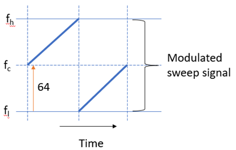
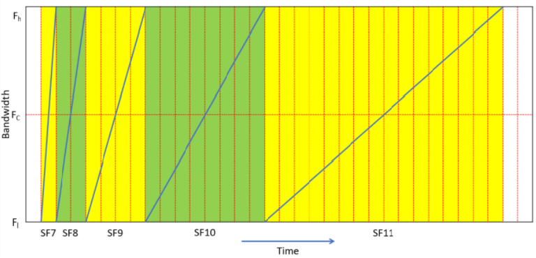
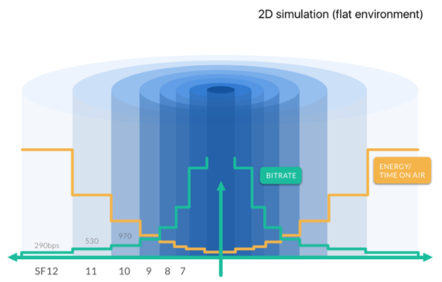
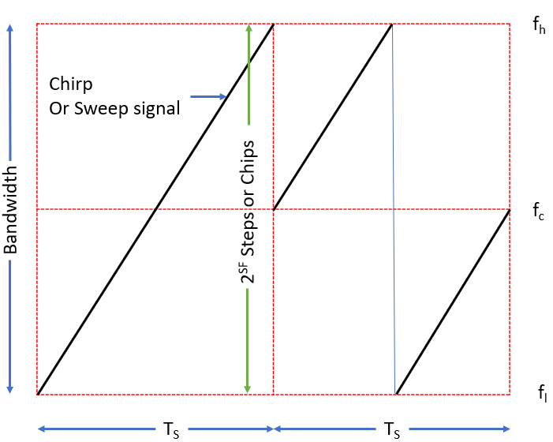

## Spreading Factors

In this chapter, you will learn about **Spreading Factors (SF)** and their impact on LoRa communication.

The Spreading Factor (SF) defines two fundamental values.

*   The number of raw bits that can be encoded or transmitted by a symbol.
*   The number of chips a symbol can hold is 2SF.

To understand the behavior of the spreading factor, let’s have a look at a symbol and how the data is encoded by a symbol, and how the symbol is encoded onto the sweep signal to form a modulated chirp.

### Symbol

A **symbol** is a **group of bits**. One bit contains a single binary value — either a 0 or a 1. The Spreading Factor indicates the number of raw bits that can be encoded or transmitted by a symbol.  For example, with **Spreading Factor 7**, you can encode or transmit **7 bits over one symbol**. The equation can be written as,

**_Spreading Factor (SF) = The number of raw bits encoded (transmitted) by a symbol_**

The following figure shows **7 raw bits** encoded by a **symbol** thus the **spreading factor is 7**.

<table>
  <tr>
   <td>1
   </td>
   <td>1
   </td>
   <td>0
   </td>
   <td>1
   </td>
   <td>1
   </td>
   <td>1
   </td>
   <td>0
   </td>
  </tr>
</table>

The equivalent **decimal** value of the number of raw bits encoded by this symbol is **110**.

A symbol can have one of the values ranging from **0** to **2SF  -1**. For example, if the Spreading Factor is **7**, a **symbol** can have one of the values ranging from **0** to **127**.

A **sweep signal** is divided into **2SF** steps called **chips**. Then the **symbol** value is encoded onto the **sweep signal**. The sweep signal could be a ramp from the lowest frequency to the highest frequency of a bandwidth called up-chirp or from the highest frequency to the lowest frequency of a bandwidth called down-chirp.

For example, if the **spreading factor** is **7** the sweep signal is divided into **27 = 128 chips**. It starts from **chip 0** and ends with **chip 127**. The following figure shows an **unmodulated sweep signal (up-chirp)**.

_Figure: Unmodulated up-chirp with SF=7._

If the **symbol** holds **modulated data**, for example, **1000000 binary**, the equivalent **decimal** value is **64**. This symbol can be encoded onto the sweep signal and the **modulated up-chirp** can be illustrated as shown in the image below.

_Figure: Cyclically shifted up-chirp data symbol._

The **sweep signal** is divided in to **2SF = 27 = 128 chips**. The **symbol** starts from **chip 64** and ends with **chip 127** and **cyclically-shifted** from **chip 0 to 64**. _The starting point of the sweep signal indicates the value of the symbol_.

### Influence of Spreading Factors

Now that you know the spreading factor (SF) represents the number of bits a symbol can transmit. LoRa modulation has a total of **6 spreading factors** from **SF7** to **SF12**. Spreading factors influence data rate, time-on-air (TOA), battery life, and receiver sensitivity, as described here.

*   **Data rate/bit rate** - Compared to a **higher spreading factor**, a **lower spreading factor** provides a **higher bit rate** for a **fixed bandwidth** and the **coding rate**. For example, **SF7** provides a **higher bit rate** than **SF12**.

    If you **doubled** the **bandwidth**, the bit rate also gets **doubled** for a **fixed spreading factor** and the **coding rate**. For example, **SF7/250kHz** provides **11000 bits/s** which is nearly twice the size of **5470 bits/s** provided by the **SF7/125kHz**.

    The following table presents bit rates calculated with the SF7 and Coding Rate (CR) = 1 for bandwidths, 125, 250, and 500 kHz.

<table>
  <tr>
   <td>
<strong>Spreading Factor</strong>
   </td>
   <td><strong>Bandwidth</strong>
   </td>
   <td><strong>Bit rate (kbits/s)</strong>
   </td>
  </tr>
  <tr>
   <td>7
   </td>
   <td>125
   </td>
   <td>5.5
   </td>
  </tr>
  <tr>
   <td>7
   </td>
   <td>250
   </td>
   <td>10.9
   </td>
  </tr>
  <tr>
   <td>7
   </td>
   <td>500
   </td>
   <td>21.9
   </td>
  </tr>
</table>

 

*   **Distance** - A signal modulated with a **larger spreading factor** will be able to travel a **longer distance**. For example, a signal modulated with the **SF12** can travel a **longer distance** than a signal modulated with the **SF7**.
*   **Time-On-Air** - Compared to a **lower spreading factor**, sending a fixed amount of data (payload) with a **higher Spreading Factor** and a fixed bandwidth needs **longer time-on-air (TOA)**. In other words, the low spreading factors have short symbol durations while the high spreading factors have long symbol duration. The following figure illustrates how the **symbol duration increases** as the **spreading factor increases**.

_Figure: Symbol duration comparison for SF7 - SF11._

The **Things Network’s LoRaWAN airtime calculator** can be used to calculate the time-on-air using **input bytes (payload size), bandwidth, and spreading factor**. TTN’s LoRaWAN airtime calculator can be accessed here:

https://www.thethingsnetwork.org/airtime-calculator

*   **Receiver Sensitivity** - The **larger spreading factors** provide a **higher receiver sensitivity**, for example, **SF12** provides a **higher receiver sensitivity** than the **SF7**. Usually, LoRa uses **higher spreading factors** when the **signal is weak**.

The following table shows how **spreading factors** impact the **receiver sensitivity**. Note that the higher the spreading factor results in the higher the receiver sensitivity.

<table>
  <tr>
   <td>
<strong>Spreading factor</strong>
   </td>
   <td><strong>Receiver sensitivity for bandwidth fixed at 125 kHz</strong>
   </td>
  </tr>
  <tr>
   <td>SF7
   </td>
   <td>-123 dBm
   </td>
  </tr>
  <tr>
   <td>SF8
   </td>
   <td>-126 dBm
   </td>
  </tr>
  <tr>
   <td>SF9
   </td>
   <td>-129 dBm
   </td>
  </tr>
  <tr>
   <td>SF10
   </td>
   <td>-132 dBm
   </td>
  </tr>
  <tr>
   <td>SF11
   </td>
   <td>-134.5 dBm
   </td>
  </tr>
  <tr>
   <td>SF12
   </td>
   <td>-137 dBm
   </td>
  </tr>
</table>

* The **battery life** of an end device is **highly dependent** on the **spreading factor** used. Using **larger spreading factors** results in **shorter battery life**. The reason is that the signals modulated with the **larger spreading factors** take **longer time-on-air** hence the radio transceiver must be **active** for a long period of time compared to **lower spreading factors**. The radio transceivers consume more power when they are in the active mode. This results in shorter battery life.

The following figure illustrates how the bit rate and time-on-air (OTA) changes for each spreading factor (SF7-SF12).

_Figure: SF vs bit rate vs time-on-air._

Signals modulated with different spreading factors and transmitted on the same frequency channel at the same time **do not interfere** with each other.

The following section briefly describes some important parameters: coding rate, data rate, symbol rate, symbol duration, chip rate, chip duration.

## Coding Rate

The **coding rate** represents the proportion of bits that actually carry information. The redundant bits are used for error correction. The error correction can be used to recover the data if they are lost due to interference. Therefore, the error correction mechanism reduces data throughput but increases the sensitivity of the receiver.

LoRa modulation has a total of 4 codes for error correction. The Coding Rate (CR) can be calculated by using the following equation.

CR = 4/(4+CR) where CR = 1,2,3, or 4

<table>
  <tr>
   <td><strong>Error Correction Code</strong>
   </td>
   <td><strong>Coding Rate</strong>
   </td>
  </tr>
  <tr>
   <td>1
   </td>
   <td>4/5
   </td>
  </tr>
  <tr>
   <td>2
   </td>
   <td>4/6
   </td>
  </tr>
  <tr>
   <td>3
   </td>
   <td>4/7
   </td>
  </tr>
  <tr>
   <td>4
   </td>
   <td>4/8
   </td>
  </tr>
</table>

 

For example, the following symbol carries raw 7 bits with the coding rate  = 4/5.

The number of bits that carries the actual information can be calculated as,

**_Spreading Factor X Coding Rate = 7 X 4/5 = 5.6_**

The remaining 1.4 bits are used for the error correction.

If you use a higher coding rate for error correction the number of bits that can be transmitted using a symbol is reduced but the ability to recover the data is increased.

## Data Rate

The **data rate** is the number of bits that are transferred per unit of time. The **data rate** can be expressed in **bits per second (bits/s)**. The term data rate can be used interchangeably with bit rate. The bit rate can be calculated using the following equation.

**_Bit Rate = SF x (BW / 2^SF) x  (4(4+CR))_**

**Example:**

Calculate the bit rate for the following parameters.

Bandwidth = 125 kHz, Spreading Factor = 7, Coding Rate =4/5

 

**Solution:**

The equation can be written by applying the given parameters as shown below.

Bit rate = 7 x (125000 / 128) x (4 / 5) = 5468 bits/s

This is approximately 5470 bits/s, the same bit rate mentioned for SF7 / 125 kHz in the LoRaWAN regional parameters document.

 

## Symbol Rate

The symbol rate is expressed in symbols per second and can be calculated using the following equation.

**_Bandwidth in Hertz / 2SF_**

For example, the symbol rate for bandwidth 125kHz and Spreading Factor 7 can be calculated as follows.

Symbol rate = 125000 / 128 = 977 symbols/sec

 

## Symbol Duration

The sweep time of a chirp (up or down) is known as the **symbol duration**. The symbol duration can be calculated using the following equation.

**_Symbol Duration = 2SF / Bandwidth in Hertz_**

TS = Symbol duration, fC = center frequency, fh = upper frequency limit of the bandwidth, fl = lower frequency limit of the bandwidth.

**Example:**

Calculate the symbol rate for the spreading factor 7 and bandwidth 125 kHz.

 

**Solution:**

Symbol duration = 128 / 125000 = 1.024 ms

 

## Chip Rate

The **chip rate** always equals the bandwidth where the bandwidth is expressed in Hertz. The chip rate is expressed in the **number of chips per second (chips/sec)**.

**_Chip Rate = Bandwidth in Hertz_**

**Example:**

If the bandwidth is 125kHz, the chip rate can be written as,

125 kHz = 125000 Hz = 125000 chips/sec

 

## Chip Duration

The **Chip duration** can be calculated using the following equation.

**_Chip Rate = Bandwidth in hertz._**

Therefore,

**_Chip Duration = 1/Chip Rate = 1/Bandwidth in Hertz_**

 

**Example:**

Calculate the chip duration for the bandwidth 125 kHz.

 

**Solution:**

chip duration = 1/125000 = 8µs

 

## Questions

1. How many values can a symbol hold with SF7?

- 26

- 27

- 28

- 29

_The number of values a symbol can hold can be calculated as, 2SF = 27._

2. Which spreading factor provides the highest bit rate?

- SF7

- SF8

- SF9

- SF10

_As the rule of thumb, lower spreading factors provide higher bit rates. By looking at the answer options spreading factor 7 is the lowest spreading factor._

3. Which spreading factor provides the longest battery life for an end device?

- SF7

- SF8

- SF9

- SF10

_As a rule of thumb, lower spreading factors provide higher bit rates resulting in shorter time-on-air (TOA). Shorter TOA resulting in longer battery life because the radio transceiver is active for a shorter period._

4. For the same amount of data and bandwidth, which spreading factor results in the longest time-on-air?

- SF7

- SF8

- SF9

- SF10

_The higher spreading factors resulting in a longer time-on-air._

5. Which spreading factor provides the highest receiver sensitivity?

- SF9

- SF10

- SF11

- SF12

_A signal modulated with a larger spreading factor can be received with less errors by the RF receiver compared to a signal with a lower spreading factor. The higher the SF value is, the more chips used to represent a symbol, which means there will be more processing gain from the receiver side. Therefore, larger spreading factors provide higher receiver sensitivity._
