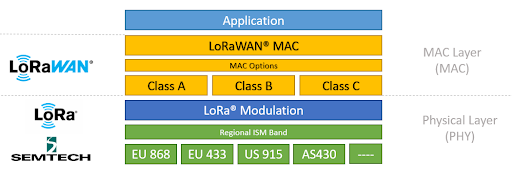

### LoRa

LoRa is a wireless modulation technique derived from **Chirp Spread Spectrum (CSS)** technology. It encodes information on radio waves using chirp pulses - similar to the way dolphins and bats communicate! LoRa modulated transmission is robust against disturbances and can be received across great distances.

Don’t be alarmed about the complex terms; **LoRa modulation** and **Chirp Spread Spectrum technology** are simple to understand in practice. In case you are curious, in this video, **Richard Wenner** explains how **Chirp Spread Spectrum technology** works: 



LoRa is ideal for applications that transmit small chunks of data with low bit rates. Data can be transmitted at a longer range compared to technologies like WiFi, Bluetooth or ZigBee. LoRa is well suited for sensors and actuators that operate in low power mode.

LoRa can be operated on the license free **sub-gigahertz** bands, for example, 915 MHz, 868 MHz, and 433 MHz. It also can be operated on **2.4 GHz** to achieve higher data rates compared to sub-gigahertz bands, at the cost of range. These frequencies fall into **ISM bands** that are reserved internationally for **industrial**, **scientific**, and **medical** purposes.

### LoRaWAN

**LoRaWAN** is a **Media Access Control (MAC)** layer protocol built on top of LoRa modulation. It is a software layer which defines how devices use the LoRa hardware, for example when they transmit, and the format of messages.

The LoRaWAN protocol is developed and maintained by the [LoRa Alliance](https://lora-alliance.org/). 

_Figure: LoRaWAN protocol stack._

The first LoRaWAN specification was released in January 2015. The table below shows the version history of the LoRaWAN specifications. At the time of this writing the latest specifications are 1.0.4 (in 1.0 series) and 1.1 (1.1 series).

_Table: LoRaWAN specification versions and release dates._

<table>
  <tr>
   <td><strong>Version</strong>
   </td>
   <td><strong>Release date</strong>
   </td>
  </tr>
  <tr>
   <td>1.0
   </td>
   <td>January 2015
   </td>
  </tr>
  <tr>
   <td>1.0.1
   </td>
   <td>February 2016
   </td>
  </tr>
  <tr>
   <td>1.0.2
   </td>
   <td>July 2016
   </td>
  </tr>
  <tr>
   <td>1.1
   </td>
   <td>October 2017
   </td>
  </tr>
  <tr>
   <td>1.0.3
   </td>
   <td>July 2018
   </td>
  </tr>
  <tr>
   <td>1.0.4
   </td>
   <td>October 2020
   </td>
  </tr>
</table>

## Why is LoRaWAN so awesome?

*   **Ultra low power** - LoRaWAN end devices are optimized to operate in low power mode and the battery lifetime on coin cells can be up to 10 years.
*   **Long range** - LoRaWAN gateways can transmit and receive signals over a distance of over 10 kilometers in rural areas and up to 3 kilometers in dense urban areas depending on how deep indoors the end devices are located.
*   **Deep indoor penetration** - LoRaWAN networks can provide deep indoor coverage including multi floor buildings.
*   **License free spectrum** - you don’t need to obtain a license to deploy a LoRaWAN network.
*   **Geolocation**- A LoRaWAN network can determine the location of your end devices using triangulation without the need for GPS. A LoRa end device can be located if at least three gateways pick up its signal.
*   **High capacity** - LoRaWAN Network Servers handle millions of messages from thousands of gateways. 
*   **Public and private deployments** - It is easy to deploy public and private LoRaWAN networks using the same hardware (gateways, end devices, antennas) and software (UDP packet forwarders, Basic Station software, LoRaWAN stacks for end devices).
*   **End-to-end security**- LoRaWAN ensures secure communication between the end device and the application server using AES-128 encryption.
*   **Firmware updates over the air** - Remotely update firmware (applications and the LoRaWAN stack) for a single-end device or group of end devices.
*   **Roaming**- Seamless handovers of an end device from one network to another.
*   **Low cost** - Minimal infrastructure, low-cost end nodes and open source software.
*   **Certification program**- The LoRa Alliance certification program certifies end devices and provides end-users with confidence that the devices are reliable and compliant with the LoRaWAN specification.
*   **Ecosystem**- LoRaWAN has a very large ecosystem of device makers, gateway makers, antenna makers, network service providers, and application developers.

## LoRaWAN use cases

The following use cases will give you a better insight into how LoRaWAN can be applied (source: https://info.semtech.com/lora-everywhere):

*   **Animal conservation** - Tracking sensors manage endangered species such as Black Rhinos and Amur Leopards.
*   **Dementia patients** - Wristband sensors provide fall detection and medication tracking 
*   **Smart farms**- Real time insights into crop soil moisture, optimized irrigation schedule reduce water use up to 30%.
*   **Water conservation**- Identification and faster repair of leaks in a city's water network.
*   **Food safety**- Temperature monitoring ensures food quality
*   **Smart waste bins** - Waste bin level alerts sent to staff optimizes pickup schedule.
*   **Smart bikes**- Bike trackers track bikes in remote areas and dense buildings.
*   **Airport tracking** - GPS-free tracking monitors vehicles, personnel, and luggage.
*   **Efficient workspaces** - Monitors room occupancy, temperature, energy usage, and parking availability.
*   **Cattle health** - Sensors monitor cattle health, detect diseases and forecast delivery of calves.
*   **LoRa in space** - Satellites to provide LoRaWAN-based coverage worldwide.
*   **Covid-19** - Proximity detection and back-tracking helps businesses protect their workers from COVID-19 threats.

## LoRa Alliance

The LoRa Alliance is an open, non-profit association established in 2015. It supports development of the LoRaWAN protocol and ensures interoperability of all LoRaWAN products and technologies. Today, the LoRa Alliance has over 500 members around the globe ([https://lora-alliance.org/member-directory/](https://lora-alliance.org/member-directory/)).

The LoRa Alliance provides LoRaWAN certification for end devices. Certified end devices provide users with confidence that the end device is reliable and compliant with the LoRaWAN specification. You can learn more about LoRaWAN certification by visiting [https://lora-alliance.org/lorawan-certification/](https://lora-alliance.org/lorawan-certification/). Certification is only available for device manufacturers that are members of the LoRa Alliance. Once certified, the manufacturer can use the LoRaWAN® CertifiedCM mark with the product.

## Questions

1. Who provides the LoRaWAN certification?
   - LoRa Alliance
   - The Things Network
   - IEEE
   - Semtech
   

2. LoRa is a
   - MAC layer protocol_
   - Physical layer implementation
   
   
3. LoRaWAN is a
   - MAC layer protocol
   - Physical layer implementation
   
   
4. LoRaWAN can be operated on.
   - License free spectrum
   - ISM bands
   - 2.4 GHz
   - All of the above
   
   
5. Which is not a use case of LoRaWAN?
   - Animal conservation
   - Credit card payments
   - Smart waste bins
   - Cattle health
   
