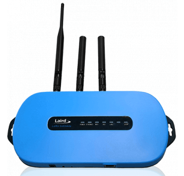
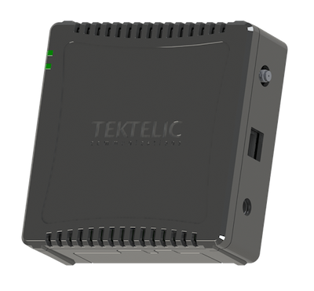
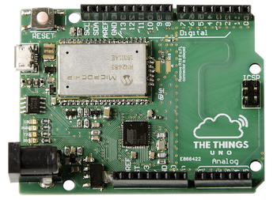
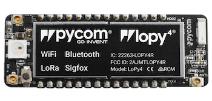
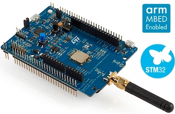
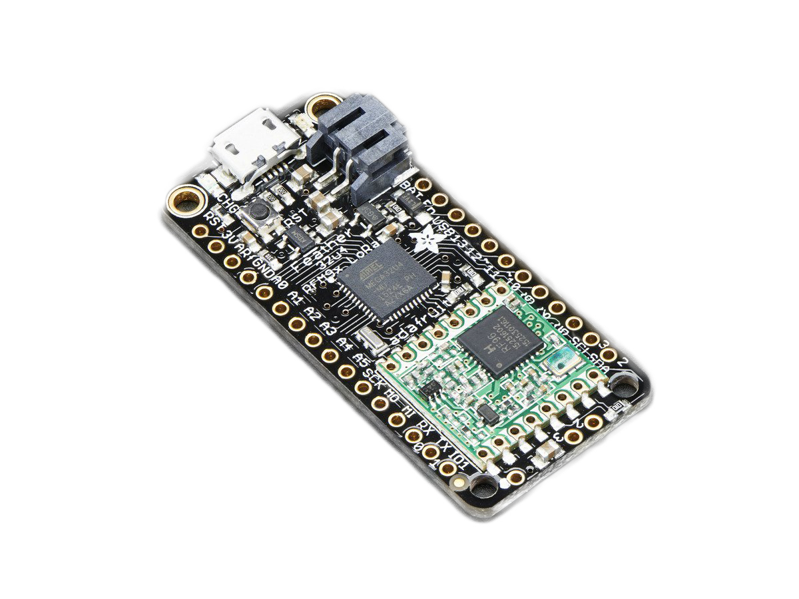

Since January 2021, **The Things Network V2 software has been upgraded to The Things Stack Community Edition**. This upgrade comes with a set of brand new features, out-of-the-box integrations, extended coverage and improved user experience. 

The Things Stack Community Edition is one of the distributions of The Things Stack, a third version (V3) of the LoRaWAN Network Server that is developed and actively maintaned by The Things Industries. 

The Things Stack Community Edition runs on open source code, so if you would like to explore or contribute, visit our [open source LoRaWAN stack repository](https://github.com/TheThingsNetwork/lorawan-stack).

> Click [here](https://www.thethingsindustries.com/docs/download/) to learn about other distributions of The Things Stack.

The Things Stack Community Edition offers a free and developer-friendly way to get familiar with LoRaWAN technology. It provides a public community LoRaWAN network, initiated by [The Things Industries](https://thethingsindustries.com/), and supported by 100k+ The Things Network community members from more than 100 countries around the world.

Join The Things Network [Forum](https://www.thethingsnetwork.org/forum/) or [Slack](https://thethingsnetwork.slack.com/) for community support.

> For commercial solutions, we recommend using an SLA-backed network provided by The Things Industries. Visit [The Things Industries website](https://thethingsindustries.com/) to learn more about it.

#### Useful links:

- [The Things Stack Community Edition development environment](https://console.cloud.thethings.network/)
- [The Things Stack Introduction video](https://www.youtube.com/watch?v=rK8oJHZ9Q7U)
- [The Things Stack official documentation page](https://www.thethingsindustries.com/docs)
- [What is The Things Industries, The Things Network and The Things Stack?](https://www.thethingsindustries.com/docs/getting-started/what-is-tts/)

## Learn more about LoRaWAN

LoRaWAN is a radio frequency protocol that allows devices to connect to the Internet over a long range with incredibly low power consumption. Visit our documentation to [learn more about LoRaWAN]().

Watch the video below on *Everything you need to know about LoRaWAN in 60 minutes* by Johan Stokking (tech lead of The Things Network):



 

Read along to learn how you can implement your end-to-end IoT prototype within a day.

## The Things Stack features

The Things Stack, compared to The Things Network V2, is **more scalable, more secure and supports all the latest LoRaWAN developments** like the latest LoRaWAN versions 1.1 and 1.0.4.

The Things Stack architecture is based on microservices which allows for **better distribution of services, better scaling and interoperability with other LoRaWAN networks**.

The Things Stack **supports all LoRaWAN classes (A, B, C) and multicast device groups, all existing LoRaWAN versions (including v1.0.4 and v1.1) and all regional parameters as defined by the LoRa Alliance**. By being standards compliant, The Things Stack **supports passive roaming and will support handover roaming** in the future. **Firmware updates over the air, advanced clustering and load balancing techniques** also come along with this upgrade.

The advanced APIs offer **gRPC, HTTP and MQTT [integrations](https://www.thethingsindustries.com/docs/integrations/)**. For debugging purposes, there are **API-based event streams** that can help you trace issues, monitor device behaviour and get useful alerts. [Data Formats](https://www.thethingsindustries.com/docs/reference/data-formats/) used by The Things Stack have a different schema and have a much **richer metadata support**. For storing data, a **[Storage Integration](https://www.thethingsindustries.com/docs/integrations/storage/)** is also available.

Users of The Things Stack have the opportunity to use the **Global Join Server** for storing and issuing security keys, and in that way, improve the security of their sensor deployment. Since this network architecture is standards-compliant, developers can even use a join server operated by a trusted third party.

One of the most important features is the connection to **[Packet Broker](https://www.thethingsindustries.com/docs/reference/peering/)**, allowing the exchange of traffic between The Things Stack Community Edition and private LoRaWAN networks which increases LoRaWAN network coverage, performance and capacity, and prolongs the end device battery life. 

You will also be able to reuse your username and password from The Things Network V2 to log in, thanks to **The Things ID feature**. Users can use the [Console](https://www.thethingsindustries.com/docs/getting-started/console/) with an **improved user interface** or [CLI](https://www.thethingsindustries.com/docs/getting-started/cli/), to manage [gateways](https://www.thethingsindustries.com/docs/gateways/), [devices](https://www.thethingsindustries.com/docs/devices/), [applications](https://www.thethingsindustries.com/docs/integrations/adding-applications/), [users and organizations](https://www.thethingsindustries.com/docs/getting-started/user-management/), as well as to interact with uplink and downlink events in real-time. 

For a more detailed comparison between The Things Network V2 and The Things Stack Community Edition, check out the [Major Changes in The Things Stack](https://www.thethingsindustries.com/docs/getting-started/migrating/major-changes/) page.

## Start using The Things Stack Community Edition

The Things Stack Community Edition can be accessed via the Console. You can access the Console by [selecting a cluster](https://console.cloud.thethings.network/) that is closest to you geographically.

## Set up your LoRaWAN network

The main building blocks of the public community LoRaWAN network are **gateways**. Thousands of gateways across the globe are already connected to The Things Stack Community Edition, making the community LoRaWAN network available for free usage. 

Take a look at the [global The Things Network coverage map](https://www.thethingsnetwork.org/map).

Although you might already have coverage in your area, we still recommend you get your hands on a gateway to ensure reliable coverage. There are a lot of gateways with extensive features on the market, so make sure you choose the one that fits your needs best. For example, here is a short list of some popular indoor gateways:

|   |  Gateway | Link  |
| ------------- |:-------------:| -----:|
|  | **Mikrotik wAP LR8** | [More info](https://mikrotik.com/product/wap_lr8_kit) |
|  | **Laird Sentrius RG1xx** | [More info](https://www.lairdconnect.com/wireless-modules/lorawan-solutions/sentrius-rg1xx-lorawan-gateway-wi-fi-ethernet-optional-lte-us-only) |
|  | **Tektelic Kona Micro Lite** | [More info](https://tektelic.com/catalog/kona-micro-lite-lorawan-gateway) |
|  | **Multitech Conduit AP** | [More info](https://www.multitech.com/brands/multiconnect-conduit-ap) |

Once you have your hands on a gateway, [learn how to connect your gateway to The Things Stack Community Edition]().

 Different world regions use different [frequency plans](https://www.thethingsindustries.com/docs/reference/frequency-plans/), e.g. 863-870 MHz for Europe, 902-928 MHz for North America, etc. Make sure you double-check that the hardware aligns with your region’s radio frequency before purchasing! 

To learn more about gateways, have a look at the review video by Ben Olayinka:



## Get your development board and activate it

To build a prototype of your end-to-end IoT solution, you will need a development board. Here is a short list of popular development boards that can help you build your IoT app in no-time:

| Image | Development board | Webshop  |
| ------------- |:-------------:| -----:|
|  | **The Things Uno** | [Buy](https://connectedthings.store/gb/lorawan-development/the-things-uno-development-board.html) |
|  | **Arduino MKR WAN 1300** | [Buy](https://store.arduino.cc/arduino-mkr-wan-1300-lora-connectivity-1414) |
|  | **Pycom LoPy4** | [Buy](https://pycom.io/product/lopy4/) |
|  | **STM32L0 Discovery Kit** | [Buy](https://www.st.com/en/evaluation-tools/b-l072z-lrwan1.html) |
|  | **Adafruit Feather RFM95 LoRa Radio** | [Buy](https://www.adafruit.com/product/3078) |

Did you set up your gateway and created a free account on The Things Stack Community Edition? Great, now it is time to activate your development board! [Learn how to connect your device to The Things Stack Community Edition]().

To learn more about getting started with The Things Stack (Community Edition), have a look at the video by Bogdans Afonins:



## Build your end-to-end application

Once you have your LoRaWAN network setup, you can use available integrations to build your end-to-end IoT solution. Integrations allow you to process data and act on it by triggering events. Learn [how to create integrations on The Things Stack Community Edition]().

### Other useful links:

- [Official The Things Stack documentation page](https://www.thethingsindustries.com/docs)
- [What is The Things Industries, The Things Network and The Things Stack?](https://www.thethingsindustries.com/docs/getting-started/what-is-tts/)
- [The Things Stack Getting Started playlist](https://www.youtube.com/playlist?list=PLM8eOeiKY7JWTf-d4XmRuRjK1ZFaoinwM)
- [The Things Network Forum](https://www.thethingsnetwork.org/forum/)
