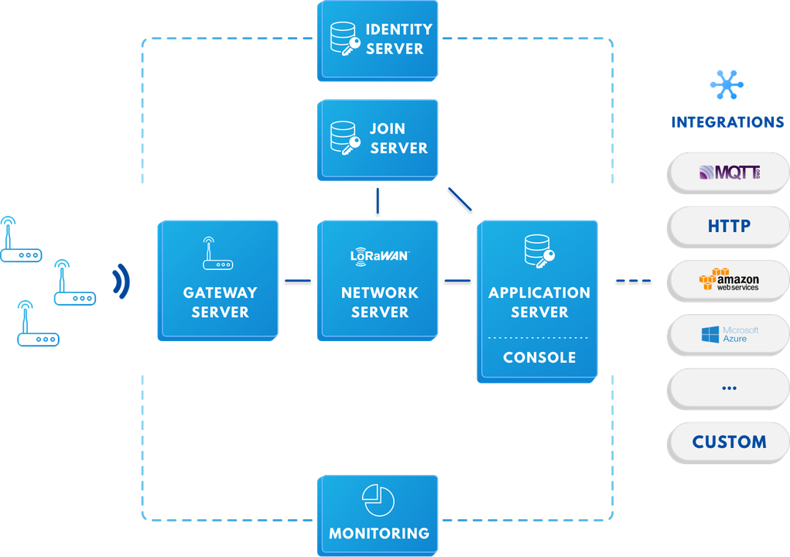
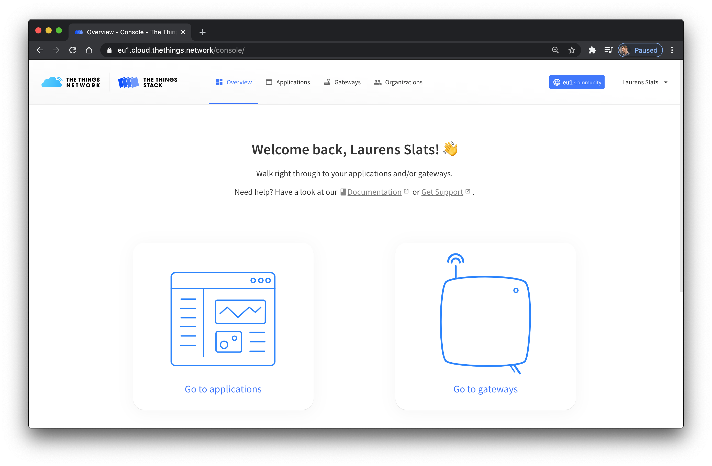

As announced during The Things Conference held in January 2021, The Things Network software is upgrading to The Things Stack V3. This upgrade comes with a set of brand new features, out-of-the-box integrations, extended coverage and improved user experience. 

## What is The Things Stack V3?

The Things Stack V3 is a user-friendly, enterprise-grade LoRaWAN network server built on top of an open source stack. Comparing to The Things Network Stack V2, The Things Stack V3 is not just an update but a completely new solution built from scratch. 

The Things Stack V3 [architecture](https://www.thethingsindustries.com/docs/reference/components/) shown below follows the LoRaWAN Network Reference Model. 

> For a detailed info on The Things Stack V3, visit [The Things Stack official documentation page](https://www.thethingsindustries.com/docs/).

## How can I access V3?

The (free) community edition of The Things Stack V3 can be accessed via the [**Development Console**](https://console.cloud.thethings.network/). Make sure to select the cluster which is closest to you geographically.

## Why should I migrate from V2 to V3?

> Here, we assume you have experience using The Things Network running The Things Network Stack V2. If you have not been using The Things Network yet, you can visit the [The Things Stack Quickstart]().

The Things Stack (V3) is more scalable, more secure and support all the latest LoRaWAN developments like the latest LoRaWAN versions 1.1 and 1.0.4. Near the end of 2021, The Things Network V2 clusters will be shut down. 

The Things Stack Architecture is based on micro services which allows for better the distribution of services, better scaling and interoperability with other LoRaWAN networks. 

The Things Stack V3 supports all LoRaWAN classes (A, B, C) and multicast device groups, all existing LoRaWAN versions (including v1.0.4 and v1.1) and all regional parameters by defined by the LoRa Alliance. By being standards compliant, The Things Stack V3 allows passive roaming, and will allow handover roaming in the future. Firmware updates over the air, advanced clustering and load balancing tehchniques also come along with this upgrade.

You will be able to reuse your username and password from The Things Network Stack V2 to log in, thanks to The Things ID feature. Users can use the [Console](https://www.thethingsindustries.com/docs/getting-started/console/) with improved user interface, or [Command-Line Interface](https://www.thethingsindustries.com/docs/getting-started/cli/) to manage [gateways](https://www.thethingsindustries.com/docs/gateways/), [devices](https://www.thethingsindustries.com/docs/devices/), [applications](https://www.thethingsindustries.com/docs/integrations/adding-applications/), [users and organizations](https://www.thethingsindustries.com/docs/getting-started/user-management/), as well as to interact with uplink and downlink events in real-time. 

The advanced APIs offer gRPC, HTTP and MQTT [integrations](https://www.thethingsindustries.com/docs/integrations/). For debugging purposes, there are API-based event streams that can help you trace issues, monitor device behaviour and get useful alerts. [Data formats](https://www.thethingsindustries.com/docs/reference/data-formats/) used by The Things Stack V3 have a different schema and have a much richer metadata support. For storing data, a [Storage Integration](https://www.thethingsindustries.com/docs/integrations/storage/) is also available.

Users of The Things Stack V3 will now have an opportunity to use the Global Join Server for storing and issuing security keys, and in that way, highly improve the security of their network. Since this network architecture is standards compliant, developers can even use a join server operated by a trusted third party.

One of the most important features is the connection to Packet Broker, allowing the [exchange of traffic](https://www.thethingsindustries.com/docs/reference/peering/) between The Things Network and private LoRaWAN networks which increases LoRaWAN network coverage, performance and capacity, and prolongs the end device battery life. 

> **For more detailed comparison between V2 and V3, check out the [Major Changes in The Things Stack](https://www.thethingsindustries.com/docs/getting-started/migrating/major-changes/) page.**
