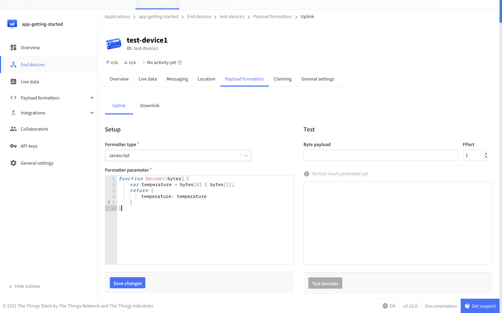

This guide was written to explain the overall migration process of migrating from The Things Network V2 to The Things Stack Community Edition in a several easy-to-follow steps.

 Since version 3.13 of The Things Stack (released in May, 2021), The Things Network V2 routes traffic back and forth to The Things Stack Community Edition. When migrating your gateways to The Things Stack Community Edition, the coverage of the public community network will not be impacted. 

 
The Things Stack Community Edition is a LoRaWAN Network Server which is free to use for The Things Network community members. The Community Edition is designed for testing and evaluating LoRaWAN projects and is managed by [The Things Industries](https://www.thethingsindustries.com/). The Community Edition comes without guarantees and only includes community support, hence is not suitable for commercial usage. Join The Things Network [Forum](https://www.thethingsnetwork.org/forum/) or [Slack](https://thethingsnetwork.slack.com/) for community support.

For commercial LoRaWAN projects, it is recommended to use an SLA-backed version of The Things Stack, as it includes professional support. [Click here to learn more.](https://www.thethingsindustries.com/deployment/)
 

Generally, the process of migrating from The Things Network V2 to The Things Stack Community Edition depends on few things:

- Type of devices you are using - ABP or OTAA
- If you are able to migrate your gateway at the moment, or you want to use [Packet Broker](https://www.thethingsindustries.com/docs/reference/packet-broker/) to route your traffic (and migrate your gateway later)
- How many devices you wish to migrate, i.e. if you want to migrate them one by one or in bulk
- If you wish to migrate your devices with or without an active session from V2

Let us assume that your gateway and device are connected to The Things Network V2. 

> [Link to The Things Network V2 Console](https://v2console.thethingsnetwork.org/)

In this section, we will first consider migrating your end device, then your gateway to The Things Stack Community Edition. Along the way, we will highlight differences between the aforementioned use cases and recommend some best practices. You will also need to add your applications, integrations and payload formatters in The Things Stack Community Edition. 

> [Link to The Things Stack Community Edition Console](https://www.thethingsindustries.com/deployment/)

#### Video Migrate from The Things Network V2 to The Things Stack
<iframe width="560" height="315" src="https://www.youtube.com/embed/DL87O5zNE_4" frameborder="0" allow="accelerometer; autoplay; clipboard-write; encrypted-media; gyroscope; picture-in-picture" allowfullscreen></iframe>

## Log in to The Things Stack Community Edition

To be able to continue following steps below, you first need to log in to The Things Stack Community Edition Console by first [selecting a cluster](https://console.cloud.thethings.network/) that is closest to you geographically. You can then log in with your The Things Network credentials via The Things ID.

## Add an application in The Things Stack Community Edition

To migrate your end device, you first need to [add an application](https://www.thethingsindustries.com/docs/integrations/adding-applications/) on the The Things Stack Community Edition. The `Application ID` does not neccessarily have to be the same as the one in The Things Network V2.

## Add your payload formatters and integrations

After adding an application in The Things Stack Community Edition, you also need to re-add the associated elements, like payload formatters (known as coders and decoders in The Things Network V2) and integrations.

The format of {} payload coders and decoders is still supported in The Things Stack. You can copy and paste function code used in {} directly in The Things Stack.



The Things Stack also supports a new `decodeUplink` function which is described in [The Things Stack Payload Formatter Documentation](https://www.thethingsindustries.com/docs/integrations/payload-formatters/javascript/).

While you can simply paste your `Decoder` function in The Things Stack and it will work, if you wish to take advantage of the additional `warnings` and `errors` fields in The Things Stack, you need to convert your `Decoder` function to a `decodeUplink` function.

The `decodeUplink` function receives an `input` object, and must return an object containing `data`.

For example, if your payload decoder function in {} was:

```js
function Decoder(bytes) {
    var temperature = bytes[0] | bytes[2];  
    return {
        temperature: temperature;
    }
}
```

then your uplink payload formatter function in The Things Stack should be:

```js
function decodeUplink(input) {
    var bytes = input.bytes;
    var temperature = bytes[0] | bytes[2];
    return {
      data: {
        temperature: temperature;
      }
    }
}
```

And to take advantage of the `warnings` and `errors` fields, you could do the following:

```js
function decodeUplink(input) {
    var bytes = input.bytes;
    var temperature = bytes[0] | bytes[2];
    var warnings = [];
    var errors = [];
    if (temperature < -10) {
      warnings.push("it's cold!");
    }
    if (temperature < -273) {
      errors.push("out of bounds");
    return {
      data: {
        temperature: temperature;
      }
      warnings: warnings;
      errors: errors;
    }
}
```

See more info on how to [write payload formatters](https://www.thethingsindustries.com/docs/integrations/payload-formatters/) and [add integrations](https://www.thethingsindustries.com/docs/integrations/adding-integrations/) in The Things Stack Community Edition. 

## Ready for Migration

Next, you need to migrate your end device(s) to The Things Stack Community Edition.

 This guide refers only to The Things Network V2 and The Things Stack Community Edition deployments. The full migration process that covers all V2 and The Things Stack deployments is described [here](https://www.thethingsindustries.com/docs/getting-started/migrating/migrating-from-v2/). 

Migrating end devices can be easily done using:

- The Things Stack Community Edition Console. See [Migrate End Devices using The Things Stack Community Edition Console]().
- `ttn-lw-migrate` tool. See [Migrate End Devices using the Migration Tool]().

 We highly recommend to test the migration on a single end device or a small batch of end devices first, just to make sure the migration process is succesful and that you are getting an expected result. 

Depending on your use case, you might want to:

- Keep your gateway connected to The Things Network V2 and route your traffic via Packet Broker to The Things Stack Community Edition - if this is the case, we recommend to read the [Packet Broker Requirements](https://www.thethingsindustries.com/docs/getting-started/migrating/migrating-from-v2/packet-broker-requirements/)
- Migrate your gateway to The Things Stack Community Edition - see [Migrate Gateways]()

